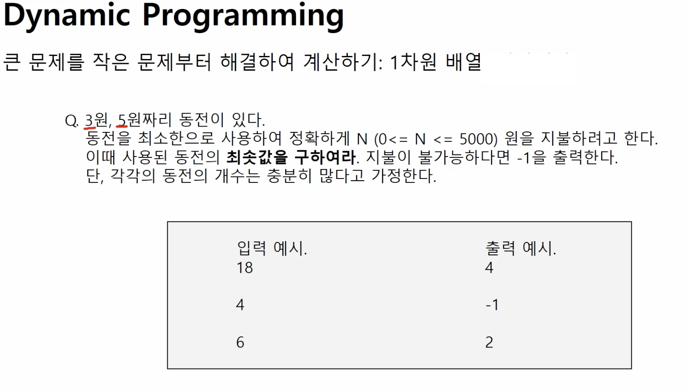
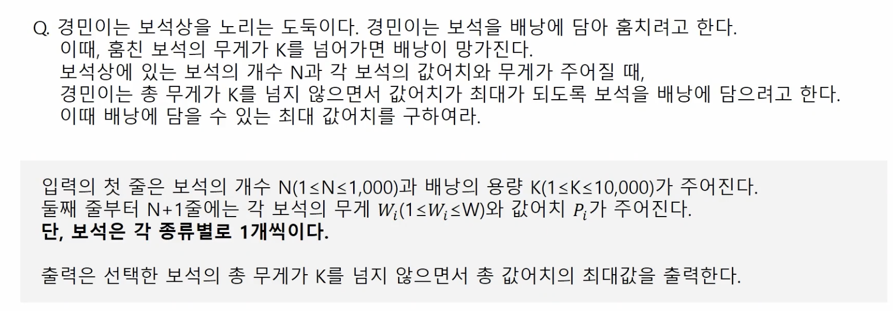
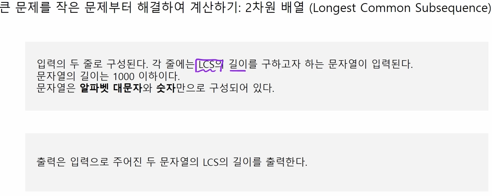
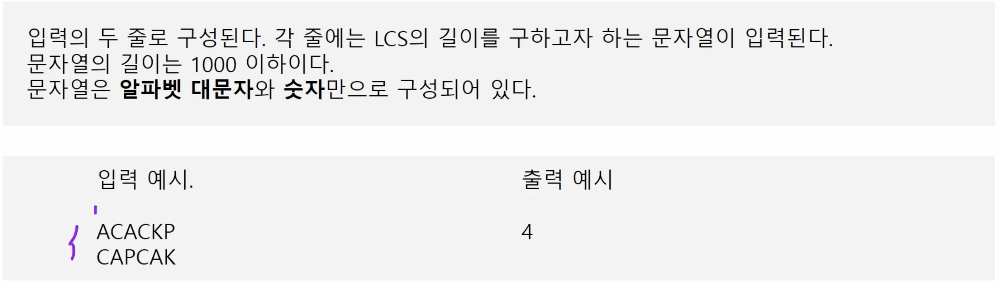

# Coding Test 준비 for '24
- PCCP (프로그래머스 코딩전문역량인증시험 일정)

- '24.2/18 시험 접수해보는 것으로
- Lv3의 문제를 문제없이 풀면 가뿐하다는데...,
- PCCP 시험을 보기 전에, 프로그래머스에서 제공하는 [스킬체크(난이도별)](https://school.programmers.co.kr/skill_checks)를 응시하면 좋은 준비가 될 듯


## 1. Dynamic Programming

- 수열을 떠올리자!
    - 수열은 초항(초기값)을 나타내는 값과,
    - 이 후, 어떠한 관계로 수열이 전개되는지 나타내는 점화식으로 구성된다.
    - ~= 동적프로그래밍 문제는 위 2개를 찾는 문제

- 풀이 방법
    - 점화식이 구해졌다면, 구하는 방식으로 2가지 (top-down / bottom-up)
    - top-down 방식은 재귀호출을 이용하여 프로그래밍
    - bottom-up 방식은 array 를 순차적으로 쌓아가는 방식으로 프로그래밍 하기 수월함

- 기본 문제 
    - 어떤 수열의 점화식과 초항이 유도되어 졌다면 이를 구현하는 방법(bottom-up)
        - [점화식 동적프로그래밍](./dynamic_programming/dp_reccurence.cpp)

- 연습 문제
    1. 금액을 지불하기 위한 동전의 최소 개수, 1차원
        - 
        - [코드](./dynamic_programming/dp_reccurence.cpp)

    2. 보석 배낭 채우기, 2차원
        - 
        - [코드_배열](./dynamic_programming/dp_backpack.cpp)
        - [코드_배열Transpose](./dynamic_programming/dp_backpack_T.cpp)
            - 혼자 풀었을 때, 아이디어는 맞췄는데, 확신이 안서서 헤매었다. 점화식 유도를 클리어하게 하고 구현을 시작하자.
            - 배낭 무게를 늘려나가면서 순회를 하여야지, 보석을 무게 순으로 정렬할 필요가 없어진다.
            - 점화식 유도와 초기값을 잘 설정하는 것 2개 다 잘 정의하여야 한다.

    3. LCS(Longest Common Subsequence), 2차원
        - 
        - 
        - [코드](./dynamic_programming/dp_LCS.cpp)

- 실전 문제 (프로그래머스)
    1. [N으로 표현](https://school.programmers.co.kr/learn/courses/30/lessons/42895)
        - 하.. 조건 하나를 못 주어서 끝내 못 풀고, 답지 보고 다시 품
            - 이거 어렵다...ㅎㅎ Lv3 인데..
        ```c++
            // 아래와 같이 N 하나로도 답이 될 수 도 있는데, N 하나 짜리는 trivial case 로 넣어야 했는데
            // 그렇지 못해 찾아지는 답이 2~8 사이만 나오게 되서 틀렸다 ㅎㅎ
           for(auto data: dp[1])
                if (data==number)
                    return 1;
        ```
        - [코드](./dynamic_programming/programmers1.cpp)

    2. [정수삼각형](https://school.programmers.co.kr/learn/courses/30/lessons/43105)
        - 이거는 한번에 풀었음 Lv3
        - 사실 한번 풀어봤던 문제라.. 
        - [코드](./dynamic_programming/N으로표현.cpp)

    3. [등굣길](https://school.programmers.co.kr/learn/courses/30/lessons/42898)
        - a_star의 변형 정도의 dp 문제인데 왜 8번 시간초과지... 흠흠..
        - a_star풀이가 틀렸나 해서 몇번 생각했는데, 그게 아니고 애초에 a_star처럼 복잡한 길찾기 문제가 아니었기 때문에 훨씬 간단한 dp 알고리즘으로 풀 수 있었던 문제였다. 여러번 종이에 스케치해보면서 혼자 힘으로 풀긴 하였음 
        - [코드](./dynamic_programming/등굣길.cpp) Lv3

    4. [사칙연산](https://school.programmers.co.kr/learn/courses/30/lessons/1843)
        - Lv4 `보통 효율성을 보는 문제는 DFS나 BFS는 거른다고 생각하면 편할 것이다.(항상 그런건 아님 -_-;;)`
        - 이거 어렵다.. ㅎㅎ;;
            - 해설 잘하네... https://school.programmers.co.kr/questions/35224
        - 점화식이 어려운 문제다..
            - 표로 표시하면 아래와 같다. 손으로 체크해보면 점화식을 이해할 수 있다.(처음보고 유도해낼 수 있을까?ㅎㅎ)

            ||연산자|-|+|-|
            |---|---|---|---|---|
            |**숫자**|1|3|5|8|
            |1|1|(1-3)|(1-8, -2+5)|(1-0, -2+3, 3-8)|
            |3||3|(3+5)|(3+3, 8-8)|
            |5|||5|(5-8)|
            |5||||8|

            - 점화식 유도
            ```c++
            for(int step = 0 ; step < n ; ++step){
                for(int i = 0 ; i < (n-step) ; ++i){
                    int j = i + step;
                    if (step == 0)
                        DP[i][i] = "초기값 숫자"
                    else{
                        for (int k = i ; k < j ; ++k){
                            if ("k번째의 연산자" == "+" )
                                MAX_DP[i][j] = max(MAX_DP[i][j], MAX_DP[i][k] + MAX_DP[k+1][j])
                                ...
                        }
                    }
                }
            }
            ```

        - [코드](./dynamic_programming/사칙연산.cpp)
        
    5. [도둑질](https://school.programmers.co.kr/learn/courses/30/lessons/42897)
        - Lv4, 원형 배열의 1차원 DP 문제
        - 쉬운 문제 처럼 보였으나, 원형 배열의 형태여서 특별하게 고려해야 주어야 할 것이 있다.
            - 바로 1차원 배열 1개가 아닌, 2개가 사용해야 풀 수 있는 문제다.
            1. 원형배열의 시작을 고려하되, 끝은 포함되지 않게끔
            2. 원형배열의 끝은 고려하되, 시작은 포함되지 않게끔
            - 그래야지만, 첫 집이 선택됬을 때, 마지막 집이 선택되지 않게끔 할 수 있다.
        - [코드](./dynamic_programming/도둑질.cpp)
            - 정답을 거의 알려준거나 다름 없는 힌트를 보고 풀었다.
                - 해설 잘하시는 분이네 ... https://school.programmers.co.kr/questions/31576

- 백준 (DynamicProgramming)
    1. [타일링](https://www.acmicpc.net/problem/11726)
        - [코드](./dynamic_programming/타일링.cpp)
    2. [타일링2](https://www.acmicpc.net/problem/11727)
        - [코드](./dynamic_programming/타일링2.cpp)
    3. [이친수](https://www.acmicpc.net/problem/2193)
        - [코드](./dynamic_programming/이친수.cpp)
        -  위의 3개 문제가 같은 것이다. 피보나치 수열
            - 이전까지 계산되어온 값 + 이전이전까지 계산되어온 값
    


## 2. Graph Search
- 여기서부터 듣기 ('24.1/13)