# PCCP Coding Test for '24

- PCCP (코딩전문역량인증시험 일정)

  - 
  - Lv3의 문제를 문제없이 풀면 가뿐하다는데,
  - '24.2/18 시험 접수해보는 것으로, 또는 3월 시험 일정
  - PCCP 시험을 보기 전에, 프로그래머스에서 제공하는 [스킬체크(난이도별)](https://school.programmers.co.kr/skill_checks)를 응시하면 좋은 준비가 될 듯

- 맥북 단축키 익히기

  - 코드 러너 단축키: `ctrl+opt+N`
  - 스크린샷: `shift+cmd+4`
  - 마크다운 이미지 붙여넣기: `opt+cmd+v`
  - 터미널 창 토글: ctrl+` (근데 이거 한글입력 상태일 땐 안되고, 영어입력 상태일때만 됨)

- 평일: 손코딩, 퇴근 후 1~3문제
- 주말: 최소 5문제 풀기
  - 1주일에 25문제
  - 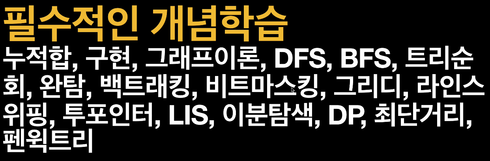
  - 

---

## 1. [인프런 강의1](https://www.inflearn.com/course/%EC%BD%94%EB%94%A9%ED%85%8C%EC%8A%A4%ED%8A%B8-%ED%98%BC%EC%9E%90-%EC%A0%95%EB%B3%B5/dashboard)

### 1-1. Dynamic Programming

- 수열을 떠올리자!

  - 수열은 초항(초기값)을 나타내는 값과,
  - 이 후, 어떠한 관계로 수열이 전개되는지 나타내는 점화식으로 구성된다.
  - ~= 동적프로그래밍 문제는 위 2개를 찾는 문제

- 풀이 방법

  - 점화식이 구해졌다면, 구하는 방식으로 2가지 (top-down / bottom-up)
  - top-down 방식은 재귀호출을 이용하여 프로그래밍
  - bottom-up 방식은 array 를 순차적으로 쌓아가는 방식으로 프로그래밍 하기 수월함

- 기본 문제

  - 어떤 수열의 점화식과 초항이 유도되어 졌다면 이를 구현하는 방법(bottom-up)
    - [점화식 동적프로그래밍](./1_dp/dp_reccurence.cpp)

- 연습 문제

  1. 금액을 지불하기 위한 동전의 최소 개수, 1차원

     - 
     - [코드](./1_dp/dp_reccurence.cpp)

  2. 보석 배낭 채우기, 2차원

     - 
     - [코드\_배열](./1_dp/dp_backpack.cpp)
     - [코드\_배열Transpose](./1_dp/dp_backpack_T.cpp)
       - 혼자 풀었을 때, 아이디어는 맞췄는데, 확신이 안서서 헤매었다. 점화식 유도를 클리어하게 하고 구현을 시작하자.
       - 배낭 무게를 늘려나가면서 순회를 하여야지, 보석을 무게 순으로 정렬할 필요가 없어진다.
       - 점화식 유도와 초기값을 잘 설정하는 것 2개 다 잘 정의하여야 한다.

  3. LCS(Longest Common Subsequence), 2차원
     - 
     - 
     - [코드](./1_dp/dp_LCS.cpp)

- 실전 문제 (프로그래머스)

  1. [N으로 표현](https://school.programmers.co.kr/learn/courses/30/lessons/42895)

     - 하.. 조건 하나를 못 주어서 끝내 못 풀고, 답지 보고 다시 품
       - 이거 어렵다...ㅎㅎ Lv3 인데..

     ```c++
         // 아래와 같이 N 하나로도 답이 될 수 도 있는데, N 하나 짜리는 trivial case 로 넣어야 했는데
         // 그렇지 못해 찾아지는 답이 2~8 사이만 나오게 되서 틀렸다 ㅎㅎ
        for(auto data: dp[1])
             if (data==number)
                 return 1;
     ```

     - [코드](./1_dp/N으로표현.cpp)

  2. [정수삼각형](https://school.programmers.co.kr/learn/courses/30/lessons/43105)

     - 이거는 한번에 풀었음 Lv3
     - 사실 한번 풀어봤던 문제라..
     - [코드](./1_dp/정수삼각형.cpp)

  3. [등굣길](https://school.programmers.co.kr/learn/courses/30/lessons/42898)

     - a_star의 변형 정도의 dp 문제인데 왜 8번 시간초과지... 흠흠..
     - a_star풀이가 틀렸나 해서 몇번 생각했는데, 그게 아니고 애초에 a_star처럼 복잡한 길찾기 문제가 아니었기 때문에 훨씬 간단한 dp 알고리즘으로 풀 수 있었던 문제였다. 여러번 종이에 스케치해보면서 혼자 힘으로 풀긴 하였음
     - [코드](./1_dp/등굣길.cpp) Lv3

  4. [사칙연산](https://school.programmers.co.kr/learn/courses/30/lessons/1843)

     - Lv4 `보통 효율성을 보는 문제는 DFS나 BFS는 거른다고 생각하면 편할 것이다.(항상 그런건 아님 -_-;;)`
     - 이거 어렵다.. ㅎㅎ;;
       - 해설 잘하네... https://school.programmers.co.kr/questions/35224
     - 점화식이 어려운 문제다..

       - 표로 표시하면 아래와 같다. 손으로 체크해보면 점화식을 이해할 수 있다.(처음보고 유도해낼 수 있을까?ㅎㅎ)

       |          | 연산자 | -     | +           | -                |
       | -------- | ------ | ----- | ----------- | ---------------- |
       | **숫자** | 1      | 3     | 5           | 8                |
       | 1        | 1      | (1-3) | (1-8, -2+5) | (1-0, -2+3, 3-8) |
       | 3        |        | 3     | (3+5)       | (3+3, 8-8)       |
       | 5        |        |       | 5           | (5-8)            |
       | 5        |        |       |             | 8                |

       - 점화식 유도

       ```c++
       for(int step = 0 ; step < n ; ++step){
           for(int i = 0 ; i < (n-step) ; ++i){
               int j = i + step;
               if (step == 0)
                   DP[i][i] = "초기값 숫자"
               else{
                   for (int k = i ; k < j ; ++k){
                       if ("k번째의 연산자" == "+" )
                           MAX_DP[i][j] = max(MAX_DP[i][j], MAX_DP[i][k] + MAX_DP[k+1][j])
                           ...
                   }
               }
           }
       }
       ```

     - [코드](./1_dp/사칙연산.cpp)

  5. [도둑질](https://school.programmers.co.kr/learn/courses/30/lessons/42897)
     - Lv4, 원형 배열의 1차원 DP 문제
     - 쉬운 문제 처럼 보였으나, 원형 배열의 형태여서 특별하게 고려해야 주어야 할 것이 있다.
       - **바로 1차원 배열 1개가 아닌, 2개가 사용해야 풀 수 있는 문제다.**
         1. 원형배열의 시작을 고려하되, 끝은 포함되지 않게끔
         2. 원형배열의 끝은 고려하되, 시작은 포함되지 않게끔
       - 그래야지만, 첫 집이 선택됬을 때, 마지막 집이 선택되지 않게끔 할 수 있다.
     - [코드](./1_dp/도둑질.cpp)
       - 정답을 거의 알려준거나 다름 없는 힌트를 보고 풀었다.
         - 해설 잘하시는 분이네 ... https://school.programmers.co.kr/questions/31576

- 백준 (DynamicProgramming)
  1. [타일링](https://www.acmicpc.net/problem/11726)
     - [코드](./1_dp/타일링.cpp)
  2. [타일링2](https://www.acmicpc.net/problem/11727)
     - [코드](./1_dp/타일링2.cpp)
  3. [이친수](https://www.acmicpc.net/problem/2193)
     - [코드](./1_dp/이친수.cpp)
     - 위의 3개 문제가 같은 것이다. 피보나치 수열
       - 이전까지 계산되어온 값 + 이전이전까지 계산되어온 값

### 1-2. Graph Search

- 그래프
  - Node(정점, Vertex)와 Edge(간선)으로 이루어져 있음
  - `G = (V, E)`
  - 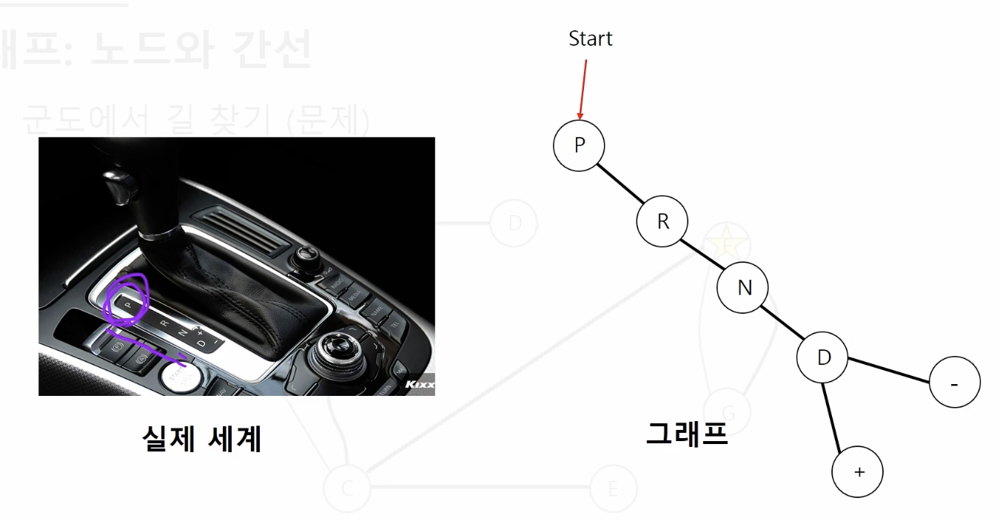
- 탐색알고리즘(BFS너비우선탐색, DFS깊이우선탐색)
  - BFS는 `Queue: candidates`를 관리하고 순차적으로 방문하는 방식으로 구현
    1. 탐색 후 방문
    2. 큐(FIFO)의 역할: 탐색 노드(방문 예정 노드) 저장
  - DFS는 recursively하게 호출하는 형태로 구현하는 것이 간단하다.
    1. 즉시 방문
    2. 스택(LIFO)의 역할: 지금까지 방문한 노드 모두 저장(Trace)
       - 실제로 스택 자료구조를 사용할 수도 있지만, 재귀호출(recursively fcn call)로 구현하는 것이 구현에 있어 단순함
- 기본문제(길찾기)
  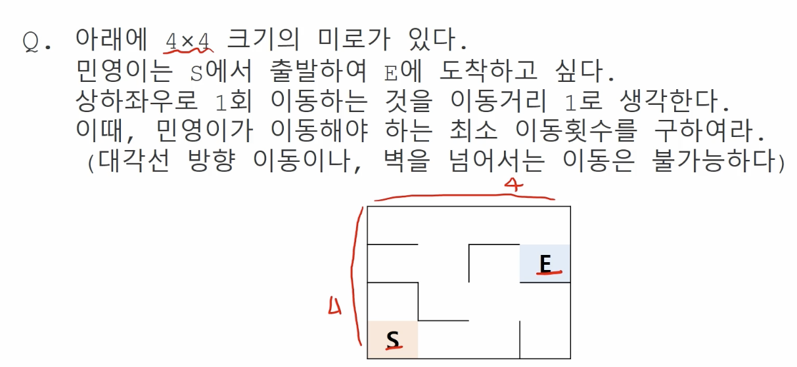

  - 최소 이동 거리를 찾는 문제이므로 BFS로 접근
    - 미로의 자료구조를 그래프로 한다면 아래와 같이 표현할 수 있겠음
      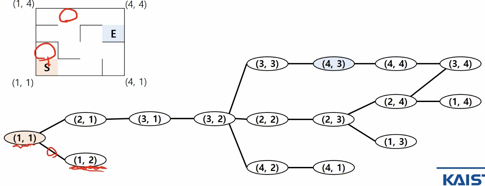
  - 직접 구현한 예제에서는 2차원 격자로 표현하였음 (보통은 2차원 격자로 풀 수 있게 주어진다)

    - [길찾기](./1_graph/길찾기_BFS.cpp)

  - DFS로도 풀어보자
    - [길찾기2](./1_graph/길찾기_DFS.cpp)
    - 설명만 듣고 풀었는데, 구현이 엉성한 듯함
    - 예전에 한번 들은 강의인데, 구현 디테일을 깜빡한듯..ㅠ

#### 1-2-1. BFS(너비우선탐색)

1. 장기문제

   - 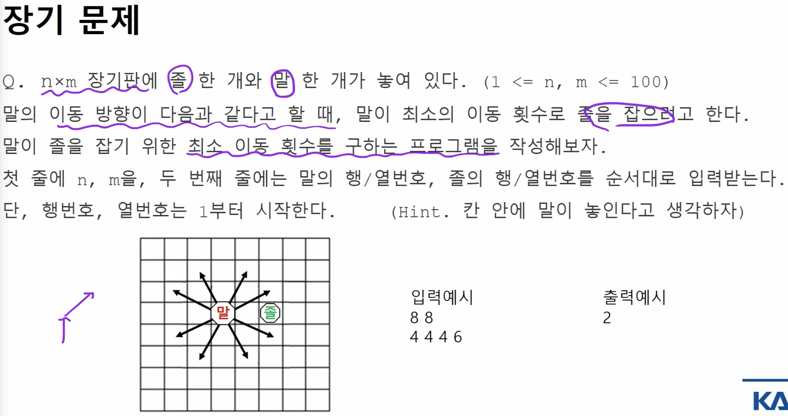
   - [장기문제](./1_graph/장기문제_BFS.cpp)

2. 상한 귤
   - 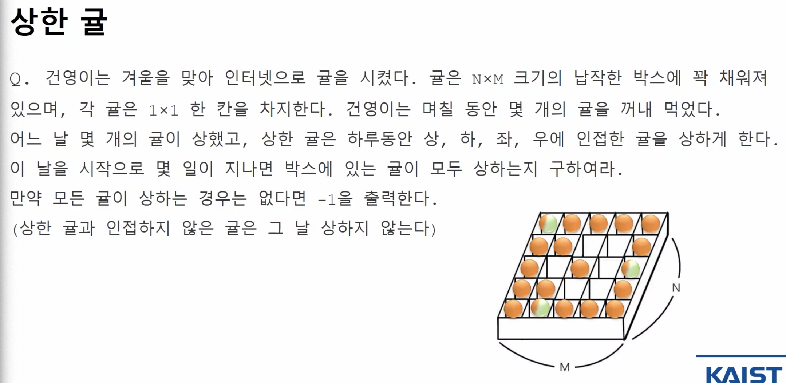
   - 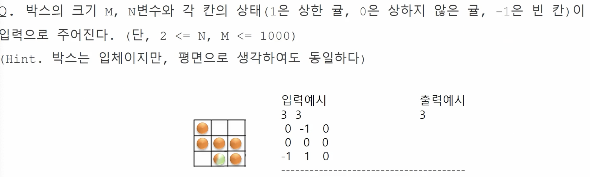
   - [상한귤](./1_graph/상한귤_BFS.cpp)

#### 1-3-1. DFS(깊이우선탐색)

- DFS 구현은 Stack 자료형을 직접 사용할 수도 있지만 재귀호출(호출 스택)을 이용해서 구현하는 것이 쉽다.
  - 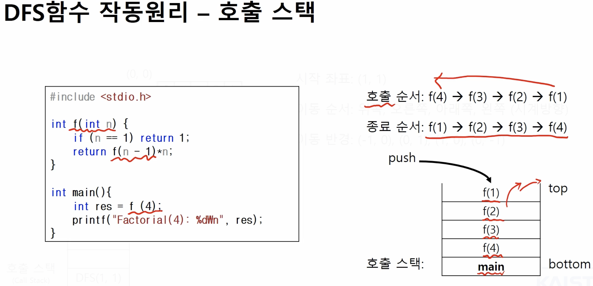

1. 아파트 단지

   - 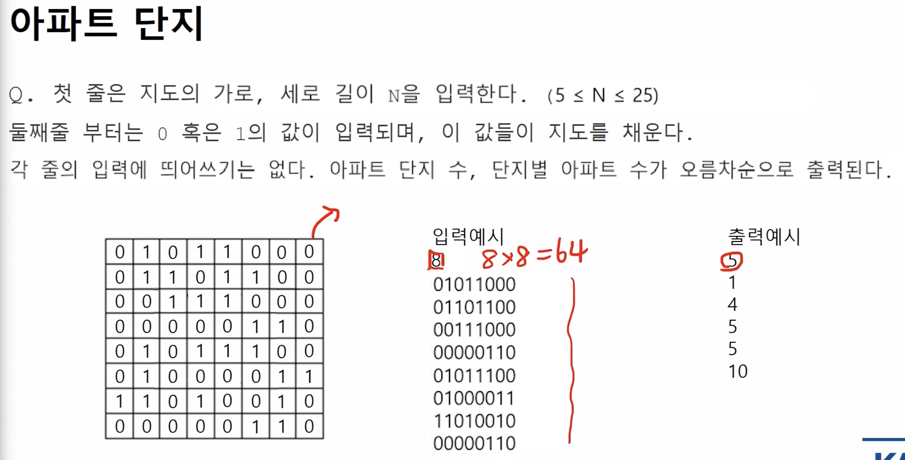
   - DFS는 함수를 호출하는 형태니까, 전역변수를 활용해서 구현하는 것이 함수의 프로토타입이 단순해서 좋을 듯 하다.
   - [아파트단지](./1_graph/아파트단지_DFS.cpp)

2. 욕심쟁이 조이
   - 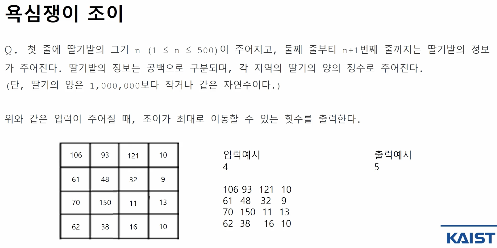
   - 아래 코드 처럼 풀면 매번 모든 좌표마다 DFS를 실행하게 되는 것으로 엄청난 연산 횟수를 필요로 하게 된다.
     - [욕심쟁이 조이 Worst](./1_graph/욕심쟁이조이Worst_DFS.cpp)
   - 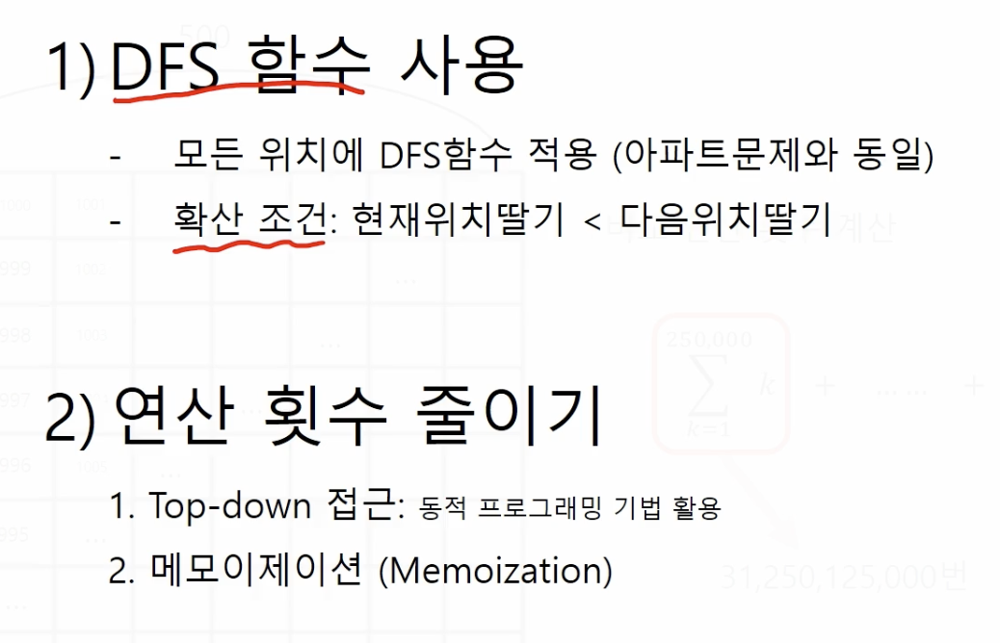
     - 연산 횟수를 줄일 수 있는 방법을 강구해야한다.
       - 어쩐지 DFS로만 구현하니까 이거 DP로도 풀 수 있을것 같은 느낌/비효율적일거같은 느낌이 들었다.
     - 다시 풀었는데, 오래 걸렸다. 호출 스택의 최상단 종료 시점과 최하단의 탈출 출력에 대해 고민했다.
       - [욕심쟁이 조이 한번 더](./1_graph/욕심쟁이조이Again.cpp)

---

## 2. [인프런 강의2](https://www.inflearn.com/course/10%EC%A3%BC%EC%99%84%EC%84%B1-%EC%BD%94%EB%94%A9%ED%85%8C%EC%8A%A4%ED%8A%B8-%ED%81%B0%EB%8F%8C/dashboard)

- [알고리즘 수업자료](./material/알고리즘교안.pdf)
- [문제 및 해설](./material/알고리즘+문제해설.pdf)

### 2-1. 기본

1. 재귀함수(recursion)

- 
- 첫 문단에는 반드시 기저사례 (종료조건)을 포함해야 한다,
- 두번째 문단은 재귀호출을 하는 라인이 위치
  - 사이클이 있다면 쓰면 안된다. (종료가 안됨)
- 마지막은 최종적으로 return 하고 싶은 값이 있다면 위치할 것
  - 반복문으로 될 것 같으면 반복문으로 작성하는 것이 낫다.

2. 순열(permutation)과 조합(combination)

- 순열(permutation)은 순서가 상관있는 나열

  - `std::next_permutation(begin(), end()) 오름차순으로 만들어줌`
  - STL을 쓸 때, 배열은 정렬이 되어 있어야 함 (오름차순에 맞게)
  - `std::prev_permutation(begin(), end()) 내림차순으로 만들어줌`
  - [직접 구현은 재귀함수로 구현](./2_basic/permutation_self.cpp)

- 조합(combination)은 순서가 상관없는 나열
  - [combination 직접구현: 외워라 무조건](./2_basic/combination_self.cpp)
  - [3개를 뽑는 것이면 for문 3개로도 풀 수 있다](./2_basic/combination_for.cpp)

3. split() 함수

- "aaa bbb ccc" => {"aaa", "bbb", "ccc"}
  - STL에 `split`는 제공하지 않는다. 만들면 됨
  ```c++
  while ((pos = input.find(delimeter)) != string::npos){
      token = input.substr(0, pos); // token에 찾은 부분을 넣어주고
      ret.push_back(token);
      input.erase(0, pos + delimeter.length()); // delimeter를 포함해서 지운다
  }
  ret.push_back(input); // 마지막 나머지도 ret 에 넣어줘야지
  ```

4. 메모리와 포인터

- 메모리는 1바이트의 셀들로 이루어져있고, 각 셀들은 고유한 주소를 갖는다.
  - int는 4바이트니까, int를 선언하면, 4개의 셀을 예약하게 된다.
- 포인터는 메모리의 주소를 가리키는 타입 `Node* p`
  - 포인터의 크기 (sizeof(p) = 8 <64비트 운영체제라면>)는 운영체제에 따라 다름
- 역참조(dereference)
  - 포인터 주소가 가리키는 value를 풀어헤친다는 의미지
  ```c++
  string a = "adv" // define & declaration
  string *b = &a; // point
  *b = "ggg" ; // de-reference
  ```
- 배열의 포인터

  - 배열의 이름 = 주소값 (=Array to Pointer decay)

  ```c++
  int a[N];
  int *c = a; // array to pointer decay, a 배열의 크기는 날라갔지만 이렇게 나타낼 수 있다는 것, 이렇게 될 경우 a의 첫번째 주소가 배열의 주소로 binding된다.

  int* c = &a[0]; // 위와 같은 것임
  ```

5. 중복된 요소 제거

- `{1,1,2,2,3,3}`
- 가장 간단하게 구현하는 방법은 map 구조를 이용해서 map[1] = true; [이런식으로](./2_basic/map_for_unique.cpp)
- STL에 구현되어 있는 함수 [`unique()`](./2_basic/unique.cpp)
  - `V.erase(unique(V.begin(), V.end()), V.end());`

### 2-2. 1주차: 시간복잡도, 빅오표기법, 공간복잡도, 누적합, 구현

- 시간복잡도: 어떠한 알고리즘이 주어진 입력크기를 기반으로 어떠한 로직이 몇번 반복되었는가

  - 빅오표기법(Big-Order): e.g. $O(n^2)$
    - 복잡도에 가장 영향을 많이 끼치는 항의 상수인자를 빼고 나머지 항을 없애서 복잡도를 나타내는 표기법
    - 
  - 재귀함수의 시간복잡도는: `main Logic`복잡도 + `재귀함수`총 호출 횟수
  - 문제에서 풀라고 하면 `count`를 직접 찍어보고 유추해보는 식으로

- 공간복잡도: 입력 크기에 대해 어떠한 알고리즘이 실행되는데 필요한 변수(메모리) 공간의 양
    - 문제를 푼다고 하면, 문제에 주어진 `최대범위`, `메모리제한`(512mb) -> 512,000,000 -> int 배열이라면 `/4`한 만큼 쓸 수 있다는 의미

- 누적합: `prefixSum`
    - 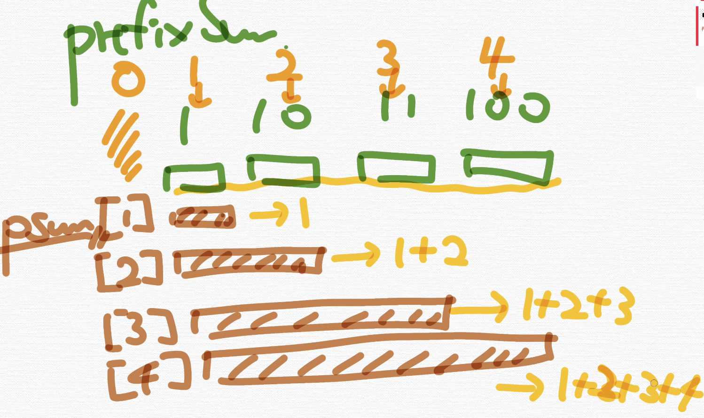
    - 문제 유형: 구간 합 구하기(`구간쿼리`) -> 누적합을 떠올려야함 또는 펜윅트리(`동적배열인 경우`)

- 구현: 말 그대로 문제 그대로 구현하면 됨
    - 예를 들어, 배열을 회전(`void reverse(v.begin(), v.end())`하라 스택에 넣어라 등.

- 카운팅Star: 어떤 요소가 나온 횟수를 세기 `맵 또는 배열` 자료구조로 구현
  - Map: string 요소일 경우 / sparse 한 요소일 경우
    - 알파벳도 아스키코드로 이루어져있으니까 배열이 나음
      - `v[input[i] - 'a'] += 1;`
    - 아스키코드 2개만 외워: "A: 65 / a:97" , 총 알파벳은 25개임
  - 배열: integer 요소일 경우

- 백준 풀기
  - [boj2309](./2_1주차/boj2309.cpp) // 1-A
  - [boj10808](./2_1주차/boj10808.cpp) // 1-B
  - [boj2979 나쁘게 푼 예시](./2_1주차/boj2979_bad.cpp)
    - 구현문제처럼 긴 코드로 풀었는데..., 아래 처럼 푸는게 시간복잡도는 같긴 하지만 라인수가 적어 더 좋은 코드입니다.
    - [boj2979](./2_1주차/boj2979.cpp) // 1-C
  - [boj10988](./2_1주차/boj10988.cpp) // 1-D
  - [boj1159](./2_1주차/boj1159.cpp) // 1-E
    - 참고삼아, 아스키코드로 A는 65 , a는 97에 대응된다. 알파벳은 26개이다.
  - [boj11655](./2_1주차/boj11655.cpp) // 1-F
    - `getline(cin, s);`
  - [boj9996](./2_1주차/boj9996.cpp) // 1-G
    - 흠... 문제를 정확히 파악 못해서 왜맞틀만 반복하고 못 풀었음
    - string parsing 하는 것을 외우자
      ```c++
      int pos = pattern.find("*");
      string pre, suf;
      pre = pattern.substr(0,pos); // 구간 자르기 (begin_pos, end_pos)
      suf = pattern.substr(pos+1); // pos+1 하나의 인자만을 넘겨준 상황에선 pattern 문자열의 끝까지 자르게 된다.
      ```
  - [boj2559](./2_1주차/boj2559.cpp)
