# PCCP Coding Test for '24

- PCCP (코딩전문역량인증시험 일정)

  - 
  - Lv3의 문제를 문제없이 풀면 가뿐하다는데,
  - '24.4월, 5월 중에 시험 응시하는 것이 목표임
  - PCCP 시험을 보기 전에, 프로그래머스에서 제공하는 [스킬체크(난이도별)](https://school.programmers.co.kr/skill_checks)를 응시하면 좋은 준비가 될 듯

- 맥북 단축키 익히기

  - 코드 러너 단축키: `ctrl+opt+N`
  - 스크린샷: `shift+cmd+4`
  - 마크다운 이미지 붙여넣기: `opt+cmd+v`
  - 터미널 창 토글: ctrl+` (근데 이거 한글입력 상태일 땐 안되고, 영어입력 상태일때만 됨)

- 평일: 손코딩, 퇴근 후 1~3문제
- 주말: 최소 5문제 풀기
  - 1주일에 25문제
  - 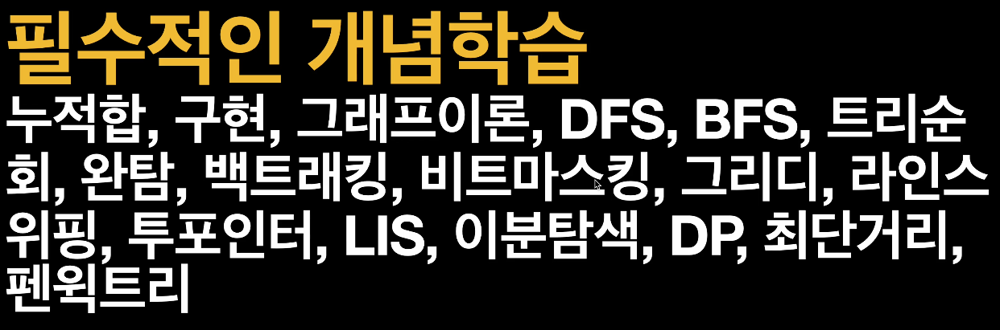
  - 

---

## 2. [인프런 강의2](https://www.inflearn.com/course/10%EC%A3%BC%EC%99%84%EC%84%B1-%EC%BD%94%EB%94%A9%ED%85%8C%EC%8A%A4%ED%8A%B8-%ED%81%B0%EB%8F%8C/dashboard)

1. [알고리즘 수업자료](./material/알고리즘교안.pdf)
2. [문제 및 해설](./material/알고리즘+문제해설.pdf)

### 2-1. 기본

1. 재귀함수(recursion)

- 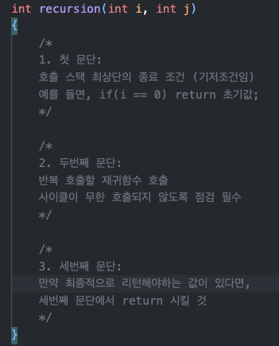
- 첫 문단에는 반드시 기저사례 (종료조건)을 포함해야 한다,
- 두번째 문단은 재귀호출을 하는 라인이 위치
  - 사이클이 있다면 쓰면 안된다. (종료가 안됨)
- 마지막은 최종적으로 return 하고 싶은 값이 있다면 위치할 것
  - 반복문으로 될 것 같으면 반복문으로 작성하는 것이 낫다.

2. 순열(permutation)과 조합(combination)

- 순열(permutation)은 순서가 상관있는 나열

  - `std::next_permutation(begin(), end()) 오름차순으로 만들어줌`
  - STL을 쓸 때, 배열은 정렬이 되어 있어야 함 (오름차순에 맞게)
  - `std::prev_permutation(begin(), end()) 내림차순으로 만들어줌`
  - [직접 구현은 재귀함수로 구현](./2_0기본/permutation_self.cpp)

- 조합(combination)은 순서가 상관없는 나열
  - [combination 직접구현: 외워라 무조건](./2_0기본/combination_self.cpp)
  - [3개를 뽑는 것이면 for문 3개로도 풀 수 있다](./2_0기본/combination_for.cpp)

3. split() 함수

- "aaa bbb ccc" => {"aaa", "bbb", "ccc"}
  - STL에 `split`는 제공하지 않는다. 만들면 됨
  ```c++
  while ((pos = input.find(delimeter)) != string::npos){
      token = input.substr(0, pos); // token에 찾은 부분을 넣어주고
      ret.push_back(token);
      input.erase(0, pos + delimeter.length()); // delimeter를 포함해서 지운다
  }
  ret.push_back(input); // 마지막 나머지도 ret 에 넣어줘야지
  ```

4. 메모리와 포인터

- 메모리는 1바이트의 셀들로 이루어져있고, 각 셀들은 고유한 주소를 갖는다.
  - int는 4바이트니까, int를 선언하면, 4개의 셀을 예약하게 된다.
- 포인터는 메모리의 주소를 가리키는 타입 `Node* p`
  - 포인터의 크기 (sizeof(p) = 8 <64비트 운영체제라면>)는 운영체제에 따라 다름
- 역참조(dereference)
  - 포인터 주소가 가리키는 value를 풀어헤친다는 의미지
  ```c++
  string a = "adv" // define & declaration
  string *b = &a; // point
  *b = "ggg" ; // de-reference
  ```
- 배열의 포인터

  - 배열의 이름 = 주소값 (=Array to Pointer decay)

  ```c++
  int a[N];
  int *c = a; // array to pointer decay, a 배열의 크기는 날라갔지만 이렇게 나타낼 수 있다는 것, 이렇게 될 경우 a의 첫번째 주소가 배열의 주소로 binding된다.

  int* c = &a[0]; // 위와 같은 것임
  ```

5. 중복된 요소 제거

- `{1,1,2,2,3,3}`
- 가장 간단하게 구현하는 방법은 map 구조를 이용해서 map[1] = true; [이런식으로](./2_0기본/map_for_unique.cpp)
- STL에 구현되어 있는 함수 [`unique()`](./2_0기본/unique.cpp)
  - `V.erase(unique(V.begin(), V.end()), V.end());`

### 2-2. 1주차: 시간복잡도, 빅오표기법, 공간복잡도, 누적합, 구현

- 시간복잡도: 어떠한 알고리즘이 주어진 입력크기를 기반으로 어떠한 로직이 몇번 반복되었는가

  - 빅오표기법(Big-Order): e.g. $O(n^2)$
    - 복잡도에 가장 영향을 많이 끼치는 항의 상수인자를 빼고 나머지 항을 없애서 복잡도를 나타내는 표기법
    - 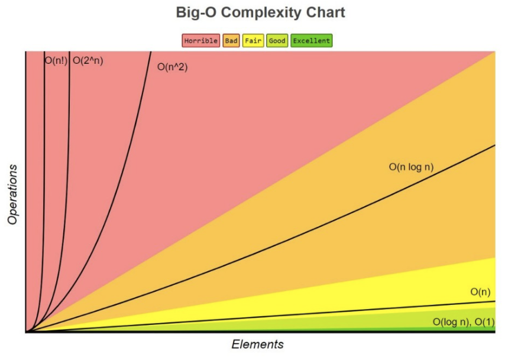
  - 재귀함수의 시간복잡도는: `main Logic`복잡도 + `재귀함수`총 호출 횟수
  - 문제에서 풀라고 하면 `count`를 직접 찍어보고 유추해보는 식으로

- 공간복잡도: 입력 크기에 대해 어떠한 알고리즘이 실행되는데 필요한 변수(메모리) 공간의 양

  - 문제를 푼다고 하면, 문제에 주어진 `최대범위`, `메모리제한`(512mb) -> 512,000,000 -> int 배열이라면 `/4`한 만큼 쓸 수 있다는 의미

- 누적합: `prefixSum`

  - 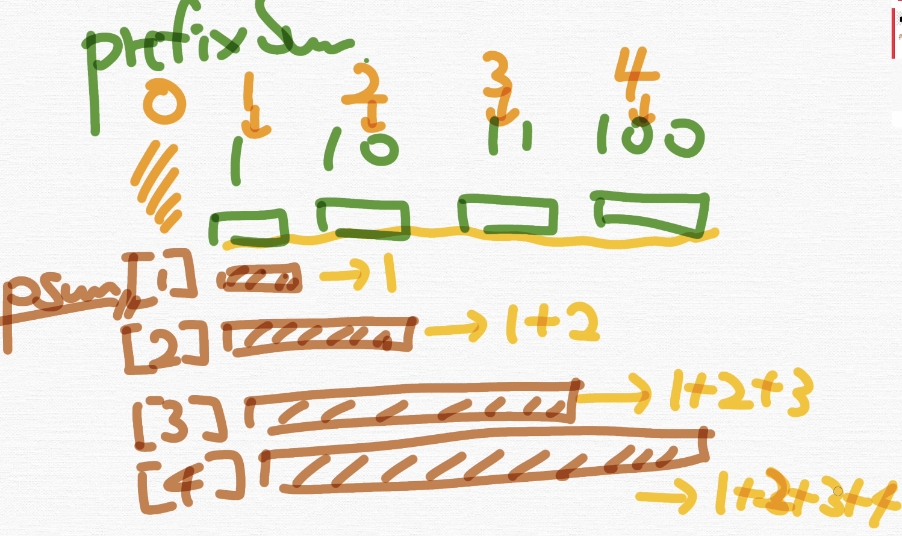
  - 문제 유형: 구간 합 구하기(`구간쿼리`) -> 누적합을 떠올려야함 또는 펜윅트리(`동적배열인 경우`)

- 구현: 말 그대로 문제 그대로 구현하면 됨

  - 예를 들어, 배열을 회전(`void reverse(v.begin(), v.end())`하라 스택에 넣어라 등.

- 카운팅Star: 어떤 요소가 나온 횟수를 세기 `맵 또는 배열` 자료구조로 구현

  - Map: string 요소일 경우 / sparse 한 요소일 경우
    - 알파벳도 아스키코드로 이루어져있으니까 배열이 나음
      - `v[input[i] - 'a'] += 1;`
    - 아스키코드 2개만 외워: "A: 65 / a:97" , 총 알파벳은 25개임
  - 배열: integer 요소일 경우

#### 백준 풀기(1주차)

  - [boj2309](./2_1주차/boj2309.cpp) // 1-A
  - [boj10808](./2_1주차/boj10808.cpp) // 1-B
  - [boj2979 나쁘게 푼 예시](./2_1주차/boj2979_bad.cpp)
    - 구현문제처럼 긴 코드로 풀었는데..., 아래 처럼 푸는게 시간복잡도는 같긴 하지만 라인수가 적어 더 좋은 코드입니다.
    - [boj2979](./2_1주차/boj2979.cpp) // 1-C
  - [boj10988](./2_1주차/boj10988.cpp) // 1-D
  - [boj1159](./2_1주차/boj1159.cpp) // 1-E
    - 참고삼아, 아스키코드로 A는 65 , a는 97에 대응된다. 알파벳은 26개이다.
  - [boj11655](./2_1주차/boj11655.cpp) // 1-F
    - `getline(cin, s);`
  - [boj9996](./2_1주차/boj9996.cpp) // 1-G
    - 흠... 문제를 정확히 파악 못해서 왜맞틀만 반복하고 못 풀었음
    - string parsing 하는 것을 외우자
      ```c++
      int pos = pattern.find("*");
      string pre, suf;
      pre = pattern.substr(0,pos); // 구간 자르기 (begin_pos, end_pos)
      suf = pattern.substr(pos+1); // pos+1 하나의 인자만을 넘겨준 상황에선 pattern 문자열의 끝까지 자르게 된다.
      ```
  - [boj2559](./2_1주차/boj2559.cpp) // 1-H
    - DP로 풀었는데, 구간합으로 푸는것도 좋다.
    - 시간복잡도는 O(N)으로 동일함
  - [boj1620](./2_1주차/boj1620.cpp) // 1-I
    - 혼자 못 풀었다...;
      1. 맵을 두개 써야 한다.
         왜냐면, pockets 를 하나 써서, int 가 나오면 pockets.begin() + number 로 찾아가려고 했는데,
         맵같은 경우는 array와 다르게 순서대로 저장되는 형태가 아니기 떄문에 그래선 안된다.
      2. atoi(s.c_str()) 을 통과할 경우 int가 아닌 것들은 0이 리턴된다.
         이를 통해 int인지 아닌지 구분할 수 있다.
  - [boj9375](./2_1주차/boj9375.cpp) // 1-J
    - 혼자 풀었더니, Timeout이 발생하였음
      - 모든 Combination을 직접 구한다음에 값을 계산하려고 하였음 [boj9375_timeout](./2_1주차/boj9375_timeout.cpp)
    - Timeout을 해소하려면 아이디어가 필요함
      - 선글라스 3종류, 헤드기어 2종류가 있다면, 문제에선 아무것도 안 입는것만을 제외하고 모든 경우의 수를 구하라고 했으니까
      - 선글라스 3+1(안입는) , 헤드기어 2+1(안입는) = 4 x 3 = 12 -1 (아무것도 안입는) 방식을 통해 구할 수 있다.
        - 아이디어가 필요한 문제였음
      - 경우의 수를 구하는 문제의 경우 `answer` 변수를 `long long`으로 선언하자
  - [boj1213](./2_1주차/boj1213.cpp) // 1-K
    - 타임아웃 STL을 이용해서 라인수를 짧게 해서 풀었는데.., 시간초과 뜬다.
    - 시간을 단축해서 풀어야하는 문제임 [boj1213_timeout](./2_1주차/boj1213_timeout.cpp)
    - 강의를 보니, 규칙을 파악해서 시간을 단축할 수 있는 방법으로 풀어야함
      - 그리디 알고리즘
        1. 홀수 알파벳이 2개 이상이면 팰린드롬을 만들 수 없다.
        2. 생성할 팰린드롬은 가장 알파벳이 큰 값부터 `mid`에 붙여 나가는 식으로 생성한다.
  - [boj1940](./2_1주차/boj1940.cpp) // 1-L
    - 처음 시도에서 오래 걸렸다.
    - 문제에서 분명히 2개만 고른다고 했는데도 나는, 고르는 재료의 개수는 상관없는지 알고,
      - 모든 조합, nC1, nC2, nC3, nC4 ... 순서로 조합을 찾아가며 조건을 만족하면
      - 해당 원소는 지우는 형태로 로직을 구현하려고 했다.
    - 그럴 필요가 없는 문제였다 ㅠㅠㅠ.. 문제좀 잘 읽어 꼼꼼하게
    - 2개를 뽑는 문제임을 알고 `recursively` 하게 combination을 구해서 조건을 만족하는지
      체크하는 코드를 구현했는데, 메모리 초과가 났다.
      - 이렇게 푸는게 아닌가 해서.. 강의를 들으니까.. combination을 2중 for문을 통해서 만들어내서
        메모리 초과는 없게 알고리즘을 만들었더라.
      - 외우자.. nC3 까지는 for문으로 구현하고 그보다 큰 경우에 recursive로 구하자.
      - [boj1940\_메모리아웃](./2_1주차/boj1940_메모리아웃.cpp)
  - [boj3986](./2_1주차/boj3986.cpp) // 1-M

    - 이건 혼자 풀었다.
    - stack 자료구조를 이용하면 풀 수 있는 문제다.
    - 이런 `ABABAB..` 등의 순서를 갖는 문자열을 해결하는 문제를 만났을 때, 풀이가 떠오르지 않으면
      - 주어진 문자열을 뒤집어도 보고 90도 회전도 해보고 앞뒤로도 붙여보면서 종이에 써서 아이디어를 떠올려 봐라
    - 문제에서 만약에 `짝짓기 또는 폭발`이라는게 나오면 `stack`을 떠올려라

  - [boj1629](./2_1주차/boj1629.cpp) // 1-N
    - 굉장히 유명한 문제임
    - 분할정복 문제라는 힌트를 보고 (log2N)의 복잡도를 갖게끔 풀었다
    - 처음에는 for 문으로 접근해서 풀었는데, 당연히 시간초과고,,,
    - log2N 방식으로 푼 이후에도 틀렸다고 나왔는데, 문제에서 주어진 최대값 조건을 보고 풀어야한다.
      - 문제에서 변수의 최대값을 보면 32bit 자료형인데 꽤 큰 값이기 때문에 모든 연산에 `%C`를 해주어서 중간중간 mod 값을 계산해주면서 풀어야한다.
    - 모듈러 연산 (`곱하기 더하기에 대한 분배법칙이 성립한다.`)
      1. $(a+b)\%c = a\%c + b\%c$
      - 증명:
        $$
        a = q1*c + r1, b = q2*c + r2  이므로,
        ((q1+q2)*c+r1+r2)\%c
        = (r1+r2)\%c
        = r1\%c + r2\%c
        = a\%c + b\%c 가 성립한다.
        $$
      2. $(a*b)\%c = a\%c * b\%c$
  - [boj4375](./2_1주차/boj4375.cpp) // 1-O
    - 혼자 못풀었음
    - 최대공약수가 자기 자신이 나오면, 그 말은 배수라는 뜻이니까,, 그렇게 되면 정답을 찾게되는거니까 gcd 알고리즘을 만들어서 해봣는데
      - 시간초과입니다.
      - 구현해놓고 생각해보니, 최대공약수 구하는거나 바로 `111%a==0` 확인하는거나 시간복잡도 측면에선 차이가 없을듯하네 [boj4375_timepout](./2_1주차/boj4375_timeout.cpp)
    - 최대공약수는 전혀 만들필요가 없었고요...
    - 모듈러 연산의 특성을 이용하는 문제였음
      - 아래 코드처럼 mod 값을 계속 증가시키게 되는데, 이 때 중간 연산인 `mod = (mod*10+1)%N` 해주는 방식으로 풀면된다.
        ```c++
        if (mod%N == 0){
          cout << i << "\n";
          break;
        }
        mod = (mod * 10 + 1)%N; // 모듈러 연산의 특성을 이용해서 중간계산을 계속 해주어도 된다.
        ```

### 2-3. 2주차: 그래프이론 DFS BFS

1. 그래프

- 그래프: 정점(vertex)와 간선(edge)로 이루어진 집합(세트)를 그래프라고 함
- 정점(Vertex)는 노드라고도 불림. 즉, 점
- 간선(Edge)는 정점을 잇는 선을 의미함
  - 단방향 간선도 있고, 양방향 간선도 있고,
  - 예를 들어 `u->v` (단방향 간선)
- 가중치: 정점(vertex)와 정점(vertex) 사이의 간선을 이동하는데 드는 비용
  1. in degree
     : 해당 정점으로 들어오는 간선의 개수
  2. out degree
     : 해당 정점을 나가는 간선의 개수
     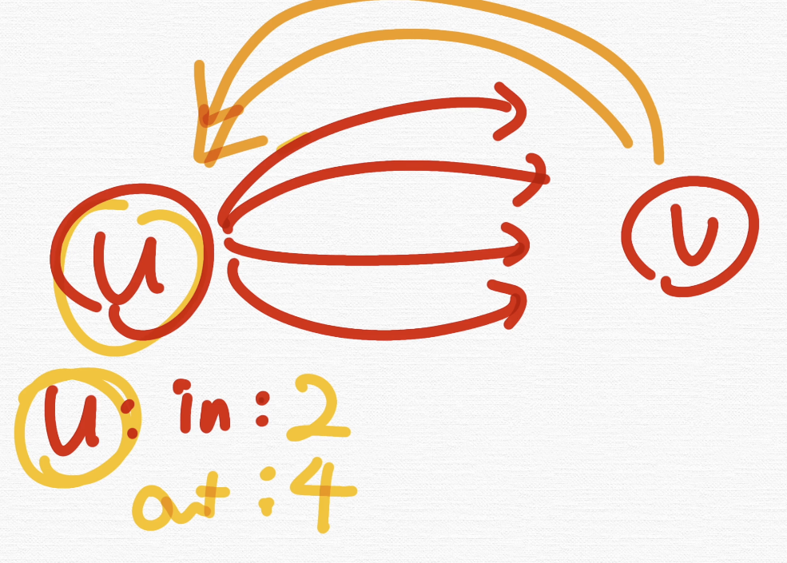

2. 트리 (그래프 구조에 속함)

- 트리: 자식노드와 부모노드로 이루어진 계층적 구조로 무방향 그래프의 일종이자 사이클이 없는 자료구조
  - 트리: `Edge의 수 = Vertex의 수 - 1`
  - 루트 노드: 트리의 처음(부모노드가 없는)
  - 리프 노드: 트리의 맨 마지막 (자식노드가 없는)
  - 트리가 여러개인 걸 forest 구조라고 함

3. 이진트리(`BT`)와 이진탐색트리(`BST`)

- 이진 트리: 각각의 노드의 자식노드의 수가 2개 이하로 구성되어 있는 트리를 의미함
  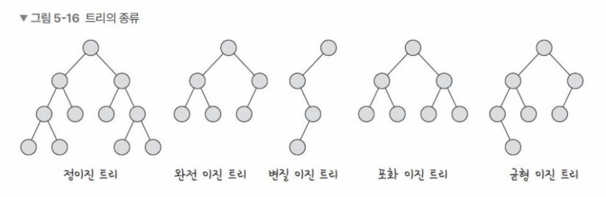
  3-1. 정 이진 트리 full binary tree: 자식 노드가 0 또는 2개인 이진트리
  3-2. 완전 이진 트리 compelte binary tree: 왼쪽에서 부터 채워져 있는 이진 트리, 마지막 레벨을 제외하고는 모든 레벨이 채워져 있음
  3-3. 변질 이진 트리 degenerate binary tree: 자식 노드가 하나 밖에 없는 이진 트리
  3-4. 포화 이진 트리 perfect binary tree: 모든 노드가 꽉 차 있는 이진 트리
  3-5. 균형 이진 트리 balanced binary tree: 모든 노드의 왼쪽 하위 트리와 오른쪽 하위트리의 높이 차이가 1이하인 트리, `map, set`을 구성하는 레드블랙트리는 균형 이진트리 중 하나임

- 이진 탐색 트리: 이진 트리의 일종으로 노드의 오른쪽 하위 트리에는 노드의 값보다 큰값, 왼쪽 하위트리에는 노드의 값보다 작은값이 들어가 있는 트리
  
  - 탐색 시 시간 복잡도, 이진트리의 높이가 좌/우 균형 잡혀있지 않으면 최악의 경우에 탐색의 시간복잡도는 O(N). 따라서, 트리의 구조가 균형잡혀 있어야 탐색의 시간복잡도가 O(logN)이다.
    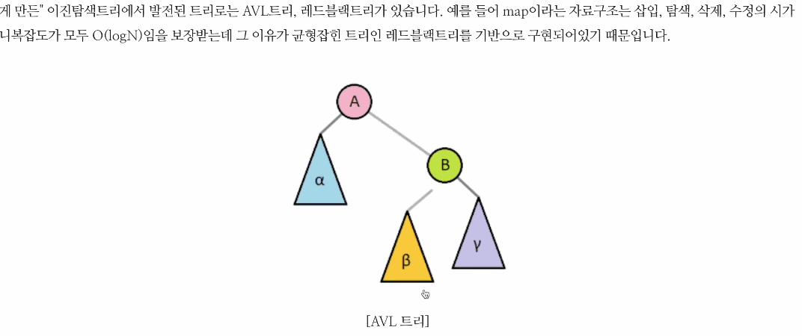

4. 인접 정보 (adjacency matrix 또는 adjancency list)

- 그래프로 이루어진 정보를 담고 있는, (인접해있다. 연결되어있다.)
- 인접 행렬: 그래프에서 `정점과 간선의 관계를 나타내는 bool 타입의 정사각형 행렬`을 의미함
  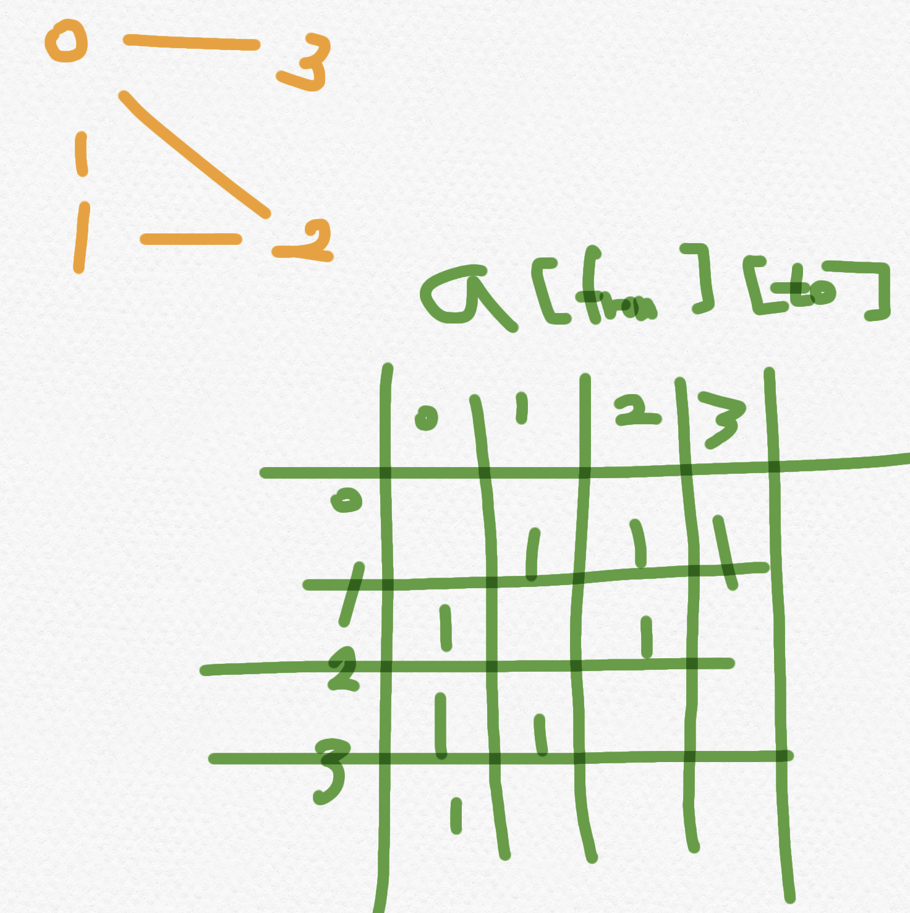
  - 만약, 자신에서 자신으로 이동할 수 있으면 (사이클이 있으면) a[i][i] = 1 이 된다.
  ```c++
  bool adj[4][4] = {
    {0,1,1,1},
    {1,0,1,0},
    {1,1,0,0},
    {1,0,0,0},
  };
  ```
  - 인접행렬을 이용한 그래프 순회 [예제](./2_2주차/adj_matrix.cpp)
- 인접 그래프: 그래프에서 정점과 간선의 관계를 나타내는 연결리스트를 의미함(벡터 자료구조로도 구현 가능함, 시간복잡도 동일)

  - 정점마다, 연결되어 있는 노드를 나타내는 리스트를 만든다.

  ```c++
  vector<int> adj[4];
  adj[0] = {1, 2, 3};
  adj[1] = {0, 2};
  adj[2] = {0, 1};
  adj[3] = {0};
  ```

  - 인접리스트를 이용한 그래프 순회 [예제](./2_2주차/adj_list.cpp)

- 인접행렬과 인접리스트의 차이: 무엇을 써야할까?

  1. 공간복잡도

  - 인접행렬은 sparse하게 인접정보를 포함하므로, 공간복잡도가 `O(V^2)`가 된다.
  - 인접리스트의 공간복잡도는 `O(V+E)`

  2. 시간복잡도: 간선(Edge) 한개 찾기

  - 인접행렬: `O(1)`
  - 인접리스트: `O(V)`

  3. 시간복잡도: 모든 간선 찾기

  - 인접행렬: `O(V^2)`
  - 인접리스트: `O(V+E)`

  4. 그래프가 희소할 때(Sparse)는 인접리스트, 조밀할 때는 인접행렬이 좋다.

  - 조밀할때(dense)는 인접행렬의 간선 하나를 찾는 시간복잡도가 좋기 때문에 인접행렬이 좋다.
  - 문제를 풀 땐 어떻게 선택할지..,
    - 보통은 sparse 한 그래프가 주어지기 때문에, 인접리스트로 푸는게 낫다.
    - 인접행렬이 주어지면, 그대로 인접행렬로 푸는게 낫고..,

5. 맵과 방향벡터(direction vector)

- 미로 찾기 문제에서는 2차원 그리드 형태의 맵 정보가 주어진다.
  - 미로라는 2차원 그리드를 인접한 그리드만 연결되어 있는 형태라고 볼 수 있다.
  - direction 방향 벡터를 통해 인접한 노드를 방문하기 위한 배열을 정의할 수 있다.
    ```c++
    int direction[4][4] = {
      {-1,  0}, // up
      { 1,  0}, // down
      { 0, -1}, // left
      { 0,  1}, //right
    };
    // 동서남북 뿐만 아니라 대각선방향으로 이동가능하다고 주어질 수도 있다.
    ```

6. 연결된 컴포넌트 (connected componet)

- 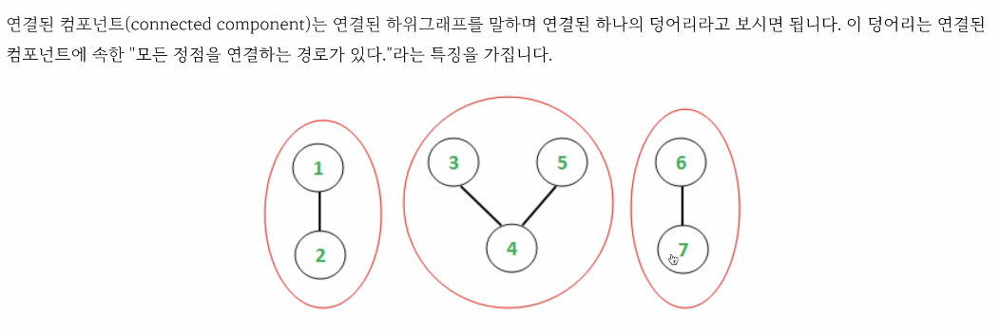
- 연결된 컴포넌트(덩어리)를 찾는 문제: `flood fill`
  - DFS로 풀면된다.
  - [예제 코드](./2_2주차/maze.cpp)

7. 깊이우선탐색(DFS, Depth First Search)

- DFS는 인접한 노드들을 재귀적으로 방문하는 알고리즘입니다.
- 또는 `stack` 이라는 자료구조를 이용하여 구현하게 된다.
  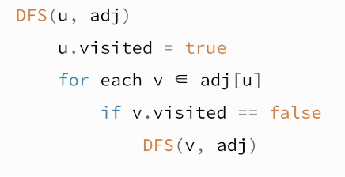
- [예제 코드](./2_2주차/dfs_list.cpp)
- [기본 문제](./2_2주차/dfs_기본문제1.cpp)
  - connect component 문제임

8. 너비우선탐색(BFS, Breadth First Search)

- BFS는 가까운 노드를 탐색해 나가면서, 레벨별로 방문하는 알고리즘이다. 노드를 이동하는 비용은 다 같아야 한다.
  - 같은 가중치를 가진 그래프에서 최단거리 알고리즘으로 쓰임
  - 이동비용이 다르다면, `sort` 정렬 알고리즘이 들어와야함
    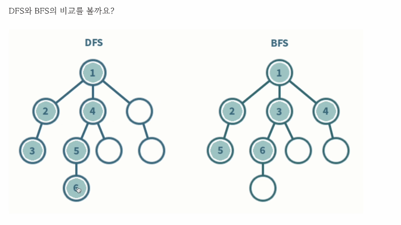
- `Queue` 라는 자료구조를 이용하는 것, 먼저 `candidates`에 추가된 노드를 먼저 방문한다.

```c++
queue<int> q;
q.push(here);
searched[here] = 1; // 시작
while(q.size()){
  int here = q.front();
  q.pop(); // queue에서 꺼낼 때, 방문하는 것
  for(int there: adj[here]){
    if (searched[there] == 0){
      searched[there] = searched[here]+1; // 최단거리 이동경로 정보도 같이 담아줌
      q.push(there);
    }
  }
}
```

- [예제 코드](./2_2주차/bfs_list.out)
- [기본 문제](./2_2주차/bfs_기본문제1.cpp)

9. DFS와 BFS의 비교

- 최악의 조건에서 시간복잡도는 모두 O(V^2)가 되므로 동일함
- DFS가 메모리를 덜 쓰는 편이고, 코드가 좀 더 짧음(완전탐색 코드)
- BFS 메모리를 더 쓰는 편이고, 최단거리를 구할 수 있음

10. 트리 순회 (Tree traversal) 후위순회, 전위순회, 중위순회

- 트리 순회는 트리 구조에서 각각의 노드를 정확히 한번만, 체계적인 방법으로 방문하는 과정
  - 방문 순서에 따라 후위/전위/중위/레벨 순회가 있음
- [예제 코드](./2_2주차/traversal.cpp)

1. 후위순회(postorder traversal)

- 자식들 노드를 방문하고 자신의 노드를 방문하는 것 "자식들부터"
  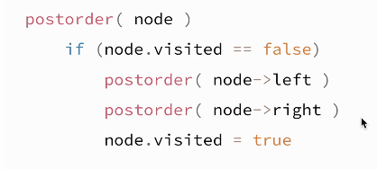
  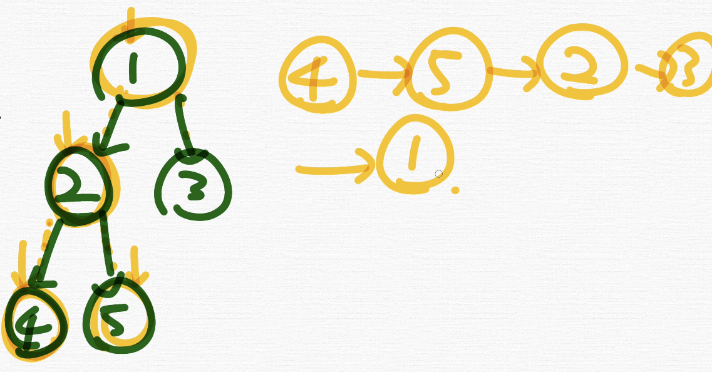

2. 전위순회(preorder traversal)

- 자신의 노드부터 방문하고 자식 방문하는 것 "나부터"
- `dfs` 알고리즘이 전위순회 알고리즘이다.
  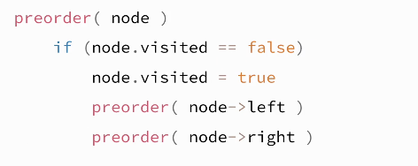

3. 중위순회(inorder traversal)

- 왼쪽 노드를 먼저 방문한다음 자신의 노드를 방문하고 그 다음 오른쪽 노드를 방문한다. "꼈다"
  - "안에 넣다.(in)"
    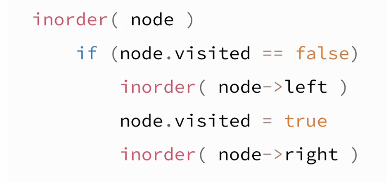
    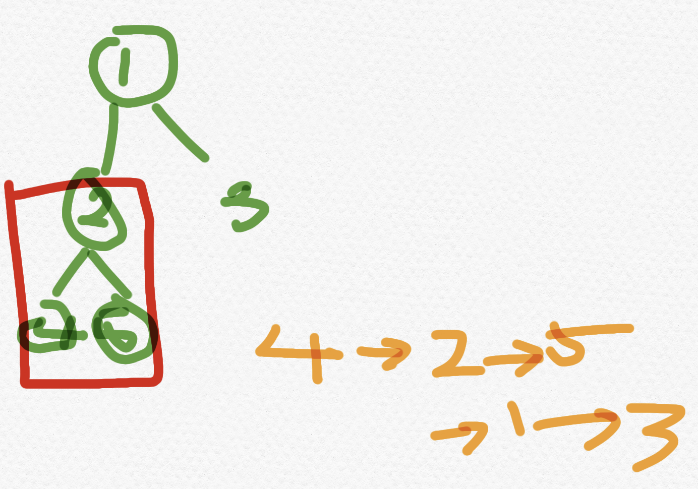
  - `4->2->5->1->3`

4. 레벨순회(level traversal)

- `bfs`알고리즘이 레벨순회 알고리즘이다.
- `1->2->3->4->5`

11. 반례를 생각하는 팁(맞왜틀팁)

- 아래 테스트 케이스를 직접 만들어보고 입력시켜본다.

  1. 최소 조건, 최대 조건
  2. 있을 때/없을 때, 없거나/있거나 조건

- 변수명을 최대한 표준화해서 사용해보자

  - (i,j,k)(배열 인덱스), next_i, next_j, answer(정답), delta(변화량), mx(최대), mn(최소)

#### 백준 풀기(2주차)

  - [boj2178](./2_2주차/boj2178.cpp) // 2-A
    - 문제 자체는 bfs로 뻔한 문제인데, 입력을 받아오는 과정에서 엄청난 시간 소모를 ㅠㅠ...
    - 아래 코드 스니펫(`Code Snipet`)을 잘 익혀두자...
    ```c++
    string s;
    for (int i = 0; i < N; ++i)
    {
      cin >> s;
      for (int j = 0; j < M; ++j)
      {
        // 문자'1'과 숫자1은 다르다. 문자'1'은 아스키코드로 49이다. 1이 아니다.
        maze[i][j] = s[j]-'0';
      }
    }
    ```
  - [boj1012](./2_2주차/boj1012.cpp) // 2-B

    - 혼자 풀었음, `Connect Component, Fluid Fill 문제`

  - [boj2468](./2_2주차/boj2468.cpp) // 2-C

    - 혼자 풀었음, 문제 오타 있어서 좀 헤맸는데 문제 오타였음 -> 문제 오타가 아님, 내가 틀린거임

      - 아무지역도 물에 잠기지 않을 수 있다.
        - 아무 지역도 잠기지 않으면 안전영역은 1이지 0이 아님
        - 문제에 대한 반례 조건을 잘 따져보자.....

    - 신기한게 제한시간 1초여서, DFS 를 for문 돌리면 3중 루프니까 시간 초과일 수 있겠다 싶어서 h 높이를 찾는 것을 바이너리 서치 알고리즘이라도 적용해야 하는건가 고민했는데,, naive 하게 3중루프 써서 하니까 통과네? ㅎㅎ
      - 시간복잡도 참고: `보통 1000만 까지는 시간복잡도 발생해도 타임오버 안나나 봄`

  - [boj2583](./2_2주차/boj2583.cpp) // 2-D

    - 혼자 풀었음

  - [boj1992](./2_2주차/boj1992.cpp) // 2-E, 쿼드트리, 다시 풀어보기

    - 풀어보려고 했는데, 1차 시도는 실패임 (24.1/31)
    - 분할정복 이런거 써서 했던것 같고 아주 예전에 답지 참고해서 풀었던 문제같은데.....

      - DFS로 풀면 될 것 같아서, 1시간 이상 풀어봤는데 잘 안되었다...ㅠ [boj1992실패](./2_2주차/boj1992_fail.cpp)

    - 풀이 (해설)

      - 재귀함수를 생각해야할 때? 똑같은 로직이 반복되는데, 매개변수는 바뀌어서 처리해야할 때
      - 참고: 분할정복은 재귀함수 아니면 `stack`으로 풀 수 있음
      - [boj1992](./2_2주차/boj1992.cpp)

    - 다시 풀어봐야할 문제다
      - 다음날 다시 풀어봄

  - [boj2828](./2_2주차/boj2828.cpp) // 2-F

    - 혼자 풀기 실패... 문제 독해부터가 난해하네;;
      - 문제 독해 이해를 다시하고 혼자 풀었음 (맞추었음)
      - 생각보다 엄청 쉬운문제인데, 최소값을 구하라는 문제의 말에 BFS 로 풀어야하는문제다라고 생각해버리는 바람에.., 이걸 어떻게 1차원인데 BFS로 묶어서 한번에 풀 수 있는지 고민하다가.. 시간을 엄청 써서 풀었음...
    - 구현 문제 카테고리에 속하는 쉬운문제인데...

  - [boj2910](./2_2주차/boj2910.cpp) // 2-G

    - 일단 푸는데 좀 걸렸고, tuple을 써야하나 해서,, 근데 tuple 사용법이 익숙치가 않네요 ㅠㅠ
    - 푼것 같은데, 예외 처리 하느라 시간이 더 걸렷고, 제출했더니 메모리 초과 ..

    - 해설
      1. 맵 2개를 써서, 한개는 빈도수를 체크하고, 한개는 처음 숫자가 등장한 idx를 저장함
      - tip: 맵 자료구조는 지역변수라해도 선언과 동시에 0 초기화됨
      - tip: 맵 자료구조는 바로 정렬(sort)함수 사용이 안되니, vector 자료구조에 담아야한다.
      - tip: `mp.first: key`, `mp.second: value`
      2. 다음에 다시 한번 풀어보자

  - [boj4659](./2_2주차/boj4659.cpp) // 2-H

    - 재귀함수로 풀 수 있다는 것을 혼자 잘 떠올려서, 혼자 풀 수 있었음
    - 다만, 구현의 내용이 길고, 그 사이에 인덱싱 같은 기본적인 실수가 많아서,,,, 디버깅하는데 시간이 매우 오래 걸렸다.

  - [boj2870](./2_2주차/boj2870.cpp) // 2-I

    - 혼자 풀었음, 처음에는 out of range 가 나왔는데, 그 이유가 stoi의 출력값 범위를 넘어섰기 때문임
      - 문제를 읽고, 바로 파악해야 하는 제약조건이고, 이걸 캐치해야 로직을 제대로 짤수있음
      - 당연 longlong을 지원하는 `stoll` 도 되지는 않았고, 별수 없이 `string` 으로 데이터를 저장시켜야 했음
    - 간단한 문제인데도 오래 걸리네요...
      1. `string& erase (size_t pos = 0, size_t len = npos);`
      - 리턴받지 않아도 레퍼런스 호출이라 인풋 배열이 변형되서 나오게 됨
      2. `string substr (size_t pos = 0, size_t len = npos) const;`
    - 강의를 들이니까, 필요없는 조건문들은 삭제할 수 있었음

  - [boj10709](./2_2주차/boj10709.cpp) // 2-J

    - 무식하게 풀면되는거 아닌가 하다가, DFS도 배운거니까 적용해보자 하니까, 쉽게 풀리는 형태였음 ㅎㅎ

  - [boj3474_teacher](./2_2주차/boj3474.cpp) // 2-K

    - 혼자 못풀었음...
    - DFS 에서 중간값을 가져와서, 중간값의 0을 체크하고, 하는 과정을 넣어 함수를 만들었고, 잘 작동하는 것 같았는데, dfs의 스택오버플로우가 발생하여 N의 범위가 커질경우 segmentation fault 발생함
    - dfs의 호출회수가 커서 문제인가 해서, 중간 저장(memoization)을 이용해서 구현 해봤는데, 이 경우는 중간저장 배열의 요구로 하는 사이즈가 어느정도 커야하기때문에, 배열 자체가 선언이 안됨 ^^;;
      - [boj3474_trial](./2_2주차/boj3474_trial.cpp)
    - **강의 듣기로 결정함**: 아이디어가 중요한 문제였다.
      1. 팩토리얼을 직접 만드는건 에바다
      2. 팩토리얼 과정에서, `2와 5` 요소의 개수를 찾은다음에 min값을 출력하면 그게 0의 개수다
      3. 직접 세는건 시간복잡도가 너무 커서 문제가 됨
      - 주어진 숫자가 10이라면 2라는 요소를 갖는 숫자의 개수는 5개 {2,4,6,8,10}
      - 5라는 요소를 갖는 숫자의 개수는 {5,10}
      - 즉, 10/2 = 5, 10/5 = 2 가 된다.
      - 2와 5 요소의 개수 중 작은 값이 0의 개수가 된다
      4. 매우 간단하게 풀 수 있는 문제였다.
    - 혼자 풀려고 하였을 떈, 어떻게든 팩토리얼을 직접 구한다음에 0의 개수를 중간중간 집계해서 찾아내려고 했다.
    - 그럴필요가없이 숫자의 인수(2,5)의 개수를 찾는 방식으로 0의 개수를 찾을 수 있었다.

  - [boj2852](./2_2주차/boj2852_teacher.cpp) // 2-L

    - 스트링 파싱하는 방법.. 꼭 숙지하자
      ```c++
      istringstream sss(input); // string parsing
      sss >> mm >> delimeter >> ss;
      ```
    - 문제는 구현 문제에 가깝다고 보인다. 그만큼 로직도 간단하지만, 경우의 수를 잘 나누어 실수 없이 구현하는 것이 핵심인듯 싶다.
      - 졸려서 그런거라고 믿고 싶지만,, 꽤 오래 걸렷다 모든 반례에 대한 경우의 수를 따지느라..
    - 분, 초 이렇게 문제가 주어지면, 초를 기반으로 단위를 정렬하고 풀어라.
    - [내가 푼 코드](./2_2주차/boj2852_my.cpp)
      1. 구현 문제를 만나면, 함수를 많이 짜서 코드를 최대한 간결하게 유지할 수 있도록
      2. 코드가 길어지면, 실수가 잦고, 생각도 굳는다 ㅠ

  - [boj1436](./2_2주차/boj1436.cpp) // 2-M

    - 혼자 풀기 실패 (dfs로 푸는건가 시도만 해봄..)
    - `1000만` 아래 수행 횟수면 무식하게 푸는 것도 가능함
    - 알고리즘이 진짜로 간단하게 구현되는 거였음.. i를 계속 증가해가며 카운트를 빼주면 되는 문제...

    ```c++
    int i = 666;
    for (;; i++) // 무한 루프
    {
        if (to_string(i).find("666") != string::npos) N--;
        if (N == 0) break;
    }
    cout << i << "\n";
    ```

  - [boj9012](./2_2주차/boj9012.cpp) // 2-N

    - 이건 `stack` 을 사용하는 쉬운 문제였음

  - [boj4949](./2_2주차/boj4949.cpp) // 2-O

    - 이건 `stack` 을 사용하는 쉬운 문제였음

  - [boj14502](./2_2주차/boj14502.cpp) // 2-P

    - 와,, 너무 무식하게 접근하는것 같아서 이게될까 했는데, 통과는 되었다.
      - 문제의 조건을 가지고, worst 의 경우가 `1000만` 이하면 해볼만 하다.
      - 문제에서, `N<8, M<8` 이라고 했으니, 벽을 세우는 조건 `64C3` x dfs `64` + 최대값을 찾는 순회 `64` << `1000만` 임
    - 시간 오래 걸려서 풀긴 했음
    - 벽 3개 세우기 가능한 조건들을 콤비네이션으로 싹 구한 뒤,
    - 맵을 변경해가면서 dfs를 반복적으로 돌려서 안전구역의 최대값을 구하는 방식으로 하였음

    - 강의에서의 로직
      1. 벽을 세운다.
      2. 바이러스가 퍼진다
      3. 안전영역을 카운팅

  - [boj2636](./2_2주차/boj2636.cpp) // 2-Q

    - 다 녹기 전 치즈의 개수를 집계하는 것을 조금 비효율적이게.. dfs 함수 내부에서 집계 가능하게 해놓은 것이 아니라, dfs 외부에서 치즈 맵 전체를 순회하면서 집계되게 구성되었다.. 시간초과 나면 어떡하지 걱정했는데, 다행히 패스되긴 하였다.
    - 제일 worst의 시간복잡도를 줄이는 것이 중요하지, 그렇지 않은 것들은 시간 초과에 영향을 주지 않기 때문임.

  - [boj1068_teacher](./2_2주차/boj1068_teacher.cpp) // 2-R
    - [boj1068_my](./2_2주차/boj1068_my.cpp) 트리를 만들고 트리의 노드 링크를 끊어서 리프노드의 개수를 찾는 문제
    - 와 이 문제 거대 트릭이 있는게.., 이진트리가 아니어도 되는 문제였다. 예시는 이진트리라 무의식중에 이진트리로 접근헀는데... 하놔
    - 정말 오래 풀어서 혼자 풀긴하였다. 질문게시판에서 반례를 많이 이용했기 떄문에, 혼자푼거라고 보면 안될듯

    - 강의
      1. 트리의 탐색은 루트 노드부터 하자.
      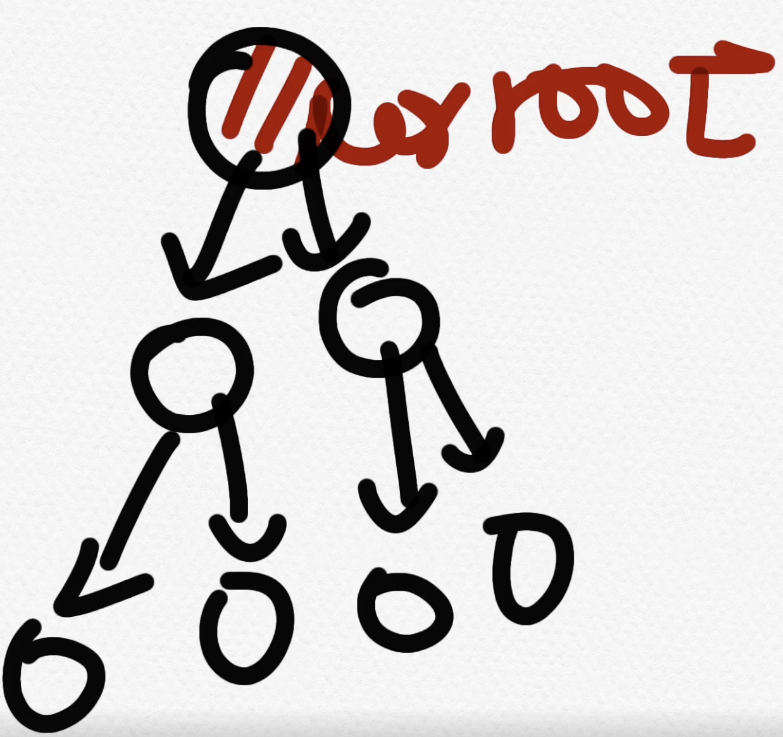
      2. 강의 코드를 보니 `struct`를 이용한 찐탱 트리를 설계한것이 아니고, adjacency list를 이용해서 트리를 구성하였다.
      3. `int` 를 리턴하는 dfs 함수도 많이 연습하자
      ```c++
      int dfs(Node *node)
      { 
          int ret = 0;
          for (auto c : node->child)
              if (c != nullptr)
                  ret+=dfs(c);        // (2) 자식이 없을 때만 생성되는 1을 계속 더해주면서

          bool hasChild = false;
          for (auto c : node->child)
              if (c != nullptr)
                  hasChild = true;

          if (!hasChild)
              return 1;               // (1) 자식이 없을 때는 상수 1 리턴함

          return ret;                 // (3) 최외곽 호출 리턴에 1이 계속 더해진 값을 리턴한다.
      }
      ```
  - [boj1325](./2_2주차/boj1325.cpp) // 2-S
    - 와 .. 이거 참 문제 하나하나에 대한 경험이 소중하겠네..
      - 계속, 시간초과가 떴음. 왜 틀렸을까? 무엇이 잘못됬을까? DFS 탐색밖엔 방법이 없는게 맞는데, 왜 틀리는거지 등등..
      - 질문게시판을 읽다가 알게되었음. 사람들은 왜 visited 체크를 하고 있을까?
      - 그렇다.. 바로 해당 컴퓨터 네트워크는 트리구조가 아닐 수 있다. 인접리스트로 컴퓨터 네트워크를 자료구조하면서 당연히 트리일거라는 생각이 내 머리속에 자리잡혔다. 근데, 그건 내 일방적 오해였고 본 문제는 순환구조의 컴퓨터 네트워크가 입력되게 되어있었다.
      - cycled 구조일 수도 있기 떄문에, visited 체크를 해주지 않으면 무한 루프에 빠질 수 있게 된다.
      - 따라서 내 코드가 시간초과에 걸렸다. visited가 없어 무한루프에 걸렸기 때문이다. 
      - 코테에서 만큼은 습관적으로 dfs에 visited를 넣어주는 것을 그냥 깔고 가는 것이 안전하겠구나

  - [boj17298](./2_2주차/boj17298.cpp) // 2-T
    - 이것도 질문게시판을 뒤져보다가 풀게 되었다.
    - for loop 순회하게 되면 시간복잡도는 O = N/2*(N-1)로 O(N^2)이다. 시간초과가 난다.
      - 해서, O(N) 복잡도의 방법이 있나 싶어서 DP 방식으로 여러 점화식을 찾아보려고 시간을 많이썼다.
      - 방법이 없는것 같은데, 혹시나 하는 마음으로 stack으로 접근해서 풀어보았고, 풀리긴 헀다. O(N^2) 아닌가.
        - 질문게시판에 질문 중(2/7)
    - 강의 팁: `짝짓기 문제` 느낌이 들면 `stack`으로 풀수 있는지 체크를 해봐라
      1. 문제 검토 순서: for문으로 무식하게 풀 수 있는가? 
        - 최대 범위 100만: O(N^2) = 1000억을 넘는다.
      2. 다른 방법 없을까? -> stack으로
      3. [강의코드](./2_2주차/boj17298_teacher.cpp)
        - 큰수가 안나왔다면 담아두었다가, 큰수를 만나면 그 값이 오큰수가 됨

    - 기본 문법 점검:
      - 이거 왜 이상하지 한참을 해맷음, 아래 코드와 같이 중괄호를 생략할 목적으로 statement를 한줄에 쓴다면, 한줄이라는 정의는 세미콜론을 기준으로 함, 세미콜론이 2개 잇을경우 그건 두줄이야 ㅠ
      ```c++
      while(i>0) cout << i << " ", i--; // 이건 한줄 맞거든
      while(i>0) cout << i << " "; i--; // 이건 두줄이라서, i--;는 while문에 하위에 위치하지 않는게 되서 동작하지 않게됩니다. 주의하세요. 
      ```

### 2-4. 3주차: 완전탐색과 백트래킹

1. 순열(permutation)과 조합(combination)
  - 순서가 상관있으면 permutation, 상관없으면 combination
2. 모든 경우의 수(조합/순열)을 모두 따지는 방식이 완전탐색 알고리즘임
  - 순열 or 조합 + 로직 (보통 1억 미만 까지) 해볼만하다

3. 제일 간단한 형태의 완탐 문제
  - [n큰수](./2_3주차/n큰수.cpp)
    - 이렇게 풀었을 때, 실행횟수가 1억 미만이면 충분히 완탐으로 접근해볼만 하다.
  - [조합의 합이 소수인것을 찾아라](./2_3주차/findAllPrime.cpp)
    - 문제 설명: 주어진 숫자 배열이 있을떄, 조합의 합이 소수인 것의 총 경우의 수는?
  - [조합의 합을 mod11 하였을 때 가장큰수](./2_3주차/findBigModuler.cpp)
    - 문제 설명: 주어진 숫자 배열이 있을때, 조합의 합을 `%11` 모듈러연산 했을 때 가장큰값은?
  

4. 재귀함수를 활용한 완전탐색
  - 반복문으로 되면 무조건 반복문으로..,
  - 그외
    - 너무 복잡하거나, 행위 반복하는데 매개변수만 수정해서 넘기면 될 것 같을떄, 재귀함수
  
5. 백트래킹
  - 완전탐색 + 가지치기
  - 가지치기가 더해진 완전탐색 방식이 백트래킹임
  - [조합의 합을 mod11 하였을 때 가장큰수 backtracking](./2_3주차/findBigModuler_back.cpp)
    - 원래는 모든 경우인 2^N 에 대해서 따져야 했던 것을 조건을 만족하면 그 밑으로는 호출이 `propagation` 되지 않도록 조기 종료
  
6. 완전탐색을 할 땐, 원상복구를 잘해라
  - 모든 경우의 수를 생각하는 것이 완전탐색이고, 탐색 후에는 원복으로 돌려야함. 그래야 다음 경우의 수를 따질 때 영향이 없음
  - 원복의 필요성: 어떠한 상태가 그 다음 경우의수에 반영이 되지 않도록
  - [긍정왕 홍철이](./2_3주차/긍정홍철.cpp)
  ```c++
  if(next_i >= 0 && next_j >= 0 && next_i < 3 && next_j <3){
    if (visited[next_i][next_j] == 0){
      visited[next_i][next_j] = 1;
      v.push_back({next_i, next_j});
      go(next_i, next_j, v);
      visited[next_i][next_j] = 0; // 원상복구
      v.pop_back(); // 원상복구
    }
  }
  ```

#### 백준풀기(3주차)

  - [boj15686](./2_3주차/boj15686.cpp) // 3-A
    - 잘 푼것 같은데 , 시간초과 문제가 계속 발생해서.. 고민을 했다.
    - visited 체크가 안되어 있던 문제도 있는고(그래도 시간초과는 여전히),
    - 한번 더 생각해보니 순서는 상관없이 치킨집M개를 뽑는건데 나는 순서 상관있이 3개를 뽑아서, 시간초과 문제가 발생했던 것임
      - 순서는 상관없이 3개만 뽑으면 되는 것이니까, `for (i =start+1;;)` 구문을 넣어준 것임
  ```c++
  void go(int start, vector<vector<int>> v){
      if (ans == M) return;
      if (v.size() == M){
          int dist = get_cityDistance(houses, v);
          ans = min(dist, ans);
          return;
      }
      for(int i = start+1 ; i < chickens.size(); ++i){ // 와 이거.. 순서 상관없으니까 조건 따져야함
          if (visited[chickens[i][0]][chickens[i][1]] == 0){
              visited[chickens[i][0]][chickens[i][1]] = 1;
              v.push_back(chickens[i]);
              go(i, v);
              v.pop_back();
              visited[chickens[i][0]][chickens[i][1]] = 0;
          }
      }
      return;
  }
  ```

  - [boj2589](./2_3주차/boj2589.cpp) // 3-B 
    - 두번째 트라이에 성공함
      - 생각 잘하고 풀어야 겠네.. 만약 Lands가 5개라면 1번 방식은 5C2 = 10 번의 BFS를 풀어야 하지만 2번 방식은 5번의 BFS 를 푸는 것이라 이득이다.
    1. 시간초과를 받았던 첫번째 트라이
      - Lands에서 NC2 콤비네이션을 뽑아서, 시작지점과 골지점으로 한 다음에 모든 시작과 골에 대해 BFS로 최단거리를 저장한다음, 최대값을 출렸했다.
    2. 두번째 트라이
      - 모든 Lands를 시작점으로 하여 goal 지점 없이 candidates가 소진될 때 까지 BFS를 돌렸고, 맵 정보에서 거리가 최대인 정보를 저장한다음, 모든 Ladns 시작점에 대해서 거리 최대값을 출력했다.

  - [boj16234](./2_3주차/boj16234.cpp) // 3-C
    - 와 1시간 반 정도 붙잡고 풀어서 풀긴 풀었다.
      - ..내가 이런 문제를 실전에서 만나도 끈기 있게 풀어낼수있을까? ㅎㅎ;;
      - 문제는 connect component 과 dfs 를 섞었다.
      1. 첫번째 시도
        - connected component 를 못 떠올리고, 국경이 열리는 부분을 체크하려고 하였다. 오류 투성이 ㅠㅠ
        - 당연히 틀렸음
      2. 두번째 시도
        - 국경이 열리는 그룹의 체크는 connected component (dfs)로 풀어야겠구나를 떠올림
        - 그러나 그룹 체크와, 평균 계산 각각을 2개의 dfs로 했기 때문에 시간초과
      3. 세번째 시도
        - 두번째 시도는 각각 설계한 dfs를 하나로 합치는 것을 하였다.
        - 성공...

  - [boj4179](./2_3주차/boj4179_retry.cpp) // 3-D, 강의보고 풀었음
    - 혼자 풀기 실패 (3시간 가까이 풀었나..) [혼자풀기 시간초과](./2_3주차/boj4179.cpp)
      - 결과: 시간초과 ... ㅜㅜ
      - 나는 dfs로 풀었는데.., bfs로 풀어야 하나 보다.
        - 이건 아닌듯, 워스트 케이스에서 시간복잡도는 둘이 같다 O(V2)
      - 아 이 문제의 핵심은.., 불의 전파를 핸들링하는 방식으로
        - 불의 전파 속도보다 지훈의 방문속도가 빠르면 방문할 수 있다는 식으로 로직을 구현하는 것이었음
        - 나는 불의 전파를 실제로 `F`로서 구현해서 맵을 업데이트하는 형식을 취했기 때문에 비효율적이었던 것임 


  - [boj12869](./2_3주차/boj12869.cpp) // 3-E, 강의보고 풀었음
    - 혼자 풀기 실패... ㅠㅠㅠ [boj12869_실패](./2_3주차/boj12869_실패.cpp) 
      - 순열을 만들어서 모든 순열에 대해서 완탐 형태로 뮤탈리스크 공격하는 것으로 짜보았는데 시간초과입니다.
      - DP 방식으로 풀 수 있었던 것일까?? .. 아님, 그리디? 없는것 같은데..
    - 강의를 들으니.. bfs 로 풀어야 하는 문제다
      - 3차원이 주어진 그래프를 떠올리고 풀면됩니다.
    
  - [boj16637](./2_3주차/boj16637.cpp) // 3-F, 강의보고 풀었음
    - 혼자 풀기 실패하였음...
      - 완전탐색으로 풀면된다고 생각하고 무턱대고 덤벼들었지만, 구현조차 하지 못하였음
      - 완전탐색을 재귀호출로 구현하더라도 생각 해야하는 것이 있다.
      - 이 문제에서 경우의 수는 2가지가 있는데, 3개의 숫자가 주어졌다고 했을 때,
        1. 앞에서부터 순차적으로 계산하는 방법 `1->2->3`
        2. 또는, 뒤부터 계산하고 `2->3->1` 앞을 계산하는 방법이다.
      - 위의 2개 경우의수를 계속해서 propagation 하면 완전탐색을 수행하게 된다.
    
  - [boj12851](./2_3주차/boj12851.cpp) // 3-G
    - 매우 오래 걸렸지만,, 혼자 풀긴 풀었다.
    - 핵심은 2개의 저장 배열을 이용해서 하나는 최단거리를 저장하고, 하나는 방문횟수를 저장하는 배열을 사용하는 것이다.
 
  - [boj13913](./2_3주차/boj13913.cpp) // 3-H
    - 혼자 풀었음
    - A_star 알고리즘을 배울 때, 답을 출력하는 형태에 대해서 배운적이 있어서 그 방식으로 푼 것임

  - [boj17071](./2_3주차/boj17071.cpp) // 3-I, 어렵네요 이문제 ..
    - 혼자 풀기 실패 [boj17071 실패](./2_3주차/boj17071_실패.cpp)
    - 강의
      1. 문제에서 필요한 핵심 로직 (단계별 `propagation`: 단순 bfs와는 다르게 구현해야함)
      2. 수빈과 동생의 통과 시간
        - 동생이 만약에 어떤 지점에 3초에 도착했고, 수빈이가 1초에 도착했으면 서로 만날 수 있다.
          - 왜? 수빈이는 +1, -1 위치를 옮기면서 기다릴 수 있으니까
          - 단, 수빈이가 5초 도착하고 동색이 6초에 도착하면 서로 만날 수 없다
        - 즉, 수빈이가 짝수에 먼저 도착했고 이후 동생이 짝수로 방문하면 서로 만날 수 있고, 수빈이가 홀수에 먼저 도착했고 이후 동생이 홀수로 방문하면 서로 만날 수 있다.
    - 다음에 다시 풀어보면 좋겠습니다.
  
  - [boj14497](./2_3주차/boj14497.cpp) // 3-J
    - 혼자 풀었음

  - [boj3197](./2_3주차/boj3197.cpp) // 3-K      
    - 혼자 풀기 실패 (시간 초과함)
      - [boj3197 시간초과](./2_3주차/boj3197_시간초과.cpp)
    - 강의
      - 아래 2개의 로직이 필요한 문제임
        1. moveSwan()
        2. waterMelting()
      - SwanQ, WaterQ를 각각 운영하고, 이에 따라 visitedSwan, visitedWater 배열도 각각 운영
      - `day` 마다 바뀌는 정보를 기록하기 위해 Temp_SwanQ, Temp_WaterQ를 운영해야 한다.

    - 나중에 다시 풀어보면 좋겠음
  
  - [boj1987](./2_3주차/boj1987.cpp) // 3-L
    - 혼자 풀기 실패: 제대로 푼것 같은데 왜 시간초과지 ㅎㅎ;;
      - 알고리즘 적으로 개선되어야 하는 부분이 있었다.
        1. history를 저장해가면서 일일이 비교하면서 하면 당연히 시간초과다
        2. visted 배열을 운영하고, visited 배열은 알파벳 26개를 방문했는지 안했는지에 대해 기록한다.
      - 문법적으로 개선되어야 할 부분
        1. 복사생성자 `for(auto d: delta)`가 아닌  `move`가 될 수 있게 `for(auto& d : delta)`를 사용하여라.
        2. 배열이 작아서 문제없을것이라 생각했는데, 문제의 시간제한이 타이트해서 이부분이 계속 걸렸음

  - [boj2529](./2_3주차/boj2529.cpp) // 3-M
    - 혼자 풀었음
    - 문제를 풀기 전에 시간복잡도를 얼추 계산해보고 풀어야합니다..
      - 시간복잡도는 N! 이겠죠.
      - 문제의 범위가 N=10 이될수 있으니까 10! 은 360만 정도임.
        - 시간복잡도가 1000만 이하, 1억 미만이면 충분히 괜찮다.
        - 그러면 드가자~!

  - [boj9934](./2_3주차/boj9934.cpp) // 3-N
    - 혼자 못 풀었음
      - 완탐으로 푸는 문제는 아닌 것 같고, 중위방문(`inorder`)의 역순으로 하면 되는 것 같은데, 로직은 강의를 보는게 더 나을듯해서 강의를 보는 것으로 결정
      - 그래프 순회 방식 복습 [traversal](./2_2주차/traversal.cpp) !!

      ```
          1
        2    3
      4  5  6  7


      1.전위방문(preOrder)
        1-> 2-> 4-> 5-> 3-> 6-> 7
      2.후위방문(postOrder)
        4-> 5-> 2-> 6-> 7-> 3-> 1
      3.중위방문(inOrder)
        4-> 2-> 5-> 1-> 6-> 3-> 7
      ```

    - 이 문제는 Inorder를 Level화를 시키는 문제임
      1. 구간을 반으로 쪼개서 중앙에 있는 것이 최상단
      2. 그 다음 구간의 중앙에 있는 것이 최상단
  
  - [boj15684](./2_3주차/boj15684.cpp) // 3-O
    - 혼자 풀기 실패 [boj15684_실패](./2_3주차/boj15684_실패.cpp) 
      - 와 어렵다 이거;;; ㅋㅋㅋㅋ... 풀이를 보니까 쉽게 풀수있는거였다 ㅠㅠ
      - 시도한 방식
        1. 존재할 수 있는 모든 사다리 조합에 대해 콤비네이션
        2. 콤비네이션 `r` 일 때 문제 요구조건을 만족하면 답을 구한 것이라고 생각함
        3. 사다리 조합을 만들어내고 그 조합에서 사다리 게임을 했을 때 종착점에 도착햇는지를 카운팅해서 답을 산출하려고 하였음
        - 결과: 시간초과,, 및 생각엔 반례도 있는 알고리즘인듯 싶다. ㅠㅠ
    - 강의 봅시다.
      - 시간복잡도: `300C3 =  450만` , 천만/1억 이하니까 풀만하다.
        - 내가 틀린 이유
          1. 사다리를 놓는 방식을 미리 다 만들어두고, 접근하려고 했다. 근데 그렇게 하다 보니까 로직이 매우 복잡해졌다. visited 배열을 활용해야 한다.
          2. 사다리 게임 자체를 dfs로 해야한다고 생각했다. 그러나 그럴 필요가 없다.

      - 이 문제에서 필요한 로직
        1. 문제에서 주어진 조건 그대로를 활용하여 상태값을 정의
        2. 사다리를 놓기 (visited 배열을 활용)

  - [boj14620](./2_3주차/boj14620.cpp) // 3-P
    - 오랜만에 혼자 풀기 성공하였음 ㅎㅎ;
    - 너무 오랜만이라.. 풀때도 내가 맞게 푸나 하나 의심이 들어서... 하..이참
    - 100C3 이니까 완전탐색으로 시도해볼만 함

  - [boj1189](./2_3주차/boj1189.cpp)  // 3-Q
    - 혼자 풀기 성공 


### 2-5. 4주차: 비트마스킹
  - 이진수 (bit: binary digit)
    - 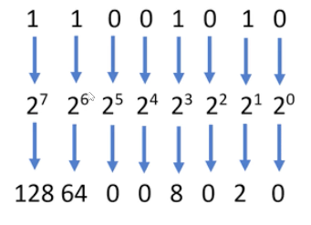
  - 비트연산자
    - 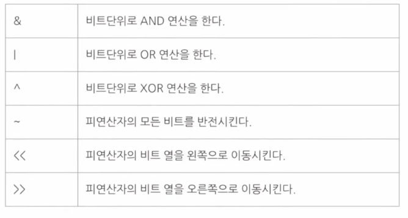
    1. 비트쉬프트
      - `a<<b` = `a x 2^b`
        - ex: 7 << 2 = 28 -> 111<<2 = 11100 = 2^4+2^3+2^2 = 28
      - `a>>b` = `a x (1/2)^b`
    2. `^, ~`
      - ^: xor 연산자(같으면 false, 서로 다르면 true)
        - 0^0: 0
        - 0^1: 1
        - 1^0: 1
        - 1^1: 0
      - ~: 비트 반전
        - ~01010: 10101
        - value가 `int` 라면,
          - `-value = ~value+1` --> `-(value+1) = ~value`
          - 왜냐면 음수를 표 현하는 방식이 이러함
    3. 비트 활용
      - 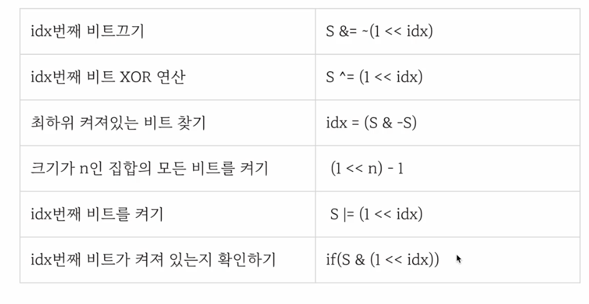
      - 토글 스위치 원리
        - `S ^= (1<<idx)` 원하는 자리의 비트를 xor
          - 1이 있으면 0이 되고, 0이 있으면 1이 되겠지
      - 최하위 켜져 있는 비트 찾기
        - `idx = (S&-S)` 
        - [제일 낮은 자리의 비트 자리수 조회](./2_4주차/bitOperation_Search.cpp)
      - 비트연산자는 `bool []`을 대체해서 모든 것을 할 수 있기 때문에 필요한 것임
        - 비트와 비트 연산자를 활용해서 `combination`을 쉽게 구할 수 있다.
        - [콤비네이션 구하기 비트 활용](./2_4주차/bitMasking_comb.cpp)
        - 재귀를 이용해 구현한 `combination(int n, int r, {})`는 5C1, 5C2, 5C3 등을 가각 구했어야 했는데, 위의 예시는 모든 `r`에 대해서 한번에 구할 수 있는 장점이 있음
      
      - 완전탐색(+원복)에도 쓰일 수 있음
        - [비트 활용 visited](./2_4주차/bit_fullsearch.cpp)

#### 백준풀기(4주차)

  - [boj19942](./2_4주차/boj19942.cpp) // 4-A
    - 혼자 푸는데 성공함... 꽤 오래 걸렸음 ㅠㅠ
    - 아래 이슈 때문에 오래동안 헤매었음
      - 비트마스킹으로 조합을 획득하여 이를 다시 순번으로 복원하는 과정에서
      - ret += to_string(j+1); 로 하니 오답이 발생했습니다.
      - ret += (char(j+1) +'0'); 으로 해주니 정답 처리가 되었는데요 그 이유가 무엇일지 궁금합니다. --> 질문하였음

  - [boj1285](./2_4주차/boj1285.cpp) // 4-B
    - 혼자 풀기: 실패 시간초과 ㅠㅠ [boj1285 시간초과](./2_4주차/boj1285_시간초과.cpp)
    - 강의 
      1. 시간복잡도를 생각해보면, 한개 셀이 (N=20*2) 횟수로 뒤집어 질 수 있으니까 
      대충 2^40 정도 되는 시간복잡도를 갖는다. -> 즉, 완탐으로는 풀 수 없다
        - 혼자 푼 로직은 완탐이었음 ..
      2. 근데, 행과 열 각각을 모두 완탐식으로 뒤집을 필요가 없다
        - 왜냐면 행만 뒤집어 봐도, 열까지 뒤집을지 말지는 T,H를 보고서 뒤집을지 말지 결정할 수 있으니까.
        - 따라서 행만 뒤집는 로직을 구현하면 된다. 시간복잡도는 2^20 수준..
      3. 문자열배열을 비트(숫자)로 변경
        ```
        HHT: 001(비트역순) --> 4
        THH: 100(비트역순) --> 1
        THT: 101(비트역순) --> 5
        ```

      4. 행 먼저 모든 경우에 대해 뒤집은 이후, 열은 뒤집을만한지 아닌지 체크하는 식으로 진행  
        - 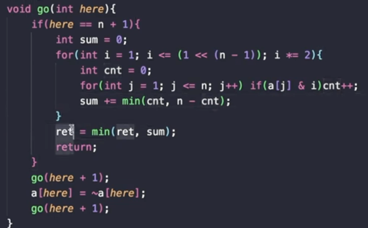
      

  - [boj17471](./2_4주차/boj17471.cpp) // 4-C
    - 혼자 못 풀었음.. 강의 보고 다시 풀기 ㅠㅠ.

    1. 헷갈린 것 (int dfs())
    ```c++

    // dfs 호출 횟수를 리턴하는
    int dfs(int here)
    {
        int ret = 1; // 기저 개수
        visited[here] = 1; 

        for (int neighbor : adj[here])
            if (visited[neighbor] == 0) ret += dfs(neighbor);
        return ret;
    }
    
    // 누적합을 리턴하는 dfs
    int dfs(int here, int id){
      visited[here] = 1;
      int ret = people[here];

      for(auto a : adj[here]){
          if (visited[a] == 0 && group[a] == id){
              ret+=dfs(a, id);
          }
      }

      return ret;
    }
    ```

    2. 노드마다 색칠을 먼저하고, 두 개 그룹으로 쪼개지는 가? 그 다음에 최소값을 갱신하는 문제임

  - [boj1987](./2_4주차/boj1987.cpp) // 4-D
    - 3주차 때 푼 문제였음. 처음에 시간초과 나와서 이잉 하다가
    - `for(auto& d : delta)` 해주니까 맞았음
      - 생각보다 레퍼런스로 불러주는거랑 아닌거 속도 차이가 있나보네..
    - 한번 푼 문제를 다시 풀라고 한 이유가, `visited`배열 없이 비트마스킹으로 좀 더 간단히 풀 수 있음을 알려주기 위함임
      - 비트마스킹을 활용한 풀이 [boj1987_비트마스킹](./2_4주차/boj1987_bitmasking.cpp)

  - [boj14890](./2_4주차/boj14890.cpp) // 4-E
    - 혼자 풀기 실패, 시도도 제대로 못해보았음
    - 강의
      1. 가로 세로 각각 훓지 말고, `transpose`를 활용
      2. 같은 높이면 계속 cnt++ 하다가, 높이가 올라가면 cnt>=L 인지 체크
      3. 내리막길을 만나면 cnt = -l+1 로 세팅하고 cnt>=0 이면 허용가능함

    - 기본 (전위 연산 vs 후위 연산)
    ```c++
    cout << m[a++] ; // a번째 어레이 출력, int a는 1 증가함
    cout << m[++b] ; // b+1번째 어레이 출력, int b는 1 증가함
    ```

  - [boj1062](./2_4주차/boj1062.cpp) // 4-F
    - 혼자 풀었음
    - 시간초과가 날까봐 걱정 했는데, 오잉 통과했네 ??
    - 강의
      - 비트마스킹으로 푸는 것이 공각복잡도를 낮출 수 있는 풀이였네

  - [boj1094](./2_4주차/boj1094.cpp) // 4-G
    - 혼자 풀었음
    - 강의
      - 비트마스킹으로 푸는 것이 정석인 문제 였음
      - 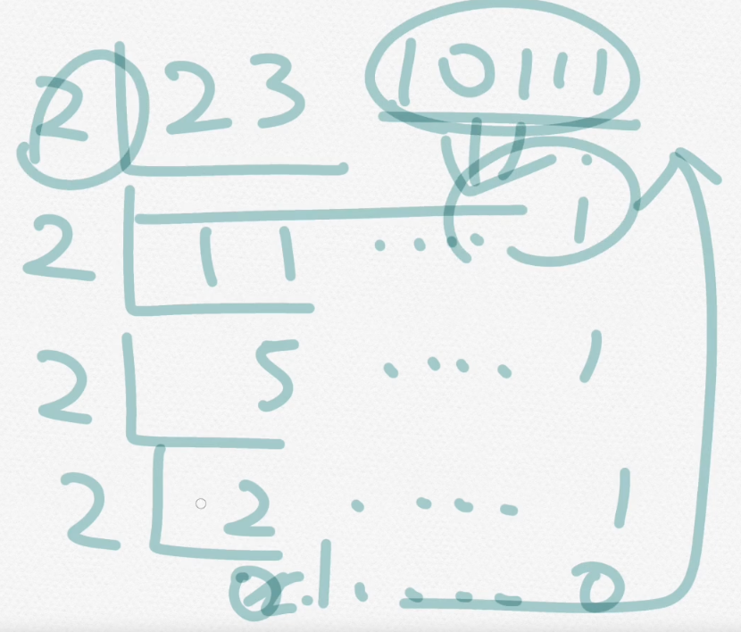
      - [boj1094_bitmassking](./2_4주차/boj1094_bitmasking.cpp)
    - 2진법으로 바꾸는건 외우기
      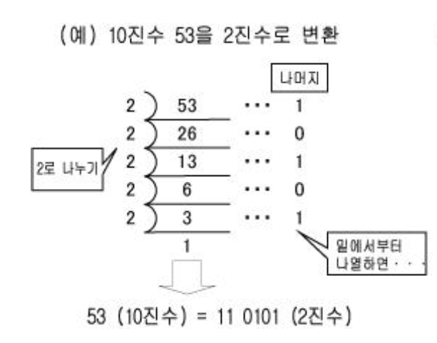
      - `53 = 110101`
      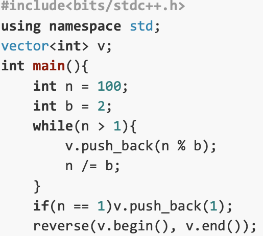


  - [boj2234](./2_4주차/boj2234.cpp) // 4-H
    - 혼자 풀었음
      - `dfs(), dfs2()` 함수를 2개 만들어서 풀었음
      - 첫번째 dfs는 방의 총 개수와 방의 사이즈를 알아내는 함수이고
      - 두번째 dfs2 함수는 방들의 이웃을 더했을 때, 최대 방사이즈를 구하는 함수이다.

  - [boj11723](./2_4주차/boj11723.cpp) // 4-I
    - 혼자 풀었음
      - 구현 문제였음
      - 시간초과가 떠서,, 뭔가 하니.. `cin.tie(NULL)` 추가해주니 해결됨
    - 강의
      - 이것도 따지면 visited 배열을 쓸 게 아니고, 비트마스킹을 활용하면 됬었네 (비트마스킹 = 불리언 배열, 최대 31개인)

  - [boj14391](./2_4주차/boj14391.cpp)// 4-J
    - 모르겠음..., 혼자 풀기 실패
      - 그리디 알고리즘의 유사무리하게 부분적 솔루션이 전체 솔루션이 될 것이라 생각하고 그규칙을 탐구했으나, 실패 ㅜㅜ
    - 강의
      - 어떻게 나눌것이냐 문제임
        - 나누는 것 자체의 구현을 `0`이면 가로로 나눈 것 , `1`이면 세로로 나눈 것으로 생각해보자
        - 비트마스킹을 통해서 모든 셀에 대해서 가로로 나눈것/ 세로로 나눈것에 대한 모든 조합을 나누고
        - 구해진 조합에 대해 합계를 구한다음
        - 최대값을 리턴하는 문제 였음
        - 본 문제의 핵심은 `0`이면 가로로 나눈것, `1`이면 세로로 나눈 것으로 마킹하는 생각을 하는 것임

  - [boj13244](./2_4주차/boj13244.cpp)// 4-K
    - 아니 이거 왜 헤맸지 ㅠㅠ
    - `Edge = Vertex-1` 이어야지만 트리이고, 이보다 Edge가 많다면 순환이 있다는 의미로 트리가 아니다
    ```c++
    if (M == N-1){ // Edge = Vertex-1; 이어야지만 트리이고, 이보다 Edge가 많다면 순환이 있다는 의미로 트리가 아니다. ㅠㅠ
        if ( N == check(a)) cout << "tree\n";
        else cout << "graph\n";
    }
    else cout << "graph\n";
    ```
        
  - [boj5430](./2_4주차/boj5430.cpp) // 4-L
    - 풀었음 `deque`
    - 강의
      1. `[1,2,3,4]` 가 들어오면 실제 배열로 바꾸는 로직을 해야하니, `stringstream ss, whilie(getline(ss, token, ','))` 이용한 파싱
      2. 실제로 R이 떴을 때 배열을 뒤집을 필요는 없다 `deque` 자료구조를 쓸 것이니, 뒤에서 지울것인지 앞에서 지울것인지만 컨트롤 해주면 된다.

  - [boj14405](./2_4주차/boj14405.cpp)// 4-M
    - 혼자 풀었음
      - 나는 재귀함수로 풀었는데, 그렇게 풀 것이 아니라 가장 간단하게 푸는 것은 `string` 메쏘드를 이용하는 것임
      ```c++
      for(int i = 0 ; i < S.size(); ++i){
        if (i < S.size()-1 && S.substr(i,2) == "pi" || S.substr(i, 2) == "ka") i += 1;
        else if(i <S.size()-2 && S.substr(i, 3) == "chu") i +=2;
        else flag = 1;
      }    
      ```
      - [substr을 이용한 풀이](./2_4주차/boj14405_FM.cpp)

  - [boj15353](./2_4주차/boj15353.cpp) // 4-N
    - 범위가 초과하기 때문에 string 으로 받아서 풀어야 함
    - 오래걸리긴 했으나 혼자 풀었음, 그리고 좀 어렵게 풀었다... [boj15353_어렵게푼..](./2_4주차/boj15353_my.cpp)
    - 강사님 코드는 매우 쉽게 풀었다. 요즘 재귀함수 호출에 익숙해져서 모든 문제를 그렇게 푸는 경향이 있는데,
    기억하자.. for문으로 풀 수 있는 것은 for문으로 푸는 것이 직관적이기에 디버깅도 빠르고 유리하다.

  - [boj15926](./2_4주차/boj15926_stk.cpp) // 4-O
    - 흠.. 뭐지 쉬운문제라고 생각햇는데, 혼자 풀기 실패
    - stack을 이용하는 방법말고는 방법이 없는 것 같은데, 내가 막힌 부분은 stack을 이용할 경우 연속되는 부분 문자열을 구할 수 없는 상황
      - 나는 stack에 문자열만 넣을 생각을 햇지 인덱스를 넣어서 해볼 생각을 못햇다.

    - 강의
      1. 배열을 이용한 풀이 [배열 풀이](./2_4주차/boj15926_array.cpp) 
        - 연속되는 것인지 배열을 두어 체크한뒤, 배열 안에 요소를 더하여 답을 출력
      2. 스택만을 이용한 풀이 [스택 풀이](./2_4주차/boj15926_stk.cpp) 
        - 연속되는 것인지 체크하기 위해 stack에 인덱스를 쌓는다.

  - [boj3015](./2_4주차/boj3015_그리디.cpp) // 4-P
    - 혼자 풀기 실패
      - 이건 어렵네요 ㅠㅠ..

    - 강의
      1. 키가 오름차순으로 주어진다면 볼수 있는 쌍: `n-1`
      2. 키가 내림차순으로 주어진다면 볼수 있는 쌍: `n-1`
      3. 키가 동일하다면?: `동일한 키의 개수를 저장` << 그리디
    
    - 코드 동작은 이해했다만, 문제를 읽고 3번의 로직을 생각해낼 수 있을까?
    - 다음에 다시 풀어볼 만한 문제 (난이도는 높음)

### 2-6. 히든퀘스트_1
  - 쉬운 문제를 빠르게 푸는 연습을 많이 하자
    - https://www.acmicpc.net/step 의 16단계 까지 빠르게

    1. 정밀도 출력(cout 함수): `cout.precision(15);`
    2. 배열 뒤집거나 조작할때 범위(p부터 q까지<q포함>): `reverse(v.begin()+p, v.begin()+q+1)`
    3. 정밀한 시간복잡도를 구하라는 문제가 나오면 꼭, 어떤 점화식을 유도할 필요 없음
      - 즉, 경우에 대한 어떤 규칙이 발견되면 그 자체를 구하는 반복문을 통해 총 반복횟수를 알 수 있을 것임  
    4. `tuple`을 쓰면 편리해지는 순간이 있다. 아래 정도만 사용할 줄 알아도 충분하다.
      ```c++
      vector<tuple<int, string, int>> v;
      for(auto vv: v){
        cout << get<0>(vv) << " " << get<1>(vv) <<"\n"; // 0번째 멤버 호출 , 1번째 멤버 호출
      }
      ```
    5. 정렬의 결과로 정렬된 `value`가 아니라, `idx`를 알고 싶을 때 방식은 여러 가지 있겠지만, 이럴 때 `lower_bound`를 활용하면 편리하다.
      - [내가 naive하게 푼 코드](./2_히든퀘스트1/정렬/boj18870.cpp) , [stl을 이용한 나이스한 코드](./2_히든퀘스트1/정렬/boj18870_더나은코드.cpp)
      - 오름차순 정렬이기 때문에 lower_bound를 쓴 것임
      - lower bound는 주소값을 리턴해줌 따라서 시작 주소와 뺴기를 통해서 몇번째 position 인지 알 수 있는 것임
      ```c++
      int pos 
      = lower_bound(sorted_input.begin(), sorted_input.end(), input[i]) - sorted_input.begin();
      // 오름차순 정렬이기 때문에 lower_bound를 쓴 것임
      // lower bound는 주소값을 리턴해줌 따라서 시작 주소와 뺴기를 통해서 몇번째 position 인지 알 수 있는 것임
      ```
    6. sort 정렬의 compare 사용:
      - `sort(v.begin(), v.end(), less<int>());`
    7. map 에서의  compare 사용:
      - `map<string, int, greater<string>> m;`
    8. map 에서의 키를 조회하기:
      - `if(m.count(n)) cout << m[n] << " ";`
    9. `boj11478` 문제는 정답코드를 참고하였음 (너무 졸려서 ㅠㅠ)
      - 부분 문자열을 획득하기 위해 처음 구상한 것은 `combination` 함수 -> 시간초과 ㅠ
      - 부분 문자열은 구태여 콤비네이션 까지 필요없고 다음과 같은 방식으로도 구할 수 있었음
        ```c++
        for(int i = 0 ; i < S.size(); ++i){
          for(int j = 1; j <= S.size()-i; ++j){
            string part = S.substr(i, j);
            ret.insert(part);
          }
        }
        ```
    10. 가로수`boj2485` 풀긴 풀었는데 좋은 코드 참고해볼 것
    11. 소수 찾기 (에라토스테네스의 체라고 불리움): 별거 있는 건 아님
      ```c++
      if (n<=1) return false;
      else if (n==2) return true;
      for(int div = 2; div*div <= n; ++div){
          if (n%div==0) return false;
      }
      return true;
      ```
    12. boj13909 문제: 다시 풀 것!
      - 혼자 못 풀었음
      - 창문이 열려있다는 의미에 대한 로직 연상이 떠오르지 않았음
        ```
        약수의 개수가 홀수개라는 것은
        차문 열기 -> 닫기 -> 열기 (3회) 창문이 열려있다는 의미임
        약수의 개수가 홀수개라는 의미는 제곱수라는 의미임
        즉, 제곱수를 찾는 문제다
        ```
    13. `스택, 큐, 덱` 단계의 2문제 혼자 풀지 못함
      - boj2346 (메모리 초과 뜸)
        - 풀이 방법: 원형 연결리스트를 직접 구현하여 해결할 수 있었음
        - [boj2346](./2_히든퀘스트1/스택큐덱/boj2346.cpp)
      - boj24511(시간초과 뜸)
        - 처음 풀었을 땐, 2중 포문으로 큐 안에 원소들을 밀어주기 되도록 구현하였다.
          - 그래서 시간 초과였고,
          - 정답코드들을 참고해보니 2중 포문이 필요가 없다.
          - 그럴려면 아이디어가 하나 필요했다. `queue`를 활용하여야 한다.
        - [boj24511](./2_히든퀘스트1/스택큐덱/boj24511.cpp)

### 2-8. 5주차 그리디/라인스위핑/투포인터
- [블로그글](https://blog.naver.com/jhc9639/222319124359)
- 그리디/라인스위핑/투포인터가 크게는 그리디 알고리즘 범주에 속하는 것임

#### A. 그리디
- 그리디는 부분최적의 선택이 전체의 최적해가 될 수 있을 때 쓰는 알고리즘 유형
- 최적 부분 구조를 가지고 있어야 함 (지금 이 state에서 최선을 다해 선택하는 해가 결국에는 전역적인 최적해로 이어져야 함)
- 탐욕적 속성이 증명되어야 함. 보통 귀류법으로 증명(간접 증명)
  - 근데, 증명이 쉽지 않음
  - 따라서, 시간복잡도를 고려하였을 때, `무식하게풀기(완탐) > DP > 그리디 순서로 알고리즘 적용을 검토하는 것` 순서로 문제를 풀자
- 그리디 문제는 보통 정렬 또는 우선순위 큐를 사용하는 유형으로 출제된다.

- `개념문제`: 보석도둑 [BOJ1202](./3_5주차/boj1202.cpp)
  1. **벡터 배열들은 오름차순 정렬 되어 있어야 함
  2. 넣을 수 있으면 후보에 다 올려둔 다음에, 가장 큰 값만 pick 해서 가방에 넣어주자.
  3. 그 다음 가방은 후보들 중에 가장 큰 값을 넣어주면 된다.
  - 2~3번의 과정을 통해 부분적인 해(선택방법)를 만들었고 이 문제 같은 경운 전체에 대해 반복하였을 때, 그 값이 전역해랑 같은 값임
  - 때문에, 시간복잡도 측면에서 이득을 볼 수 있다.

#### B. 라인스위핑
- 하나의 라인을 한번에 빗자루 쓸 듯이 탐색하는 것만으로 점과의 집합, 선과의 집합 등 탐색을 끝내는 것을 라인스위핑이라고 함

- `개념문제`: 선긋기 [BOJ2170](./3_5주차/boj2170.cpp)
  1. 기준으로 업데이트되는 순간, 기준을 업데이트된 위치로 이동시켜주기

#### C. 투포인터
- 두개의 포인터를 가지고 탐색하는 알고리즘
- 시작점과 끝점 각각의 지점에서 포인터를 두고 이동하거나, 아니면 시작점에 2개의 포인터를 운영해서 이동하거나

- `개념문제`: 두수의 합 [BOJ3273](./3_5주차/boj3273.cpp)
  1. combination을 통해서 쌍을 구해서 합한 값을 체크하는 로직 => 시간초과
  2. 투포인터를 이용해서 조건에 따라 양 끝 단에서 올라가야하는지 내려가야하는지 포인터를 움직이면서 쌍의 합을 조회 => 성공


#### 백준풀기(5주차)

  - [boj2109](./3_5주차/boj2109.cpp) // 5-A
    - 혼자 풀기 실패
      - 그리디 알고리즘에 priority_queue를 쓰는것 까지는 알겠어.., 근데 안풀리네 ..
      - 어렵네요 그리디 ㅠ
      - 혼자 다시 풀어봅시다
    - 강의
      - 제일 낮은 값을 제거하면서 priority_queue를 관리
      - 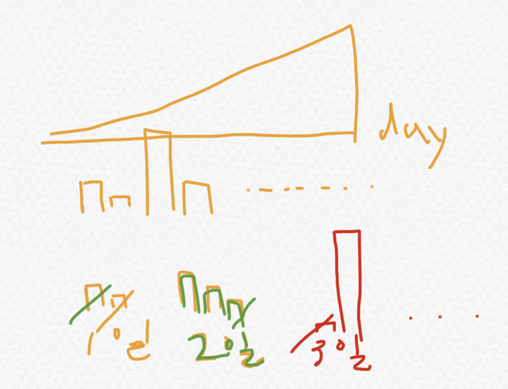
      ```c++
        priority_queue<int, vector<int> , greater<int>> pq; //top 에 제일 작은 값이 올라오게끔 priority_queue
        for(int i =0; i < n; ++i){

        pq.push(S[i].second);
        if (pq.size() > S[i].first){
            pq.pop(); //  day 안에 처리가 안되는 페이들은 제일 낮은값부터 pop()으로 제거
        }
      ```

  - [boj9935](./3_5주차/boj9935.cpp) // 5-B
    - 혼자 풀기 ok
    - 문자열이기 때문에 `substr, erase`를 이용해서 풀었는데, 이런 류의 문제들(`폭발, 짝짓기`)은 `stack` 자료구조를 이용해서 substr, erase 없이도 풀수 있다.

  - [boj1781](./3_5주차/boj1781.cpp) // 5-C
    - 혼자 풀기 ok
    - 수업에서 한번 다룬 문제라 풀었으나, 어려운 문제임
    - 강의
      - `Idea -> Logic -> Code` 순으로 알고리즘을 작성하게 됨
      1. `deadline` 기준으로 오름차순 정렬한 뒤
      2. `priority_queue`를 최소값이 `top`이 되게끔 운영하면서, 같은 deadline 안쪽에 있는 것들 중 가장 보상이 작은 것을 `pop`

  - [boj14469](./3_5주차/boj14469.cpp) // 5-D
    - 혼자 풀기 ok
    - 라인스위핑 문제
      - 문제 풀 땐, 라인스위핑이라고 생각조차 안하고 풀었는데, 이렇게 밀어내기 로직을 라인스위핑이라고 하는군..

  - [boj1931](./3_5주차/boj1931.cpp) // 5-E
    - 혼자 풀기 ok
    - 매우 유명한 그리디 알고리즘의 대표 문제임 (그리디 `정렬`을 깔고가야함)
    - 회의실에 회의 최대개수
      1. 종료시간이 빠른것을 먼저 고르면 된다.

  - [boj1202](./3_5주차/boj1202.cpp) // 5-F
    - 혼자 풀기 ok, boj1202_again.cpp
    - 그리디 알고리즘
    - 강의
      1. 가장 작은 배낭부터 시작해서, 가방에 들어갈 수 있는 보석에서 가장 비싼 것을 넣어주자
      ```c++
      while(j < N && D[j].first <= C[i]) pq.push(D[j++].second);
      if (pq.size()) ret += pq.top(); pq.pop();
      ```
    
  - [boj1644](./3_5주차/boj1644.cpp) // 5-G
    - 혼자 풀기 ok
      - 내가 푼 방식은 단계마다 `소수 배열`을 구하면, 뒤에부터 탐색해서 요구하는 `합`과 같은지 체크하는 방식이었음
    - 강의
      - 전체에 대한 `소수 배열`을 구한 뒤, 투포인터를 이용해서 푸는 방식임
      - 어떤 쌍을 구하는 문제에서 쓰기 좋은 듯 함(내가 푼 방식보다 직관적임)

  - [boj13144](./3_5주차/boj13144.cpp) // 5-H
    - 혼자 풀기 실패 ㅜㅜ
    - 내가 풀려고 한 방식: 수열의 뒤에서 부터 접근
      - 그리디 알고리즘의 솔루션이 있을 것이라 예상하였으나, 예외조건이 있어서 실패하였음
    - 답지 코드
      - 이거 투포인터 문제엿네.. 시작점에서 2개의 포인터를 운영하는 방식
      - 부분적으로 조건을 만족하면 for-loop을 돌지 않아도 되는 케이스가 있으니까 이를 찾아서 해결하자가 아이디어
    - 나중에 다시 풀어보기
  
  - [boj3273](./3_5주차/boj3273.cpp) // 5-I
    - 혼자 풀기 ok, boj3273_again.cpp
    - 팁: 어떤 `쌍의 수`를 구하는 것 -> `투포인터` 생각해보자

  - [boj1700](./3_5주차/boj1700.cpp) // 5-J
    - 혼자 풀기 실패 ㅜㅜ
      - 다시 고민해보자
      - 문제 자체를 잘못 이해한건지 싶기도 하다. 게시판의 반례들을 모아서 돌려보니..,
    - 강의
      - Swapping을 최소화 하는 알고리즘: `Memory Paging Optimal`
        - CS 지식
          1. Paging이란 프로세스에 올라가는 task 메모리들의 묶음을 말함
          2.  프로그램이 실행되어 SDD->RAM의 프로세스에 메모리들이 올라가는데, RAM이 부족하게 되면 RAM->SSD 스왑 영역에 미작업하는 프로그램을 내리고, 사용할 때 다시 RAM에 올리는 작업을 반복하게 됨. 이러한 스와핑을 최소화 하는 것이 속도 향상에 중요함
        

      - Optimal Paging Algorithm 이란 가장 먼 미래에 참조되는 Page Swap 하는 것
    
    - 로직
      1. `V` 배열에 한번도 등장하지 않는 전자용품을 담는다.
      2. `V` 사이즈가 콘센트의 개수와 같다면 로직 시작
        3. 미래의 전자용품까지 훝었을 때 `V` 요소와 겹치지 않는 전자용품이 있다면 콘센트에서 뽑아야 한다.
        4. 미래의 전자용품까지 훝었을 때 `V` 요소와 겹치는 전자용품이 있다면 콘센트에서 뽑을 필요가 없다.
    - 어려운 문제다. 나중에 다시 풀어볼 문제임.
      - 강의에서 강조하는 것은 swap의 최소화를 했다는 것 같은데, 알고리즘이 특별하다기 보다는, 구현이 까다로운 문제다. 나중에 다시 풀어볼만함

  - [boj17144](./3_5주차/boj17144.cpp) // 5-K
    - 혼자 풀었음, 구현문제임
    - 문제 구현할 내용이 많고 실수할 부분이 많아서 그렇지 문제는 단순한 것임

  - [boj14889](./3_5주차/boj14889.cpp) // 5-L
    - 혼자 풀었음
    - 강의
      1. 비트마스킹으로도 풀 수 있다.
      2. 비트마스킹해서 켜져있는 비트의 개수가 `N/2` 이면, 팀간의 점수 차이를 계산하면됨


  - [boj12100](./3_5주차/boj12100.cpp) // 5-M
    - 오래 걸려서 혼자 풀었음
    - 구현 문제인데, 규칙이 까다롭다.
    - 강의
      1. 4방향에 대해서 각각 로직을 구현할 필요가 없다.
      2. 그냥 주어진 2차원 벡터를 회전시켜서 한뱡향에 대한 로직만 구현하면된다.
        `오른쪽으로 90도 회전(정사각형): S[i][j] = S[N-j-1][i]`
        `왼쪽으로 90도 회전(정사각형):  S[i][j] = S[j][N-i-1]`
      3. 로직의 구현도 `stack`을 이용해서 구현하면 쉽겠습니다

  - [boj3190](./3_5주차/boj3190.cpp) // 5-N
    - 매우 오래 걸려서 혼자 풀었음
    - 구현 문제인데, 조금 까다롭다 
      - `오른쪽으로 90도 회전(정사각형): S[i][j] = S[N-j-1][i]`
      - `왼쪽으로 90도 회전(정사각형):  S[i][j] = S[j][N-i-1]`

  - [boj17406](./3_5주차/boj17406.cpp) // 5-O
    - 혼자 풀었음, 구현 문제
    - `next_permutation` 사용법 복습
    ```c++
    sort(ROT.begin(), ROT.end()); // next_permutation 사용 전에 반드시 정렬되어야 함
    do{
      // next_permu 함수는 다음 순열을 구해주는 함수이기 때문에 do-while 구조로 사용하여야함
    }while(next_permutation(ROT.begin(), ROT.end()));
    ```
    - vector의 `rotate` [사용법.cpp](./3_5주차/vector_rotate.cpp)
    ```c++
    vector<int> V = {1,2,3,4,5,6,7,8,9};
    rotate(V.begin(), V.begin()+8, V.end()); // {9,1,2,3,4,5,6,7,8}
    ```
  
  - [boj15662](./3_5주차/boj15662.cpp) // 5-P
    - 혼자 풀었음, 구현 문제
    - vector의 `rotate` 사용을 잘하지 않았는데, 이를 활용하면 배열 회전시킬 때 실수를 줄일 수 있으니, 적극 활용하자
    ```c++
    cout << "반시계\n";
    rotate(V.begin(), V.begin()+1, V.end()); // 반시계 회전

    cout << "시계\n";
    rotate(V.begin(), V.begin()+V.size()-1, V.end()); // 시계 회전
    ```

  - [boj1911](./3_5주차/boj1911.cpp) // 5-Q
    - 오래 걸려서, 혼자 풀었음
    - 처음 시도: visited 배열을 운영해서 풀려고 했음 (깊게 고민하기 싫어서)
      - 메모리 초과 ㅠㅠ
    - 두번째 시도: visited 배열 없이 하려다 보니, 경우의 수를 나눠서 계산해야했음

    - 강의
      1. 라인스와핑 문제임
      2. 널판지 너비가 남았을 때, 이를 경우에 따라 잘 처리해주는 것이 문제의 핵심임
    
    - 다시 풀어보기
  
  - [boj17825](./3_5주차/boj17825.cpp) // 5-R
    - 혼자 못 풀었음
    - 연결 리스트로 자료 구조를 짜서, 1개의 말을 움직이게 하는 것 까진 구현했는데,
    - 이걸 가지고 완전탐색 로직을 짜는걸, 모르겟음..
      - 필요 이상으로 복잡해지니, 겁 먹어서 못 푼 것 같음

    - 강의
      1. 자료구조를 연결 리스트로 만들어주어야 함
      2. 말 4개를 운영하는 것이니까, 말 4개에 대한 visited 배열 같은 것을 운영해야함, 위치가 겹치지 않게
    
    - 다시 풀어보기

  - [boj14888](./3_5주차/boj14888.cpp) // 5-S
    - 혼자 풀었음
      - 완탐+원복 알고리즘으로 풀었음

  - [boj17143](./3_5주차/boj17143.cpp) // 5-T
    - 오래 걸려서, 혼자 풀었음
    - 강의
      1. 상어 이동을 한 칸 한 칸 움직이게 하면 안되고, 모듈러 연산으로 수식으로 한번에 이동시킬 수 있음
        - 나는 한칸한칸 움직이게 구현하였음. 운좋게 시간초과 안 난 것임
        - 모듈러 연산으로 좌표이동 할 것이면, 좌표가 0부터 시작하게끔 구성해야함 (주의할것)
    

  - [boj15685](./3_5주차/boj15685.cpp) // 5-U
    - 혼자 풀었음
    - 원점 좌표 설정 후 회전 행렬 계산 후, 평행 이동하는 방법으로 드래곤 커브를 업데이트 시키는 로직을 구성했는데, (대충 어려웠다는 뜻) 정답률은 높다.. 그 이유가 뭘까?
      - 나만 어렵게 풀었나..
      - 강의를 보니, 규칙을 찾아서 쉽게 풀었고, 나는 실제로 기하 회전 행렬 연산을 통해 방향을 전환하였음

    - 강의
      1. 기하 문제에 속함: `규칙 찾는 문제`라고 접근하자
      2. 방향 전환하는 규칙을 찾을 수 있음
      3. 규칙을 가지고 generation 마다 `방향 벡터[시작방향 4개][최대generation인 10]`를 만들어둔다.
      4. 방향벡터를 기반으로 초기 위치값이 주어지면 generation 만큼 미리 저장해둔 방향 벡터를 따라 `cnr` 2차원 벡터를 마킹해준다.


  - [boj2632](./3_5주차/boj2632.cpp) // 5-V
    - 혼자 못 풀었음 
    - 쉬운문제로 보여 할 만하다 생각햇는데, 완탐 로직 -> 시간 초과임 [boj2632시간초과](./3_5주차/boj2632시간초과.cpp)
      - 시간복잡도 최대크기 2000 --> 2^2000: 완탐으로 못 푼다는 의미임
      - 합을 만족하는 조건에서 어떤 요소들로 채워져 있는지에 대한 정보는 필요없으니, 완탐로직이 아니어도 풀 수 있다. 
      - 횟수만 구하자

    - 강의
      1. 원형 자료구조는 선형 자료구조로 바꾼다 : `앞뒤로 붙여서`
      2. 구간쿼리(누적합) 알고리즘을 이용해서 붙은 요소들의 구간합을 구한다. `pSumA, pSumB`
      3. 구간합 정보를 가지고, 인접한 요소들의 구간쿼리 합 정보를 map에 저장한다. `map<int, int> aCnt, bCnt`
      4. map 정보를 가지고, 최종 조합의 개수를 출력한다.
        ```c++
        ret = aCnt[Want] + bCnt[Want];
        for(int i = 1; i < Want; ++i) ret += aCnt[i] * bCnt[Want-i]; 
        ```
    - 중등부 문제 ㅠㅠ... 다시 풀자 좋은 문제다 (`구간 쿼리`를 떠올리어야 한다)

  
  - [boj1912](./3_5주차/boj1912.cpp) // 5-V 
    - 혼자 못 풀었음. 시간초과
    - 직전 문제에서 `psum`을 이용해서 풀었었기 때문인지 모든 inteval에 대한 쿼리함수를 만들고, 다 순회하면서 최대값을 찾는 문제를 풀려고 하였음 

    - 강의
      1. 엄청 쉬운문제다 이걸 못 푸다니
      2. 요소의 값이 (-)로 주어졌다면, 이전의 `mx`와 비교하여 `sum` 값이 최대인지 아닌지 체크
      3. `sum`이 음수가 되면 연속적으로 더하는데 있어서 무조건 손해이므로, sum=0으로 초기화하고 다음 진행
    
    - 쉬운문제인데도 못 풀었다. 다시 풀기


  - [boj15683](./3_5주차/boj15683.cpp) // 5-X
    - 혼자 못 풀었음.. 
    - cctv를 회전시키면서 감시영역 체크하는 것 까지는 구현했는데, 이를 어떻게 재귀호출할지 구현을 못하였음
    - 생각 틀이, 재귀호출 불가능한 구조로 짜놓아서 재귀함수를 짜는데 어려움이 있었다.
    - `for i=0->4` 까지의 방향에 대해 모든  cctv를 돌리고 원복하고 하면서 모든 cctv에 대해서 풀면됐던 건데...
      ```c++
      for(int direction = 0; direction < 4; ++direction){
        vector<pair<int, int>> changes = rotate_camera(Cameras[here], ROOM[Cameras[here].first][Cameras[here].second], direction);
        dfs(here+1);
        for(auto b: changes) ROOM[b.first][b.second] = 0;
      }
      ```
    - 강의
      - `[dir+1]%4` 를 통해서 `dir[4][2] = {{-1,0},{0,1},{1,0},{0,-1}};` for문으로 순회할수 있다.
    - 다음에 다시 풀기

  - [boj17822](./3_5주차/boj17822.cpp) // 5-Y
    - 혼자 풀었음
    - 평균을 구할때 `double` 로 처리를 해주어야 했음 
    - 문제가 좀 설명이 부족한 것 같은데..,
    - `rotate`를 이용하니 편리했음
      ```c++
      void rotate_cw(vector<int>& a) rotate(a.begin(), a.end()-1, a.end());
      void rotate_ccw(vector<int>& a) rotate(a.begin(), a.begin()+1, a.end());
      ```

  - [boj2170](./3_5주차/boj2170.cpp) // 5-Z
    - 혼자 풀었음
  

### 2-9. 6주차 이분탐색(Binary Search)과 LIS(최대증가부분수열)
#### A. 이분탐색
  - [블로그자료](https://blog.naver.com/jhc9639/222335391575)
  - 정렬된 배열에 특정원소가 있는지 확인하는 것을 `Log2N`만에 구현하는 알고리즘
  - 숫자 찾기 `up&down`을 생각하자
  - 기본적인 [이분탐색](./3_6주차/boj2776.cpp)
    ```c++
    while(left<=right){
      mid = (left+right)/2;
      if (A[mid] > B[b]) right = mid-1;
      else if (A[mid] < B[b]) left = mid+1;
      else if (A[mid] == B[b]){
          found = true;
          break;
      }
    }
    ```
  - 보석 상자 [응용 형태](./3_6주차/boj2792.cpp)
    - 질투심이 mid일 때 가능한가?
      1. 가능하면 right = mid-1
      2. 불가능하면 left = mid+1;
    - 이러한 문제도 이분탐색으로 풀 수 있는 문제다.

#### B. LIS(최대증가부분수열)
  - [블로그자료](https://blog.naver.com/jhc9639/221449445864)

  - [lower_bound / upper_bound](./3_6주차/lower_upper_bound.cpp)
    - 반드시 lower_bound는 오름차순 정렬된 배열을 대상으로 할 것
    - `lower_bound 조건을 만족하는 요소가 있을 경우 처음 등장한 위치의 이터레이터 리턴`
    - `만족하는 요소가 없을 경우, 배열.end() 위치 이터레이터 리턴함`

  - [LIS 문제: 길이만](./3_6주차/boj11053.cpp)
    - 가장 간단하게 풀면 시간복잡도 `O(N^2)`으로 풀 수 있다.
  - [LIS 문제: 어떤값인지도, trace](./3_6주차/boj14002.cpp)
    - 어떤 LIS 부분수열을 갖는지 출력
    - `O(N^2)`

  - [LIS 문제: 이분탐색 활용]
    - 강의 `O(NlogN)`
    ```c++
        // 요소가 처음 등장하는 시점의 위치 이터레이터, 등장하지 않을 경우, LIS.end() 이터레이터 리턴
        auto lowerPos = lower_bound(LIS, LIS+len, number); 
        if(*lowerPos == 0) len++; // end() 위치 이터레이터의 값은 0인데, 이쪽을 가리켰다는 것은 가장 큰 값이라는 의미이므로, LIS의 길이가 길어졌다.
        *lowerPos = number; // lower_bound 위치에 값을 대입해준다.
    ```
  - 응용문제 전깃줄
    - O(N^2) 풀이 [boj2565](./3_6주차/boj2565.cpp)
    - O(NlogN) 이분탐색 풀이 [boj2565_이분탐색](./3_6주차/boj2565_이분탐색.cpp)
      - 이 방식은, 아직은 익숙해지지 않은 것 같다.
      - lower_bound를 활용한 좋은 풀이이니, 다시 풀어볼 것

#### 백준풀기(6주차)

  - [boj2792](./3_6주차/boj2792.cpp) // 6-A
    - 최대, 최소를 구하는 문제에서는 최대, 최소의 범위를 잘 확인해라 !!!
    - 왜맞틀에 빠져서 허우젹되었음.. ㅠㅠ
    
  - [boj2343](./3_6주차/boj2343.cpp) // 6-B
    - 혼자 풀었음
    - 보석상자 [문제](./3_6주차/boj2792.cpp)와 유사한 형태여서 풀었음
    - 사전 지식 없이 풀려고 했다면 어려운 문제였을 듯
    - 다시 풀어보기
    - 강의
      - for loop 2개를 통과해서 풀 문제를(`O(N^2)`) 이분탐색을 통해 (`O(N*logN)`)으로 단축

  - [boj6236](./3_6주차/boj6236.cpp) // 6-C
    - 질문게시판 읽어보며, 혼자 풀었음
    - 하... 아래의 한 줄이 없어서 계속 왜맞틀 이러고 있었음
        `if (Money[i]>mid) return 0; // 반복인출이 안되는 거였구나 ㅠㅠ.. ㅅㅂ`
    - 강의
      - 이분탐색으로 문제 풀 때는 `long long`으로 타입잡고 시작하는 게 낫겠음.
      
  - [boj7795](./3_6주차/boj7795.cpp) // 6-D
    - 혼자 풀었음
    - `lower_bound, upper_bound` 활용이 자유롭지 못한 듯 함
    - [lower_upper](./3_6주차/lower_upper_bound.cpp)
    ```c++
    // lower bound: 요소가 첫번째로 등장한 위치 이터레이터를 반환함, 
    // B보다 큰 수여서 찾지 못하면 B.end() 위치 이터레이터 반환
    // B보다 사이 어떤 값이지만 없는 수라면 Value < B[i] 시점의 위치 이터레이터 반환함
    ```
    - lower_bound: 해당값이 등장하는 첫번째 인덱스
    - upper_bound: 해당값이 마지막으로 등장하는 다음의 위치
    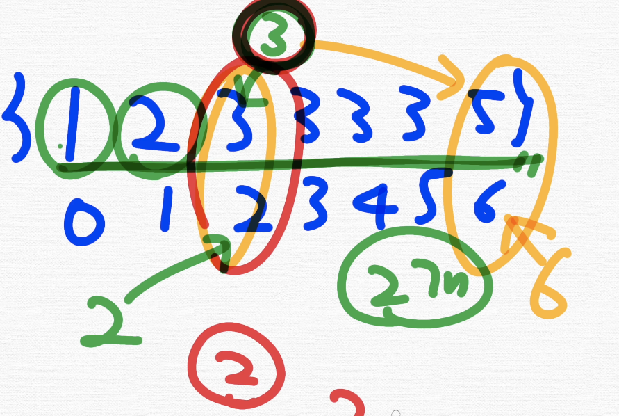
      - 빨간색(2)은 3을 입력했을때의 lower_bound의 출력값
      - 노란색(6)은 3을 입력했을때의 upper_bound의 출력값
    
  - [boj1269](./3_6주차/boj1269.cpp) // 6-E
    - 혼자 풀었음
  

  - [boj16434](./3_6주차/boj6434.cpp) // 6-F
    - 질문 게시판 보면서 혼자 풀긴하였음
    - 몬스터 잡기 vs. 히어로 전사 << 이걸 처음에 while문으로 구현했는데, 시간초과 원인이었음
    - 강의
      1. 이분탐색 문제는 `long long`으로 푸는게 좋다.
      2. 이분탐색 문제라는 건 주어진 범위가 크다는 뜻일테니
      3. `long long` 은 1e18 정도임
    - 이 문제를 그리디 방식으로도 풀 수 있다고 함 -> 이건 점프합시다 ㅎㅎ;;

  - [boj1072](./3_6주차/boj1072.cpp) // 6-G
    - 혼자 풀었음
      - 에이 퉤.. `ll ratio = (Y*100)/X;`
      - 연산 과정에서 truncation 등이 있어서 위와 같이 연산해 주어야함니다.

  - [boj2776](./3_6주차/boj2776.cpp) // 6-H
    - 혼자 풀었음
      - 원래는 이분탐색으로 푸는 문제였는데, 해쉬로 풀어보려는 탐구를 하였음 (시간복잡도1이라고 생각해서)
      - 근데 생각해야할것이, `map` 자료구조는 정렬을 해서 데이터를 넣어주기 때문에 데이터를 삽입할 때 마다 정렬이 일어나게 되서 시간초과 코드였음
      - `unordered_map`을 사용하니까 통과하였음

  - [boj14627](./3_6주차/boj14627.cpp) // 6-I
    - 혼자 풀었음
    - 강의
      1. 피연산자의 우선순위
        - 1순위: `double` / 2순위: `long long` / 3순위: `int`
        - 연산을 할 때, 중간 값의 타입 추론은 위의 우선순위에 의해 동작된다.
        - 실수할 수가있으니까. 연산과정에서는 타입캐스팅해서 타입을 맞춰주어라.

  - [boj1561](./3_6주차/boj1561.cpp) // 6-J
    - 흠... 반례는 다 맞춘거 같은데 틀렸음(1%) 뭐지..
    - 강의
      1. 덩어리 단위로 묶어서 세준다.
      2. 마지막에 답을 출력하는 부분에서 생각을 못해냈음
        - 조금만 더 고민했으면 가능햇을 것 같기도하고...
        - 어렵네요..
  
  - [boj14003](./3_6주차/boj14003.cpp) // 6-K
    - 혼자 풀기 실패
    - 정답 코드 참고.
      - TRACE: LIS의 요소를 구하는 과정이 어려움..
      - LIS 길이를 구하는 것 까지는 O(N^2)이 아닌 O(NlogN)으로 구현하였음
      - [boj14002] 문제도 trace 문제인데, 이건 O(N^2)으로 구현한거라 시간초과 발생함
    

  - [boj2670](./3_6주차/boj2670.cpp) // 6-L
    - 혼자 풀었음
    - cout 출력 포맷팅 
        ```c++
          cout << fixed; // 소수점 자리수 고정출력
          cout.precision(3); // 소숫점 자리 표현
          cout <<  value ;
        ```
      - 또는 `printf("%.3lf", ret);`
    - 강의
      1. 이거 그리디로 풀수 있는 문제였음, N의 범위가 작아서 통과됬던 것
      2. [그리디 풀이](./3_6주차/boj2670_greedy.cpp)

  - [boj11053](./3_6주차/boj11053.cpp) // 6-M
    - 혼자 풀었음
    - 강의에서 풀어본 문제임

  - [boj14002](./3_6주차/boj14002.cpp) // 6-N
    - 혼자 풀었음
    - `6-K`에서 푼 문제였음. 바로 다시 풀어서 풀 수 있었던 것 같음

  - [boj2565](./3_6주차/boj2565.cpp) // 6-O 
    - 혼자 풀었음
    - 풀어본 문제라서 풀었습니다.
    - LIS 문제임(최장 증가 수열)

### 2-10. 히든퀘스트_2
  - [프로그래머스 추천문제](https://blog.naver.com/jhc9639/222340359084) 풀기
    - 프로그래머스 로그인 연결 (깃허브 계정 연동 아이디로)
    - 내 로컬환경에서 백준 풀다가, 프로그래머스 환경에서 풀려니까, `IntelliSense`도 없고 그래서 불편하네.. 문법 등.. 확실하게 외우고 있어야 할듯함

  - [#1.외벽점검](./3_히든퀘스트2/외벽점검_teacher.cpp)
    - [문제](https://school.programmers.co.kr/learn/courses/30/lessons/60062)
    - [해설](https://blog.naver.com/jhc9639/221953358512)
    - 4시간 걸려서, 정답처리가 되긴 했는데..,
    - [내가 푼 외벽점검](./3_히든퀘스트2/외벽점검.cpp)
    - 테스트 케이스 오류인듯.. 아니면 뒷걸음질 치다가 뒷구르기 한 느낌이거나..
      - 강의를 들어봅시다.
  
  - [#2.괄호변환](./3_히든퀘스트2/괄호변환.cpp)
    - [문제](https://school.programmers.co.kr/learn/courses/30/lessons/60058)
    - [해설](https://blog.naver.com/jhc9639/221953283458)
    - 혼자 풀었음

  - [#3.자물쇠와열쇠](./3_히든퀘스트2/자물쇠와열쇠.cpp)
    - [문제](https://programmers.co.kr/learn/courses/30/lessons/60059)
    - [해설](https://blog.naver.com/jhc9639/221953235116)
    - 매우 오래 걸려서.., 혼자 풀었음
    - [자물쇠와열쇠](./3_히든퀘스트2/자물쇠와열쇠.cpp)
    - 강의 들어보기

  - [#4.문자열압축](./3_히든퀘스트2/문자열압축.cpp)
    - [문제](https://school.programmers.co.kr/learn/courses/30/lessons/60057)
    - [해설](https://blog.naver.com/jhc9639/221953176281)
    - 혼자 풀었음

  - [#5.기지국설치](./3_히든퀘스트2/기지국설치_teacher.cpp)
    - [문제](https://programmers.co.kr/learn/courses/30/lessons/12979?language=python3#_=_)
    - [해설](https://blog.naver.com/jhc9639/222093730646)
    - 혼자 풀긴 풀었는데.. 쉬운 문제임에도 경우의 수를 찾고 디버깅하느라 오래 걸림
    - 강의 코드
      - 수학식을 구해서 풀 수 있다.
      - hint: 전파가 닿지 않는 사이 길이를 구해서(station이 없는) `ceil(길이/(2*w+1))`을 더해주자
    - [내가 푼 기지국설치](./3_히든퀘스트2/기지국설치.cpp)


  - [#6. 수레움직이기](./3_히든퀘스트2/수레움직이기.cpp)
    - [문제](https://school.programmers.co.kr/learn/courses/30/lessons/250134)
    - PCCP 4번 문제 체험!!
    - 새벽3시까지 풀었습니다. (3시간 반 걸려서 풀었네요..)

### 2-11. 7주차 DP
  - [강의블로그](https://blog.naver.com/jhc9639/222349317111)
  - DP는 점화식이다, 점화식을 기반으로 푸는 것이다!!

  - 고급스러운 용어로., 메모이제이션
    - 이미 계산한 값을 저장해 두번이상 벌어지는 로직에 대해 그 값을 쓰는 것.
    - 어떤 상태값을 자료구조에 저장하는 것, 저장해두어서 다시 한번 계산하는 것을 방지하는 것이 DP의 핵심이다.

  - DP의 조건: 어느정도의 조건을 만족시켜야 쓸 수 있음
    1. 참조 투명성을 가져야 하며, 입력을 제외한 외적 요소에 결과값이 영향을 미치지 않아야 함
    2. 겹치는 부분 문제가 존재하여야 하며
    3. 최적 부분구조를 가지고 있어야 DP가 가능합니다.
    - 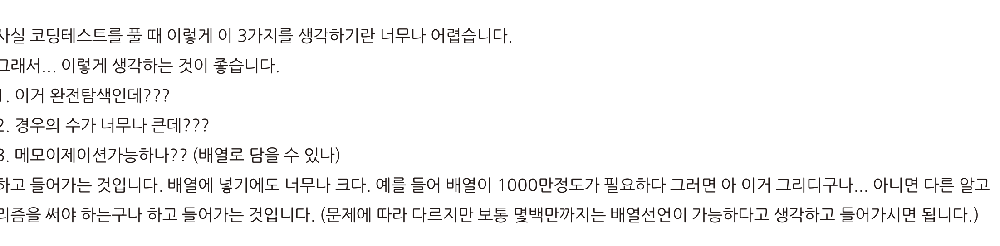
  - DP의 구성요소: 기저사례<종료조건>, 점화식(메모이제이션), 로직<완탐을 위한>, 초기화
    - 풀이 방법: 바텀업, 탑다운
      - 바텀업 방식으로 푸는 것이 점화식 유도 방식을 말하고 조금 더 쉬운 풀이일듯함

  - 기본 문제
    - [boj2240](./4_7주차/boj2240.cpp) 
      - 혼자 풀기 실패
      - 어렵다 이문제 ㅠㅠ
      - 강의
        1. 비트 연산자 복습: `~ = -(n+1)`
          - `n=-1`이라면 `~` 연산의 결과는 0이 된다.
          - -1 은 비트로 표기하면 11111111111111.. 이니까, `~`반전시키면 0000000000000...
        2. 메모이제이션 부분이 잘 이해가 되질 않는다.
          - dp에 어떤 값이 있었으면 메모이제이션된 값을 리턴해주고 종료한다.
          - 즉, dp에 어떤값이 들어가 있다는 것은 이미 한번 수행한 이력이 있는 정점이라는 의미로, 그 아래 정점에 대한 것은 `로직`에 의해 max 처리 되어있기 때문에 그 아래 정점은 탐구할 필요가 없다.
          - 질문 올렸음
      - 다시 풀어볼 문제임
    - [boj15989](./4_7주차/boj15989.cpp) 
      - 최초 시도: 혼자 풀기 실패.. 뭔가 이상하게 접근이되었음
      - 강의
        1. 일종의 규칙이 있다, 규칙을 알아내면 쉽게 풀수있는 문제임
        2. 내가 시도했던 방식은 모든 경우의 수에 대한 배열까지 알아내려고 했다,

    - [boj2748](./4_7주차/boj2748.cpp) 
      - 대표적인 DP 문제, 점화식 유도로 풀었음 (바텀업)

#### 백준풀기(7주차)

  - [boj2098](./4_7주차/boj2098.cpp) // 7-A, TSP(tsp)
    - 혼자 풀기 실패 [시간초과](./4_7주차/boj2098_dfs_timeout.cpp)
    - 일단 [답지](https://www.acmicpc.net/source/share/ded320cb8108483e81827d7499fb82ff)보고 한번 따라 쳐보았음
    - 메모이제이션 부분이 잘 이해가 안된다. 이거 2240이랑 같은 문제인데...
      - DP의 4요소 (탑다운 풀이임)
        1. 기저사례(종료조건)
        2. 메모이제이션 (저장해두기, 반복 파생계산 x)
        3. 로직 (최소 , 최대 등)
        4. 초기화 (정답이 안될 숫자로 초기화!)
      - 바텀업으로 푼다면, `점화식과 초기값`을 만들어내는 문제인거고
    - 메모이제이션 부분 이해 (역시, 손으로 디버깅이 제일 좋네)
      
    - 다시 풀어볼 문제

  - [boj17070](./4_7주차/boj17070.cpp) // 7-B
    - 완탐으로 풀어서 운좋게 정답이 된듯함
    - DP 풀이로는 혼자 못 풀었음.
      1. DP로 풀어야하는 문제: 경우의 수 문제는 보통 DP다
      2. 완탐으로 풀 경우, 중복된 경우에 대한 수 처리가 안되고, 반복 계산을 통해 시간복잡도가 너무 커진다. 

    - 강의 (DP를 푸는 2가지 방법에 대해 풀어봄)
      1. bottom-up: 점화식( 초기값, 점화식 )
      2. top-down: 재귀함수( 초기값, 기저사례, 메모이제이션, 로직 )
    - [DP_topdown](./4_7주차/boj17070_dp_topdown.cpp)
    - [DP_bottomup](./4_7주차/boj17070_dp_bottopup.cpp)
    - 다시 풀어볼 문제


  - [boj1103](./4_7주차/boj1103.cpp) // 7-C
    - 혼자 풀기 처참히 실패...
    - 다운탑으로 풀고 싶었음. 뭔가 잘 안됨
      - 연결된 고리라는 건만 체크해주었으면 되었던 것 같음 (이런경우 출력 -1)
    - 탑다운 풀이를 보고 따라 쳐봄
    - 기억하자: 탑다운으로 풀어야하는 DP의 4구성요소(초기화/기저사례/메모이제이션/로직)
    - 다시 풀어볼 문제

  - [boj2240](./4_7주차/boj2240_again.cpp) // 7-D
    - 개념 배울 때 풀어본 문제라 다시 푸는건 성공하였음
    - 정리
      1. 조건을 만족할 때 더해나가는건 기저사례 `return 0`
      2. 경우의수를 모두 더하는건 기저사례 `return 1`
    - 그냥 푼다고 하면, 시간복잡도가 최소 2^30 임

  - [boj4811](./4_7주차/boj4811.cpp) // 7-E
    - 혼자 풀기 실패
    - 시도(실패)
      1. 점화식을 찾으려고 했음, 찾은듯 했으나 아니었음
      2. 탑다운 풀이방법으로 사고 방식 전환
        - 오래 걸려서 풀어보려고 차근차근 시도해보았으나.
        - 배열이 너무 커서 .. 시간이 오래 걸린다. 결국 시간초과
      3. 정답 코드를 참고하기로...
    - 강의
      1. 상태 정의를 `Whole/Half` 알약의 개수라는 상태로 해야한다.
      2. 결국 원하는 상태는 Whole->0개가 되고, Half->0개가 되는 걸 원하는 거 아니겠음?
      3. 나는 W, H라는 요소 자체를 상태로 정의했기 때문에 같은 DP여도 시간초과가 나는 것
      4. 아름다운 코드다.. [강의코드](./4_7주차/boj4811_teacher.cpp)

    - 다시 풀어볼 문제

  - [boj12852](./4_7주차/boj12852.cpp) // 7-F
    - 혼자 풀었음
    - 1차원 DP 점화식을 유도할 수 있는 문제였음
    - Trace 해달라는 부분이 있어서, 시간이 좀 걸림. DP 중에서는 쉬운거임
    - 강의
      1. Trace 하는 부분을 재귀호출로 쉽게 구현할 수 있음
      2. [강의 코드](./4_7주차/boj12852_teacher.cpp)

  - [boj2294](./4_7주차/boj2294.cpp) // 7-G
    - 혼자 풀었음
    - 1차원 DP를 푸는 문제였음. 쉬운 축

  - [boj2293](./4_7주차/boj2293.cpp) // 7-H
    - 혼자 풀었음
    - 풀어본 유형의 문제였음

  - [boj4781](./4_7주차/boj4781.cpp) // 7-I
    - 혼자 풀기 실패함, 알고보니 쉬운문제였음
    - top-down으로 풀어서 메모이제이션을 쓸 수 있을 것이라 기대햇으나.. 실패 ㅠㅠ [실패](./4_7주차/boj4781_fail.cpp)
    - `7-H`와 유사한 문제였습니다.
    - 강의
      - 포맷이 주어진 입력을 받을 때 다음과 같이 하면 편리합니다.
        - `scanf("%d %d.%d", &Calory, &p, &q);`
      - 왼쪽에서부터 갱신해나가면서 DP배열 업데이트
        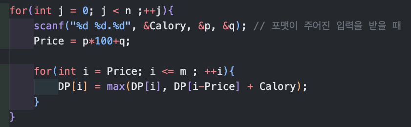

  

  - [boj12865](./4_7주차/boj12865.cpp) // 7-J
    - 배낭문제, 혼자풀었음
    - 풀어본 문제였음

  - [boj1513](./4_7주차/boj1513.cpp) // 7-K
    - 혼자 시도 실패
      - [시간초과](./4_7주차/boj1513_timeout.cpp)
    - DP 배열의 정의
      - `DP[i][j][방문한 오락실의 개수][이전에 방문한 오락실의 번호]` 로 해주어야 함

  - [boj1535](./4_7주차/boj1535.cpp) // 7-L
    - 혼자 풀었음, 보석가방이랑 같은 유형의 DP문제임
    - 강의 듣기
      1. 내가 푼 것은 2차원 DP 였는데, 강의는 1차원 DP로 풀었음
      2. [강의 코드](./4_7주차/boj1535_teacher.cpp)

  - [boj16235](./4_7주차/boj16253.cpp) // 7-M
    - 구현문제였음, 혼자 풀었음

  - [boj17136](./4_7주차/boj17136_backtracking.cpp)// 7-N
    - 혼자 풀기 실패 하였음
      - [63%에서 틀렸다고 나옴](./4_7주차/boj17136_fail_DP.cpp)
      - DP 배열의 정의를 `DP[크기5 쓴 횟수][크기4 쓴 횟수][크기3 쓴 횟수][크기2 쓴 횟수][크기1 쓴 횟수]` 로 하였는데..,
      - 틀린 이유를 생각해보니, 쓴 횟수만 영향을 주는 것이 아니고, 사용한 순서도 영향을 준다.
      - 이거 `DP` 문제 아니다. 무조건 DP라고 생각해서, 메모이제이션만 잘해주면 풀릴 것이라 생각햇음 .. 아니엇다 ㅠㅠ
    - 강의[코드](./4_7주차/boj17136_backtracking.cpp)
      - 시간복잡도를 문제 풀기전에 고민해보고 들어가자... 이게 유일한 힌트가 되네 어떤 알고리즘을 쓸지.
      - `백트래킹`으로 풀 수 있는 문제 였음
        - `완전탐색` -> `줄일 수 있는건 줄여보자` -> `휴리스틱`/`백트래킹` ->  그래도 안되면, -> `DP` -> `그리디`
          - 백트래킹: 조기 종료 시킬 수 있는 조건을 추가한것
          - [휴리스틱서치](https://ralp0217.tistory.com/entry/%EC%9D%B8%EA%B3%B5%EC%A7%80%EB%8A%A5%ED%83%90%EC%83%89Search)
            - 정보이용 탐색(informed search) 중 하나인 휴리스틱 탐색(heuristic search)
            ```
              시간이나 정보가 불충분하여 합리적인 판단을 할 수 없거나 굳이 체계적이고 합리적인 판단을 할 필요가 없는 상황에서 신속하게 어림짐작하여 탐색.
              휴리스틱을 사용하는 탐색 방법으로는 언덕오르기 방법, 최상 우선 탐색, 빔 탐색, A*알고리즘 등이 있다
            ```

  - [boj17837]// 7-O
    - 구현 문제임, 마저 풀기..,
    - 매우매우 오래 걸려서 혼자 풀었음, 질문게시판도 뒤져보면서... ㅠㅠ
    - [강의코드](./4_7주차/boj17837_teacher.cpp)
      1. 방향 `dir`을 뒤집을 때: 0/1을 좌우 , 2/3을 위아래라고 생각해보자. 아래와 같이 뒤집을 수 있음
        ```
        1^1 -> 0 
        0^1 -> 1
        2^1 -> 3
        3^1 -> 2
        ```
      2. 강사님 코드가 확실히 클린하네요..

  - [boj14867]// 7-P
    - 혼자풀기: 부분점수 획득, 실패 [내코드](./4_7주차/boj14867.cpp)
    - 완탐으로 풀었음. 완탐으로 풀고-> DP메모이제이션을 이용해서 풀면되나 했는데.. .. 잘 안되었음..
    - 강의, [정답코드](./4_7주차/boj14867_teacher.cpp)
      - bfs로 풀 수 있구나, 
        - 가중치가 동일한 그래프의 탐색 (최소거리) 문제를 푸는 것이었으니까!
      - bfs로 풀어서 최소 탐색 횟수를 보장하니까, 탐색한 노드를 발견하면 그 즉시 return해도 상관 없겠네!
      - 또 하나의 중요한 아이디어가, 보통 DP하면 배열로 많이 푸는데, 강사님 코드는 맵 자료구조를 이용해서 공간메모리를 아낄 수 있었음


  - [boj1344](./4_7주차/boj1344.cpp) // 7-Q
    - 혼자 못 풀었음
      - DP 문제에서 왠 확률이지... 하고 못 건드림
    - 질문게시판에서 정답 코드를 참고하였음
      - DP 문제로 풀 수 있었음
      - `DP[A스코어][B스코어][TIME] = 확률` 정보를 담아서 저장해둠
        ```c++
          double &ret = DP[A_Score][B_Score][Time];
          if (ret) return ret;
          ret += A가 넣고, B가 못넣을 확률
          ret += B가 넣고, A가 못넣을 확률
          ret += A, B 둘다 넣을 확률
          ret += A, B 둘다 못넣을 확률
        ```
      - 왜냐면 하나의 정점을 기준으로 그 아래 정점은 가보았던 길을 가는 것이니까. 반복 계산할 필요 없음
      

  - [boj10942](./4_7주차/boj10942.cpp) // 7-R
    - 오.. 정말 오랜만에 혼자 풀었음, 기분 좋다.
    - 풀이 순서: -> 팰린드롬도 dfs로 풀 수 있을까. 그렇다면 저장할 수 있는 정점 정보들은 무엇이 있을까?
      - `DP[시작번호][끝번호]` 저장해두면 그 아래 정점으로는 지나온 길이면 또 갈 필요 없는 것
      - 근데, 시간초과가 나서 다른 방법이 있나 고민하다가. cin.tie(NULL) 등을 추가해주니 통과!


  - [boj1509](./4_7주차/boj1509_fail.cpp) // 7-S
    - 혼자 풀기 실패..
      1. 쿼리에 대한 팰린드롬의 길이를 구하고,
      2. 구해진 DP에 대해 가장 작은 합을 갖도록 2차원 배열을 순회해서 값을 산출해 보려고 하였음
      3. 실패
    - 강의
      1. 강의와 내가 생각햇을 때 같은 로직으로 구성한 코드가 시간초과가 뜬다.. 혹시 무얼 잘못했을까?
      2. 질문 게시판에 질문 올렸음

  - [boj5557] // 7-T
    - 혼자 풀기 성공함,, 근데 마지막에 왜맞틀에 빠져서 허우적됨...
    - 그 이유가 첫번째 숫자는 (-)연산자를 붙여서 시작할 수 없는건데 나는 (-)를 붙이고 시작할 수 있게 해둬서 문제가 됬던 것임
    - 강의 들었음

  - [boj1450](./4_7주차/boj1450.cpp) // 7-U
    - 혼자 풀기 실패
      1. DP로 풀 수 있는 문제 같아서, 2차원 DP배열을 선언하고 DP[인덱스][중간합] 또는, DP[인덱스][포함/미포함] 등으로 해보려고 했는데 다 실패함
    - 강의 부터 듣기
      1. DP로 하려고 하면 DP의 사이즈나 너무 크기 때문에 불가능한 문제였음
      2. `Meet In the Middle` 이라는 알고리즘
      3. 완탐으로 접근하는데, 배열의 길이가 너무 기니까, 반을 쪼개서 2개의 완탐을 돌림
      4. 2개의 완탐 결과 배열을 조합해서 최종적인 조건을 만족하는 경우의 수를 출력
      5. 배열을 둘로 쪼갬으로써 조금 더 효율적인 알고리즘이 되었음


  - [boj14863]// 7-V
    - 초딩문제임.. 근데 혼자 못풀었음
    - `DP[index][TIME]` 으로 정의해서 푸는 문제였음
    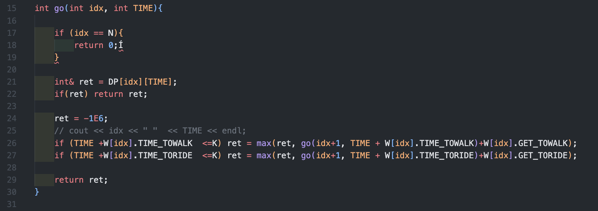 
    - 왜맞틀에 빠진이유가 26~27번 라인에 조건문을 넣어주지 않아서인데, ret에 담기는 값도 영향을 받는 부분이기 때문에 조건을 만족하지 않으면 애초에 통과시키지도 말아야함

  - [boj2342](./4_7주차/boj2342.cpp) // 7-W
    - 혼자 풀기 실패. 거의다 풀은거 같은데.. ㅠㅠ
    - DP의 생각 자체는 맞았음 `DP[idx][left][right]` 
    - 근데, 안에서 내가 DP를 구현하던 방식에 오류가 있었음
      - [내가 푼 틀린 방식](./4_7주차/boj2342_fail.cpp)
      - 기저조건에서 답을 리턴할 때, 처음 쿼리에 대한 최종 연산 결과를 리턴하게 되니까, 중간에 저장되어야할 memoization 값들이 하나의 값들로만 저장이 되는 문제가 있었던 것임

  - (4/20, 여기까지)

  
  - [boj1480] // 7-X
    - 오래 걸려서 혼자 풀었음

  - [boj3687] // 7-Y
    - 

