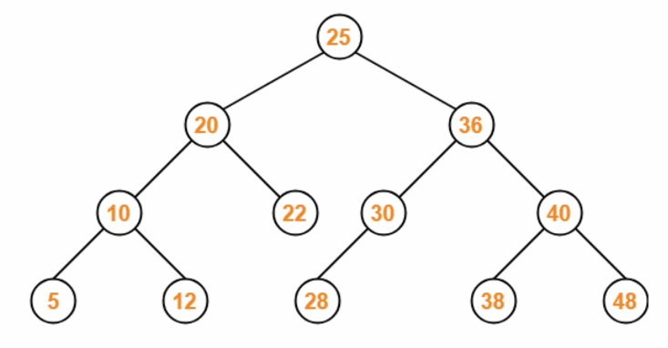

# PCCP Coding Test for '24

- PCCP (코딩전문역량인증시험 일정)

  - 
  - Lv3의 문제를 문제없이 풀면 가뿐하다는데,
  - '24.2/18 시험 접수해보는 것으로, 또는 3월 시험 일정
  - PCCP 시험을 보기 전에, 프로그래머스에서 제공하는 [스킬체크(난이도별)](https://school.programmers.co.kr/skill_checks)를 응시하면 좋은 준비가 될 듯

- 맥북 단축키 익히기

  - 코드 러너 단축키: `ctrl+opt+N`
  - 스크린샷: `shift+cmd+4`
  - 마크다운 이미지 붙여넣기: `opt+cmd+v`
  - 터미널 창 토글: ctrl+` (근데 이거 한글입력 상태일 땐 안되고, 영어입력 상태일때만 됨)

- 평일: 손코딩, 퇴근 후 1~3문제
- 주말: 최소 5문제 풀기
  - 1주일에 25문제
  - 
  - 

---

## 2. [인프런 강의2](https://www.inflearn.com/course/10%EC%A3%BC%EC%99%84%EC%84%B1-%EC%BD%94%EB%94%A9%ED%85%8C%EC%8A%A4%ED%8A%B8-%ED%81%B0%EB%8F%8C/dashboard)

1. [알고리즘 수업자료](./material/알고리즘교안.pdf)
2. [문제 및 해설](./material/알고리즘+문제해설.pdf)

### 2-1. 기본

1. 재귀함수(recursion)

- 
- 첫 문단에는 반드시 기저사례 (종료조건)을 포함해야 한다,
- 두번째 문단은 재귀호출을 하는 라인이 위치
  - 사이클이 있다면 쓰면 안된다. (종료가 안됨)
- 마지막은 최종적으로 return 하고 싶은 값이 있다면 위치할 것
  - 반복문으로 될 것 같으면 반복문으로 작성하는 것이 낫다.

2. 순열(permutation)과 조합(combination)

- 순열(permutation)은 순서가 상관있는 나열

  - `std::next_permutation(begin(), end()) 오름차순으로 만들어줌`
  - STL을 쓸 때, 배열은 정렬이 되어 있어야 함 (오름차순에 맞게)
  - `std::prev_permutation(begin(), end()) 내림차순으로 만들어줌`
  - [직접 구현은 재귀함수로 구현](./2_0기본/permutation_self.cpp)

- 조합(combination)은 순서가 상관없는 나열
  - [combination 직접구현: 외워라 무조건](./2_0기본/combination_self.cpp)
  - [3개를 뽑는 것이면 for문 3개로도 풀 수 있다](./2_0기본/combination_for.cpp)

3. split() 함수

- "aaa bbb ccc" => {"aaa", "bbb", "ccc"}
  - STL에 `split`는 제공하지 않는다. 만들면 됨
  ```c++
  while ((pos = input.find(delimeter)) != string::npos){
      token = input.substr(0, pos); // token에 찾은 부분을 넣어주고
      ret.push_back(token);
      input.erase(0, pos + delimeter.length()); // delimeter를 포함해서 지운다
  }
  ret.push_back(input); // 마지막 나머지도 ret 에 넣어줘야지
  ```

4. 메모리와 포인터

- 메모리는 1바이트의 셀들로 이루어져있고, 각 셀들은 고유한 주소를 갖는다.
  - int는 4바이트니까, int를 선언하면, 4개의 셀을 예약하게 된다.
- 포인터는 메모리의 주소를 가리키는 타입 `Node* p`
  - 포인터의 크기 (sizeof(p) = 8 <64비트 운영체제라면>)는 운영체제에 따라 다름
- 역참조(dereference)
  - 포인터 주소가 가리키는 value를 풀어헤친다는 의미지
  ```c++
  string a = "adv" // define & declaration
  string *b = &a; // point
  *b = "ggg" ; // de-reference
  ```
- 배열의 포인터

  - 배열의 이름 = 주소값 (=Array to Pointer decay)

  ```c++
  int a[N];
  int *c = a; // array to pointer decay, a 배열의 크기는 날라갔지만 이렇게 나타낼 수 있다는 것, 이렇게 될 경우 a의 첫번째 주소가 배열의 주소로 binding된다.

  int* c = &a[0]; // 위와 같은 것임
  ```

5. 중복된 요소 제거

- `{1,1,2,2,3,3}`
- 가장 간단하게 구현하는 방법은 map 구조를 이용해서 map[1] = true; [이런식으로](./2_0기본/map_for_unique.cpp)
- STL에 구현되어 있는 함수 [`unique()`](./2_0기본/unique.cpp)
  - `V.erase(unique(V.begin(), V.end()), V.end());`

### 2-2. 1주차: 시간복잡도, 빅오표기법, 공간복잡도, 누적합, 구현

- 시간복잡도: 어떠한 알고리즘이 주어진 입력크기를 기반으로 어떠한 로직이 몇번 반복되었는가

  - 빅오표기법(Big-Order): e.g. $O(n^2)$
    - 복잡도에 가장 영향을 많이 끼치는 항의 상수인자를 빼고 나머지 항을 없애서 복잡도를 나타내는 표기법
    - 
  - 재귀함수의 시간복잡도는: `main Logic`복잡도 + `재귀함수`총 호출 횟수
  - 문제에서 풀라고 하면 `count`를 직접 찍어보고 유추해보는 식으로

- 공간복잡도: 입력 크기에 대해 어떠한 알고리즘이 실행되는데 필요한 변수(메모리) 공간의 양

  - 문제를 푼다고 하면, 문제에 주어진 `최대범위`, `메모리제한`(512mb) -> 512,000,000 -> int 배열이라면 `/4`한 만큼 쓸 수 있다는 의미

- 누적합: `prefixSum`

  - 
  - 문제 유형: 구간 합 구하기(`구간쿼리`) -> 누적합을 떠올려야함 또는 펜윅트리(`동적배열인 경우`)

- 구현: 말 그대로 문제 그대로 구현하면 됨

  - 예를 들어, 배열을 회전(`void reverse(v.begin(), v.end())`하라 스택에 넣어라 등.

- 카운팅Star: 어떤 요소가 나온 횟수를 세기 `맵 또는 배열` 자료구조로 구현

  - Map: string 요소일 경우 / sparse 한 요소일 경우
    - 알파벳도 아스키코드로 이루어져있으니까 배열이 나음
      - `v[input[i] - 'a'] += 1;`
    - 아스키코드 2개만 외워: "A: 65 / a:97" , 총 알파벳은 25개임
  - 배열: integer 요소일 경우

- 백준 풀기

  - [boj2309](./2_1주차/boj2309.cpp) // 1-A
  - [boj10808](./2_1주차/boj10808.cpp) // 1-B
  - [boj2979 나쁘게 푼 예시](./2_1주차/boj2979_bad.cpp)
    - 구현문제처럼 긴 코드로 풀었는데..., 아래 처럼 푸는게 시간복잡도는 같긴 하지만 라인수가 적어 더 좋은 코드입니다.
    - [boj2979](./2_1주차/boj2979.cpp) // 1-C
  - [boj10988](./2_1주차/boj10988.cpp) // 1-D
  - [boj1159](./2_1주차/boj1159.cpp) // 1-E
    - 참고삼아, 아스키코드로 A는 65 , a는 97에 대응된다. 알파벳은 26개이다.
  - [boj11655](./2_1주차/boj11655.cpp) // 1-F
    - `getline(cin, s);`
  - [boj9996](./2_1주차/boj9996.cpp) // 1-G
    - 흠... 문제를 정확히 파악 못해서 왜맞틀만 반복하고 못 풀었음
    - string parsing 하는 것을 외우자
      ```c++
      int pos = pattern.find("*");
      string pre, suf;
      pre = pattern.substr(0,pos); // 구간 자르기 (begin_pos, end_pos)
      suf = pattern.substr(pos+1); // pos+1 하나의 인자만을 넘겨준 상황에선 pattern 문자열의 끝까지 자르게 된다.
      ```
  - [boj2559](./2_1주차/boj2559.cpp) // 1-H
    - DP로 풀었는데, 구간합으로 푸는것도 좋다.
    - 시간복잡도는 O(N)으로 동일함
  - [boj1620](./2_1주차/boj1620.cpp) // 1-I
    - 혼자 못 풀었다...;
      1. 맵을 두개 써야 한다.
         왜냐면, pockets 를 하나 써서, int 가 나오면 pockets.begin() + number 로 찾아가려고 했는데,
         맵같은 경우는 array와 다르게 순서대로 저장되는 형태가 아니기 떄문에 그래선 안된다.
      2. atoi(s.c_str()) 을 통과할 경우 int가 아닌 것들은 0이 리턴된다.
         이를 통해 int인지 아닌지 구분할 수 있다.
  - [boj9375](./2_1주차/boj9375.cpp) // 1-J
    - 혼자 풀었더니, Timeout이 발생하였음
      - 모든 Combination을 직접 구한다음에 값을 계산하려고 하였음 [boj9375_timeout](./2_1주차/boj9375_timeout.cpp)
    - Timeout을 해소하려면 아이디어가 필요함
      - 선글라스 3종류, 헤드기어 2종류가 있다면, 문제에선 아무것도 안 입는것만을 제외하고 모든 경우의 수를 구하라고 했으니까
      - 선글라스 3+1(안입는) , 헤드기어 2+1(안입는) = 4 x 3 = 12 -1 (아무것도 안입는) 방식을 통해 구할 수 있다.
        - 아이디어가 필요한 문제였음
      - 경우의 수를 구하는 문제의 경우 `answer` 변수를 `long long`으로 선언하자
  - [boj1213](./2_1주차/boj1213.cpp) // 1-K
    - 타임아웃 STL을 이용해서 라인수를 짧게 해서 풀었는데.., 시간초과 뜬다.
    - 시간을 단축해서 풀어야하는 문제임 [boj1213_timeout](./2_1주차/boj1213_timeout.cpp)
    - 강의를 보니, 규칙을 파악해서 시간을 단축할 수 있는 방법으로 풀어야함
      - 그리디 알고리즘
        1. 홀수 알파벳이 2개 이상이면 팰린드롬을 만들 수 없다.
        2. 생성할 팰린드롬은 가장 알파벳이 큰 값부터 `mid`에 붙여 나가는 식으로 생성한다.
  - [boj1940](./2_1주차/boj1940.cpp) // 1-L
    - 처음 시도에서 오래 걸렸다.
    - 문제에서 분명히 2개만 고른다고 했는데도 나는, 고르는 재료의 개수는 상관없는지 알고,
      - 모든 조합, nC1, nC2, nC3, nC4 ... 순서로 조합을 찾아가며 조건을 만족하면
      - 해당 원소는 지우는 형태로 로직을 구현하려고 했다.
    - 그럴 필요가 없는 문제였다 ㅠㅠㅠ.. 문제좀 잘 읽어 꼼꼼하게
    - 2개를 뽑는 문제임을 알고 `recursively` 하게 combination을 구해서 조건을 만족하는지
      체크하는 코드를 구현했는데, 메모리 초과가 났다.
      - 이렇게 푸는게 아닌가 해서.. 강의를 들으니까.. combination을 2중 for문을 통해서 만들어내서
        메모리 초과는 없게 알고리즘을 만들었더라.
      - 외우자.. nC3 까지는 for문으로 구현하고 그보다 큰 경우에 recursive로 구하자.
      - [boj1940\_메모리아웃](./2_1주차/boj1940_메모리아웃.cpp)
  - [boj3986](./2_1주차/boj3986.cpp) // 1-M

    - 이건 혼자 풀었다.
    - stack 자료구조를 이용하면 풀 수 있는 문제다.
    - 이런 `ABABAB..` 등의 순서를 갖는 문자열을 해결하는 문제를 만났을 때, 풀이가 떠오르지 않으면
      - 주어진 문자열을 뒤집어도 보고 90도 회전도 해보고 앞뒤로도 붙여보면서 종이에 써서 아이디어를 떠올려 봐라
    - 문제에서 만약에 `짝짓기 또는 폭발`이라는게 나오면 `stack`을 떠올려라

  - [boj1629](./2_1주차/boj1629.cpp) // 1-N
    - 굉장히 유명한 문제임
    - 분할정복 문제라는 힌트를 보고 (log2N)의 복잡도를 갖게끔 풀었다
    - 처음에는 for 문으로 접근해서 풀었는데, 당연히 시간초과고,,,
    - log2N 방식으로 푼 이후에도 틀렸다고 나왔는데, 문제에서 주어진 최대값 조건을 보고 풀어야한다.
      - 문제에서 변수의 최대값을 보면 32bit 자료형인데 꽤 큰 값이기 때문에 모든 연산에 `%C`를 해주어서 중간중간 mod 값을 계산해주면서 풀어야한다.
    - 모듈러 연산 (`곱하기 더하기에 대한 분배법칙이 성립한다.`)
      1. $(a+b)\%c = a\%c + b\%c$
      - 증명:
        $$
        a = q1*c + r1, b = q2*c + r2  이므로,
        ((q1+q2)*c+r1+r2)\%c
        = (r1+r2)\%c
        = r1\%c + r2\%c
        = a\%c + b\%c 가 성립한다.
        $$
      2. $(a*b)\%c = a\%c * b\%c$
  - [boj4375](./2_1주차/boj4375.cpp) // 1-O
    - 혼자 못풀었음
    - 최대공약수가 자기 자신이 나오면, 그 말은 배수라는 뜻이니까,, 그렇게 되면 정답을 찾게되는거니까 gcd 알고리즘을 만들어서 해봣는데
      - 시간초과입니다.
      - 구현해놓고 생각해보니, 최대공약수 구하는거나 바로 `111%a==0` 확인하는거나 시간복잡도 측면에선 차이가 없을듯하네 [boj4375_timepout](./2_1주차/boj4375_timeout.cpp)
    - 최대공약수는 전혀 만들필요가 없었고요...
    - 모듈러 연산의 특성을 이용하는 문제였음
      - 아래 코드처럼 mod 값을 계속 증가시키게 되는데, 이 때 중간 연산인 `mod = (mod*10+1)%N` 해주는 방식으로 풀면된다.
        ```c++
        if (mod%N == 0){
          cout << i << "\n";
          break;
        }
        mod = (mod * 10 + 1)%N; // 모듈러 연산의 특성을 이용해서 중간계산을 계속 해주어도 된다.
        ```

### 2-3. 2주차: 그래프이론 DFS BFS

1. 그래프

- 그래프: 정점(vertex)와 간선(edge)로 이루어진 집합(세트)를 그래프라고 함
- 정점(Vertex)는 노드라고도 불림. 즉, 점
- 간선(Edge)는 정점을 잇는 선을 의미함
  - 단방향 간선도 있고, 양방향 간선도 있고,
  - 예를 들어 `u->v` (단방향 간선)
- 가중치: 정점(vertex)와 정점(vertex) 사이의 간선을 이동하는데 드는 비용
  1. in degree
     : 해당 정점으로 들어오는 간선의 개수
  2. out degree
     : 해당 정점을 나가는 간선의 개수
     

2. 트리 (그래프 구조에 속함)

- 트리: 자식노드와 부모노드로 이루어진 계층적 구조로 무방향 그래프의 일종이자 사이클이 없는 자료구조
  - 트리: `Edge의 수 = Vertex의 수 - 1`
  - 루트 노드: 트리의 처음(부모노드가 없는)
  - 리프 노드: 트리의 맨 마지막 (자식노드가 없는)
  - 트리가 여러개인 걸 forest 구조라고 함

3. 이진트리(`BT`)와 이진탐색트리(`BST`)

- 이진 트리: 각각의 노드의 자식노드의 수가 2개 이하로 구성되어 있는 트리를 의미함
  
  3-1. 정 이진 트리 full binary tree: 자식 노드가 0 또는 2개인 이진트리
  3-2. 완전 이진 트리 compelte binary tree: 왼쪽에서 부터 채워져 있는 이진 트리, 마지막 레벨을 제외하고는 모든 레벨이 채워져 있음
  3-3. 변질 이진 트리 degenerate binary tree: 자식 노드가 하나 밖에 없는 이진 트리
  3-4. 포화 이진 트리 perfect binary tree: 모든 노드가 꽉 차 있는 이진 트리
  3-5. 균형 이진 트리 balanced binary tree: 모든 노드의 왼쪽 하위 트리와 오른쪽 하위트리의 높이 차이가 1이하인 트리, `map, set`을 구성하는 레드블랙트리는 균형 이진트리 중 하나임

- 이진 탐색 트리: 이진 트리의 일종으로 노드의 오른쪽 하위 트리에는 노드의 값보다 큰값, 왼쪽 하위트리에는 노드의 값보다 작은값이 들어가 있는 트리
  
  - 탐색 시 시간 복잡도, 이진트리의 높이가 좌/우 균형 잡혀있지 않으면 최악의 경우에 탐색의 시간복잡도는 O(N). 따라서, 트리의 구조가 균형잡혀 있어야 탐색의 시간복잡도가 O(logN)이다.
    

4. 인접 정보 (adjacency matrix 또는 adjancency list)

- 그래프로 이루어진 정보를 담고 있는, (인접해있다. 연결되어있다.)
- 인접 행렬: 그래프에서 `정점과 간선의 관계를 나타내는 bool 타입의 정사각형 행렬`을 의미함
  
  - 만약, 자신에서 자신으로 이동할 수 있으면 (사이클이 있으면) a[i][i] = 1 이 된다.
  ```c++
  bool adj[4][4] = {
    {0,1,1,1},
    {1,0,1,0},
    {1,1,0,0},
    {1,0,0,0},
  };
  ```
  - 인접행렬을 이용한 그래프 순회 [예제](./2_2주차/adj_matrix.cpp)
- 인접 그래프: 그래프에서 정점과 간선의 관계를 나타내는 연결리스트를 의미함(벡터 자료구조로도 구현 가능함, 시간복잡도 동일)

  - 정점마다, 연결되어 있는 노드를 나타내는 리스트를 만든다.

  ```c++
  vector<int> adj[4];
  adj[0] = {1, 2, 3};
  adj[1] = {0, 2};
  adj[2] = {0, 1};
  adj[3] = {0};
  ```

  - 인접리스트를 이용한 그래프 순회 [예제](./2_2주차/adj_list.cpp)

- 인접행렬과 인접리스트의 차이: 무엇을 써야할까?

  1. 공간복잡도

  - 인접행렬은 sparse하게 인접정보를 포함하므로, 공간복잡도가 `O(V^2)`가 된다.
  - 인접리스트의 공간복잡도는 `O(V+E)`

  2. 시간복잡도: 간선(Edge) 한개 찾기

  - 인접행렬: `O(1)`
  - 인접리스트: `O(V)`

  3. 시간복잡도: 모든 간선 찾기

  - 인접행렬: `O(V^2)`
  - 인접리스트: `O(V+E)`

  4. 그래프가 희소할 때(Sparse)는 인접리스트, 조밀할 때는 인접행렬이 좋다.

  - 조밀할때(dense)는 인접행렬의 간선 하나를 찾는 시간복잡도가 좋기 때문에 인접행렬이 좋다.
  - 문제를 풀 땐 어떻게 선택할지..,
    - 보통은 sparse 한 그래프가 주어지기 때문에, 인접리스트로 푸는게 낫다.
    - 인접행렬이 주어지면, 그대로 인접행렬로 푸는게 낫고..,

5. 맵과 방향벡터(direction vector)

- 미로 찾기 문제에서는 2차원 그리드 형태의 맵 정보가 주어진다.
  - 미로라는 2차원 그리드를 인접한 그리드만 연결되어 있는 형태라고 볼 수 있다.
  - direction 방향 벡터를 통해 인접한 노드를 방문하기 위한 배열을 정의할 수 있다.
    ```c++
    int direction[4][4] = {
      {-1,  0}, // up
      { 1,  0}, // down
      { 0, -1}, // left
      { 0,  1}, //right
    };
    // 동서남북 뿐만 아니라 대각선방향으로 이동가능하다고 주어질 수도 있다.
    ```

6. 연결된 컴포넌트 (connected componet)

- 
- 연결된 컴포넌트(덩어리)를 찾는 문제: `flood fill`
  - DFS로 풀면된다.
  - [예제 코드](./2_2주차/maze.cpp)

7. 깊이우선탐색(DFS, Depth First Search)

- DFS는 인접한 노드들을 재귀적으로 방문하는 알고리즘입니다.
- 또는 `stack` 이라는 자료구조를 이용하여 구현하게 된다.
  
- [예제 코드](./2_2주차/dfs_list.cpp)
- [기본 문제](./2_2주차/dfs_기본문제1.cpp)
  - connect component 문제임

8. 너비우선탐색(BFS, Breadth First Search)

- BFS는 가까운 노드를 탐색해 나가면서, 레벨별로 방문하는 알고리즘이다. 노드를 이동하는 비용은 다 같아야 한다.
  - 같은 가중치를 가진 그래프에서 최단거리 알고리즘으로 쓰임
  - 이동비용이 다르다면, `sort` 정렬 알고리즘이 들어와야함
    
- `Queue` 라는 자료구조를 이용하는 것, 먼저 `candidates`에 추가된 노드를 먼저 방문한다.

```c++
queue<int> q;
q.push(here);
searched[here] = 1; // 시작
while(q.size()){
  int here = q.front();
  q.pop(); // queue에서 꺼낼 때, 방문하는 것
  for(int there: adj[here]){
    if (searched[there] == 0){
      searched[there] = searched[here]+1; // 최단거리 이동경로 정보도 같이 담아줌
      q.push(there);
    }
  }
}
```

- [예제 코드](./2_2주차/bfs_list.out)
- [기본 문제](./2_2주차/bfs_기본문제1.cpp)

9. DFS와 BFS의 비교

- 최악의 조건에서 시간복잡도는 모두 O(V^2)가 되므로 동일함
- DFS가 메모리를 덜 쓰는 편이고, 코드가 좀 더 짧음(완전탐색 코드)
- BFS 메모리를 더 쓰는 편이고, 최단거리를 구할 수 있음

10. 트리 순회 (Tree traversal) 후위순회, 전위순회, 중위순회

- 트리 순회는 트리 구조에서 각각의 노드를 정확히 한번만, 체계적인 방법으로 방문하는 과정
  - 방문 순서에 따라 후위/전위/중위/레벨 순회가 있음
- [예제 코드](./2_2주차/traversal.cpp)

1. 후위순회(postorder traversal)

- 자식들 노드를 방문하고 자신의 노드를 방문하는 것 "자식들부터"
  
  

2. 전위순회(preorder traversal)

- 자신의 노드부터 방문하고 자식 방문하는 것 "나부터"
- `dfs` 알고리즘이 전위순회 알고리즘이다.
  

3. 중위순회(inorder traversal)

- 왼쪽 노드를 먼저 방문한다음 자신의 노드를 방문하고 그 다음 오른쪽 노드를 방문한다. "꼈다"
  - "안에 넣다.(in)"
    
    
  - `4->2->5->1->3`

4. 레벨순회(level traversal)

- `bfs`알고리즘이 레벨순회 알고리즘이다.
- `1->2->3->4->5`

11. 반례를 생각하는 팁(맞왜틀팁)

- 아래 테스트 케이스를 직접 만들어보고 입력시켜본다.

  1. 최소 조건, 최대 조건
  2. 있을 때/없을 때, 없거나/있거나 조건

- 변수명을 최대한 표준화해서 사용해보자

  - (i,j,k)(배열 인덱스), next_i, next_j, answer(정답), delta(변화량), mx(최대), mn(최소)

- 백준 풀기

  - [boj2178](./2_2주차/boj2178.cpp) // 2-A
    - 문제 자체는 bfs로 뻔한 문제인데, 입력을 받아오는 과정에서 엄청난 시간 소모를 ㅠㅠ...
    - 아래 코드 스니펫(`Code Snipet`)을 잘 익혀두자...
    ```c++
    string s;
    for (int i = 0; i < N; ++i)
    {
      cin >> s;
      for (int j = 0; j < M; ++j)
      {
        // 문자'1'과 숫자1은 다르다. 문자'1'은 아스키코드로 49이다. 1이 아니다.
        maze[i][j] = s[j]-'0';
      }
    }
    ```
  - [boj1012](./2_2주차/boj1012.cpp) // 2-B

    - 혼자 풀었음, `Connect Component, Fluid Fill 문제`

  - [boj2468](./2_2주차/boj2468.cpp) // 2-C

    - 혼자 풀었음, 문제 오타 있어서 좀 헤맸는데 문제 오타였음 -> 문제 오타가 아님, 내가 틀린거임

      - 아무지역도 물에 잠기지 않을 수 있다.
        - 아무 지역도 잠기지 않으면 안전영역은 1이지 0이 아님
        - 문제에 대한 반례 조건을 잘 따져보자.....

    - 신기한게 제한시간 1초여서, DFS 를 for문 돌리면 3중 루프니까 시간 초과일 수 있겠다 싶어서 h 높이를 찾는 것을 바이너리 서치 알고리즘이라도 적용해야 하는건가 고민했는데,, naive 하게 3중루프 써서 하니까 통과네? ㅎㅎ
      - 시간복잡도 참고: `보통 1000만 까지는 시간복잡도 발생해도 타임오버 안나나 봄`

  - [boj2583](./2_2주차/boj2583.cpp) // 2-D

    - 혼자 풀었음

  - [boj1992](./2_2주차/boj1992.cpp) // 2-E, 쿼드트리, 다시 풀어보기

    - 풀어보려고 했는데, 1차 시도는 실패임 (24.1/31)
    - 분할정복 이런거 써서 했던것 같고 아주 예전에 답지 참고해서 풀었던 문제같은데.....

      - DFS로 풀면 될 것 같아서, 1시간 이상 풀어봤는데 잘 안되었다...ㅠ [boj1992실패](./2_2주차/boj1992_fail.cpp)

    - 풀이 (해설)

      - 재귀함수를 생각해야할 때? 똑같은 로직이 반복되는데, 매개변수는 바뀌어서 처리해야할 때
      - 참고: 분할정복은 재귀함수 아니면 `stack`으로 풀 수 있음
      - [boj1992](./2_2주차/boj1992.cpp)

    - 다시 풀어봐야할 문제다
      - 다음날 다시 풀어봄

  - [boj2828](./2_2주차/boj2828.cpp) // 2-F

    - 혼자 풀기 실패... 문제 독해부터가 난해하네;;
      - 문제 독해 이해를 다시하고 혼자 풀었음 (맞추었음)
      - 생각보다 엄청 쉬운문제인데, 최소값을 구하라는 문제의 말에 BFS 로 풀어야하는문제다라고 생각해버리는 바람에.., 이걸 어떻게 1차원인데 BFS로 묶어서 한번에 풀 수 있는지 고민하다가.. 시간을 엄청 써서 풀었음...
    - 구현 문제 카테고리에 속하는 쉬운문제인데...

  - [boj2910](./2_2주차/boj2910.cpp) // 2-G

    - 일단 푸는데 좀 걸렸고, tuple을 써야하나 해서,, 근데 tuple 사용법이 익숙치가 않네요 ㅠㅠ
    - 푼것 같은데, 예외 처리 하느라 시간이 더 걸렷고, 제출했더니 메모리 초과 ..

    - 해설
      1. 맵 2개를 써서, 한개는 빈도수를 체크하고, 한개는 처음 숫자가 등장한 idx를 저장함
      - tip: 맵 자료구조는 지역변수라해도 선언과 동시에 0 초기화됨
      - tip: 맵 자료구조는 바로 정렬(sort)함수 사용이 안되니, vector 자료구조에 담아야한다.
      - tip: `mp.first: key`, `mp.second: value`
      2. 다음에 다시 한번 풀어보자

  - [boj4659](./2_2주차/boj4659.cpp) // 2-H

    - 재귀함수로 풀 수 있다는 것을 혼자 잘 떠올려서, 혼자 풀 수 있었음
    - 다만, 구현의 내용이 길고, 그 사이에 인덱싱 같은 기본적인 실수가 많아서,,,, 디버깅하는데 시간이 매우 오래 걸렸다.

  - [boj2870](./2_2주차/boj2870.cpp) // 2-I

    - 혼자 풀었음, 처음에는 out of range 가 나왔는데, 그 이유가 stoi의 출력값 범위를 넘어섰기 때문임
      - 문제를 읽고, 바로 파악해야 하는 제약조건이고, 이걸 캐치해야 로직을 제대로 짤수있음
      - 당연 longlong을 지원하는 `stoll` 도 되지는 않았고, 별수 없이 `string` 으로 데이터를 저장시켜야 했음
    - 간단한 문제인데도 오래 걸리네요...
      1. `string& erase (size_t pos = 0, size_t len = npos);`
      - 리턴받지 않아도 레퍼런스 호출이라 인풋 배열이 변형되서 나오게 됨
      2. `string substr (size_t pos = 0, size_t len = npos) const;`
    - 강의를 들이니까, 필요없는 조건문들은 삭제할 수 있었음

  - [boj10709](./2_2주차/boj10709.cpp) // 2-J

    - 무식하게 풀면되는거 아닌가 하다가, DFS도 배운거니까 적용해보자 하니까, 쉽게 풀리는 형태였음 ㅎㅎ

  - [boj3474_teacher](./2_2주차/boj3474.cpp) // 2-K

    - 혼자 못풀었음...
    - DFS 에서 중간값을 가져와서, 중간값의 0을 체크하고, 하는 과정을 넣어 함수를 만들었고, 잘 작동하는 것 같았는데, dfs의 스택오버플로우가 발생하여 N의 범위가 커질경우 segmentation fault 발생함
    - dfs의 호출회수가 커서 문제인가 해서, 중간 저장(memoization)을 이용해서 구현 해봤는데, 이 경우는 중간저장 배열의 요구로 하는 사이즈가 어느정도 커야하기때문에, 배열 자체가 선언이 안됨 ^^;;
      - [boj3474_trial](./2_2주차/boj3474_trial.cpp)
    - **강의 듣기로 결정함**: 아이디어가 중요한 문제였다.
      1. 팩토리얼을 직접 만드는건 에바다
      2. 팩토리얼 과정에서, `2와 5` 요소의 개수를 찾은다음에 min값을 출력하면 그게 0의 개수다
      3. 직접 세는건 시간복잡도가 너무 커서 문제가 됨
      - 주어진 숫자가 10이라면 2라는 요소를 갖는 숫자의 개수는 5개 {2,4,6,8,10}
      - 5라는 요소를 갖는 숫자의 개수는 {5,10}
      - 즉, 10/2 = 5, 10/5 = 2 가 된다.
      - 2와 5 요소의 개수 중 작은 값이 0의 개수가 된다
      4. 매우 간단하게 풀 수 있는 문제였다.
    - 혼자 풀려고 하였을 떈, 어떻게든 팩토리얼을 직접 구한다음에 0의 개수를 중간중간 집계해서 찾아내려고 했다.
    - 그럴필요가없이 숫자의 인수(2,5)의 개수를 찾는 방식으로 0의 개수를 찾을 수 있었다.

  - [boj2852](./2_2주차/boj2852_teacher.cpp) // 2-L

    - 스트링 파싱하는 방법.. 꼭 숙지하자
      ```c++
      istringstream sss(input); // string parsing
      sss >> mm >> delimeter >> ss;
      ```
    - 문제는 구현 문제에 가깝다고 보인다. 그만큼 로직도 간단하지만, 경우의 수를 잘 나누어 실수 없이 구현하는 것이 핵심인듯 싶다.
      - 졸려서 그런거라고 믿고 싶지만,, 꽤 오래 걸렷다 모든 반례에 대한 경우의 수를 따지느라..
    - 분, 초 이렇게 문제가 주어지면, 초를 기반으로 단위를 정렬하고 풀어라.
    - [내가 푼 코드](./2_2주차/boj2852_my.cpp)
      1. 구현 문제를 만나면, 함수를 많이 짜서 코드를 최대한 간결하게 유지할 수 있도록
      2. 코드가 길어지면, 실수가 잦고, 생각도 굳는다 ㅠ

  - [boj1436](./2_2주차/boj1436.cpp) // 2-M

    - 혼자 풀기 실패 (dfs로 푸는건가 시도만 해봄..)
    - `1000만` 아래 수행 횟수면 무식하게 푸는 것도 가능함
    - 알고리즘이 진짜로 간단하게 구현되는 거였음.. i를 계속 증가해가며 카운트를 빼주면 되는 문제...

    ```c++
    int i = 666;
    for (;; i++) // 무한 루프
    {
        if (to_string(i).find("666") != string::npos) N--;
        if (N == 0) break;
    }
    cout << i << "\n";
    ```

  - [boj9012](./2_2주차/boj9012.cpp) // 2-N

    - 이건 `stack` 을 사용하는 쉬운 문제였음

  - [boj4949](./2_2주차/boj4949.cpp) // 2-O

    - 이건 `stack` 을 사용하는 쉬운 문제였음

  - [boj14502](./2_2주차/boj14502.cpp) // 2-P

    - 와,, 너무 무식하게 접근하는것 같아서 이게될까 했는데, 통과는 되었다.
      - 문제의 조건을 가지고, worst 의 경우가 `1000만` 이하면 해볼만 하다.
      - 문제에서, `N<8, M<8` 이라고 했으니, 벽을 세우는 조건 `64C3` x dfs `64` + 최대값을 찾는 순회 `64` << `1000만` 임
    - 시간 오래 걸려서 풀긴 했음
    - 벽 3개 세우기 가능한 조건들을 콤비네이션으로 싹 구한 뒤,
    - 맵을 변경해가면서 dfs를 반복적으로 돌려서 안전구역의 최대값을 구하는 방식으로 하였음

    - 강의에서의 로직
      1. 벽을 세운다.
      2. 바이러스가 퍼진다
      3. 안전영역을 카운팅

  - [boj2636](./2_2주차/boj2636.cpp) // 2-Q

    - 다 녹기 전 치즈의 개수를 집계하는 것을 조금 비효율적이게.. dfs 함수 내부에서 집계 가능하게 해놓은 것이 아니라, dfs 외부에서 치즈 맵 전체를 순회하면서 집계되게 구성되었다.. 시간초과 나면 어떡하지 걱정했는데, 다행히 패스되긴 하였다.
    - 제일 worst의 시간복잡도를 줄이는 것이 중요하지, 그렇지 않은 것들은 시간 초과에 영향을 주지 않기 때문임.

  - [boj1068_teacher](./2_2주차/boj1068_teacher.cpp) // 2-R
    - [boj1068_my](./2_2주차/boj1068_my.cpp) 트리를 만들고 트리의 노드 링크를 끊어서 리프노드의 개수를 찾는 문제
    - 와 이 문제 거대 트릭이 있는게.., 이진트리가 아니어도 되는 문제였다. 예시는 이진트리라 무의식중에 이진트리로 접근헀는데... 하놔
    - 정말 오래 풀어서 혼자 풀긴하였다. 질문게시판에서 반례를 많이 이용했기 떄문에, 혼자푼거라고 보면 안될듯

    - 강의
      1. 트리의 탐색은 루트 노드부터 하자.
      
      2. 강의 코드를 보니 `struct`를 이용한 찐탱 트리를 설계한것이 아니고, adjacency list를 이용해서 트리를 구성하였다.
      3. `int` 를 리턴하는 dfs 함수도 많이 연습하자
      ```c++
      int dfs(Node *node)
      { 
          int ret = 0;
          for (auto c : node->child)
              if (c != nullptr)
                  ret+=dfs(c);        // (2) 자식이 없을 때만 생성되는 1을 계속 더해주면서

          bool hasChild = false;
          for (auto c : node->child)
              if (c != nullptr)
                  hasChild = true;

          if (!hasChild)
              return 1;               // (1) 자식이 없을 때는 상수 1 리턴함

          return ret;                 // (3) 최외곽 호출 리턴에 1이 계속 더해진 값을 리턴한다.
      }
      ```
  - [boj1325](./2_2주차/boj1325.cpp) // 2-S
    - 와 .. 이거 참 문제 하나하나에 대한 경험이 소중하겠네..
      - 계속, 시간초과가 떴음. 왜 틀렸을까? 무엇이 잘못됬을까? DFS 탐색밖엔 방법이 없는게 맞는데, 왜 틀리는거지 등등..
      - 질문게시판을 읽다가 알게되었음. 사람들은 왜 visited 체크를 하고 있을까?
      - 그렇다.. 바로 해당 컴퓨터 네트워크는 트리구조가 아닐 수 있다. 인접리스트로 컴퓨터 네트워크를 자료구조하면서 당연히 트리일거라는 생각이 내 머리속에 자리잡혔다. 근데, 그건 내 일방적 오해였고 본 문제는 순환구조의 컴퓨터 네트워크가 입력되게 되어있었다.
      - cycled 구조일 수도 있기 떄문에, visited 체크를 해주지 않으면 무한 루프에 빠질 수 있게 된다.
      - 따라서 내 코드가 시간초과에 걸렸다. visited가 없어 무한루프에 걸렸기 때문이다. 
      - 코테에서 만큼은 습관적으로 dfs에 visited를 넣어주는 것을 그냥 깔고 가는 것이 안전하겠구나

  - [boj17298](./2_2주차/boj17298.cpp) // 2-T
    - 이것도 질문게시판을 뒤져보다가 풀게 되었다.
    - for loop 순회하게 되면 시간복잡도는 O = N/2*(N-1)로 O(N^2)이다. 시간초과가 난다.
      - 해서, O(N) 복잡도의 방법이 있나 싶어서 DP 방식으로 여러 점화식을 찾아보려고 시간을 많이썼다.
      - 방법이 없는것 같은데, 혹시나 하는 마음으로 stack으로 접근해서 풀어보았고, 풀리긴 헀다. O(N^2) 아닌가.
        - 질문게시판에 질문 중(2/7)
    - 강의 팁: `짝짓기 문제` 느낌이 들면 `stack`으로 풀수 있는지 체크를 해봐라
      1. 문제 검토 순서: for문으로 무식하게 풀 수 있는가? 
        - 최대 범위 100만: O(N^2) = 1000억을 넘는다.
      2. 다른 방법 없을까? -> stack으로
      3. [강의코드](./2_2주차/boj17298_teacher.cpp)
        - 큰수가 안나왔다면 담아두었다가, 큰수를 만나면 그 값이 오큰수가 됨

    - 기본 문법 점검:
      - 이거 왜 이상하지 한참을 해맷음, 아래 코드와 같이 중괄호를 생략할 목적으로 statement를 한줄에 쓴다면, 한줄이라는 정의는 세미콜론을 기준으로 함, 세미콜론이 2개 잇을경우 그건 두줄이야 ㅠ
      ```c++
      while(i>0) cout << i << " ", i--; // 이건 한줄 맞거든
      while(i>0) cout << i << " "; i--; // 이건 두줄이라서, i--;는 while문에 하위에 위치하지 않는게 되서 동작하지 않게됩니다. 주의하세요. 
      ```

### 2-4. 3주차: 완전탐색과 백트래킹

1. 순열(permutation)과 조합(combination)
  - 순서가 상관있으면 permutation, 상관없으면 combination
2. 모든 경우의 수(조합/순열)을 모두 따지는 방식이 완전탐색 알고리즘임
  - 순열 or 조합 + 로직 (보통 1억 미만 까지) 해볼만하다

3. 제일 간단한 형태의 완탐 문제
  - [n큰수](./2_3주차/n큰수.cpp)
    - 이렇게 풀었을 때, 실행횟수가 1억 미만이면 충분히 완탐으로 접근해볼만 하다.
  - [조합의 합이 소수인것을 찾아라](./2_3주차/findAllPrime.cpp)
    - 문제 설명: 주어진 숫자 배열이 있을떄, 조합의 합이 소수인 것의 총 경우의 수는?
  - [조합의 합을 mod11 하였을 때 가장큰수](./2_3주차/findBigModuler.cpp)
    - 문제 설명: 주어진 숫자 배열이 있을때, 조합의 합을 `%11` 모듈러연산 했을 때 가장큰값은?
  

4. 재귀함수를 활용한 완전탐색
  - 반복문으로 되면 무조건 반복문으로..,
  - 그외
    - 너무 복잡하거나, 행위 반복하는데 매개변수만 수정해서 넘기면 될 것 같을떄, 재귀함수
  
5. 백트래킹
  - 완전탐색 + 가지치기
  - 가지치기가 더해진 완전탐색 방식이 백트래킹임
  - [조합의 합을 mod11 하였을 때 가장큰수 backtracking](./2_3주차/findBigModuler_back.cpp)
    - 원래는 모든 경우인 2^N 에 대해서 따져야 했던 것을 조건을 만족하면 그 밑으로는 호출이 `propagation` 되지 않도록 조기 종료
  
6. 완전탐색을 할 땐, 원상복구를 잘해라
  - 모든 경우의 수를 생각하는 것이 완전탐색이고, 탐색 후에는 원복으로 돌려야함. 그래야 다음 경우의 수를 따질 때 영향이 없음
  - 원복의 필요성: 어떠한 상태가 그 다음 경우의수에 반영이 되지 않도록
  - [긍정왕 홍철이](./2_3주차/긍정홍철.cpp)
  ```c++
  if(next_i >= 0 && next_j >= 0 && next_i < 3 && next_j <3){
    if (visited[next_i][next_j] == 0){
      visited[next_i][next_j] = 1;
      v.push_back({next_i, next_j});
      go(next_i, next_j, v);
      visited[next_i][next_j] = 0; // 원상복구
      v.pop_back(); // 원상복구
    }
  }
  ```

- 백준풀기(3주차)

  - [boj15686](./2_3주차/boj15686.cpp) // 3-A
    - 잘 푼것 같은데 , 시간초과 문제가 계속 발생해서.. 고민을 했다.
    - visited 체크가 안되어 있던 문제도 있는고(그래도 시간초과는 여전히),
    - 한번 더 생각해보니 순서는 상관없이 치킨집M개를 뽑는건데 나는 순서 상관있이 3개를 뽑아서, 시간초과 문제가 발생했던 것임
      - 순서는 상관없이 3개만 뽑으면 되는 것이니까, `for (i =start+1;;)` 구문을 넣어준 것임
  ```c++
  void go(int start, vector<vector<int>> v){
      if (ans == M) return;
      if (v.size() == M){
          int dist = get_cityDistance(houses, v);
          ans = min(dist, ans);
          return;
      }
      for(int i = start+1 ; i < chickens.size(); ++i){ // 와 이거.. 순서 상관없으니까 조건 따져야함
          if (visited[chickens[i][0]][chickens[i][1]] == 0){
              visited[chickens[i][0]][chickens[i][1]] = 1;
              v.push_back(chickens[i]);
              go(i, v);
              v.pop_back();
              visited[chickens[i][0]][chickens[i][1]] = 0;
          }
      }
      return;
  }
  ```

  - [boj2589](./2_3주차/boj2589.cpp) // 3-B 
    - 두번째 트라이에 성공함
      - 생각 잘하고 풀어야 겠네.. 만약 Lands가 5개라면 1번 방식은 5C2 = 10 번의 BFS를 풀어야 하지만 2번 방식은 5번의 BFS 를 푸는 것이라 이득이다.
    1. 시간초과를 받았던 첫번째 트라이
      - Lands에서 NC2 콤비네이션을 뽑아서, 시작지점과 골지점으로 한 다음에 모든 시작과 골에 대해 BFS로 최단거리를 저장한다음, 최대값을 출렸했다.
    2. 두번째 트라이
      - 모든 Lands를 시작점으로 하여 goal 지점 없이 candidates가 소진될 때 까지 BFS를 돌렸고, 맵 정보에서 거리가 최대인 정보를 저장한다음, 모든 Ladns 시작점에 대해서 거리 최대값을 출력했다.

  - [boj16234](./2_3주차/boj16234.cpp) // 3-C
    - 와 1시간 반 정도 붙잡고 풀어서 풀긴 풀었다.
      - ..내가 이런 문제를 실전에서 만나도 끈기 있게 풀어낼수있을까? ㅎㅎ;;
      - 문제는 connect component 과 dfs 를 섞었다.
      1. 첫번째 시도
        - connected component 를 못 떠올리고, 국경이 열리는 부분을 체크하려고 하였다. 오류 투성이 ㅠㅠ
        - 당연히 틀렸음
      2. 두번째 시도
        - 국경이 열리는 그룹의 체크는 connected component (dfs)로 풀어야겠구나를 떠올림
        - 그러나 그룹 체크와, 평균 계산 각각을 2개의 dfs로 했기 때문에 시간초과
      3. 세번째 시도
        - 두번째 시도는 각각 설계한 dfs를 하나로 합치는 것을 하였다.
        - 성공...

  - [boj4179](./2_3주차/boj4179_retry.cpp) // 3-D, 강의보고 풀었음
    - 혼자 풀기 실패 (3시간 가까이 풀었나..) [혼자풀기 시간초과](./2_3주차/boj4179.cpp)
      - 결과: 시간초과 ... ㅜㅜ
      - 나는 dfs로 풀었는데.., bfs로 풀어야 하나 보다.
        - 이건 아닌듯, 워스트 케이스에서 시간복잡도는 둘이 같다 O(V2)
      - 아 이 문제의 핵심은.., 불의 전파를 핸들링하는 방식으로
        - 불의 전파 속도보다 지훈의 방문속도가 빠르면 방문할 수 있다는 식으로 로직을 구현하는 것이었음
        - 나는 불의 전파를 실제로 `F`로서 구현해서 맵을 업데이트하는 형식을 취했기 때문에 비효율적이었던 것임 


  - [boj12869](./2_3주차/boj12869.cpp) // 3-E, 강의보고 풀었음
    - 혼자 풀기 실패... ㅠㅠㅠ [boj12869_실패](./2_3주차/boj12869_실패.cpp) 
      - 순열을 만들어서 모든 순열에 대해서 완탐 형태로 뮤탈리스크 공격하는 것으로 짜보았는데 시간초과입니다.
      - DP 방식으로 풀 수 있었던 것일까?? .. 아님, 그리디? 없는것 같은데..
    - 강의를 들으니.. bfs 로 풀어야 하는 문제다
      - 3차원이 주어진 그래프를 떠올리고 풀면됩니다.
    
  - [boj16637](./2_3주차/boj16637.cpp) // 3-F, 강의보고 풀었음
    - 혼자 풀기 실패하였음...
      - 완전탐색으로 풀면된다고 생각하고 무턱대고 덤벼들었지만, 구현조차 하지 못하였음
      - 완전탐색을 재귀호출로 구현하더라도 생각 해야하는 것이 있다.
      - 이 문제에서 경우의 수는 2가지가 있는데, 3개의 숫자가 주어졌다고 했을 때,
        1. 앞에서부터 순차적으로 계산하는 방법 `1->2->3`
        2. 또는, 뒤부터 계산하고 `2->3->1` 앞을 계산하는 방법이다.
      - 위의 2개 경우의수를 계속해서 propagation 하면 완전탐색을 수행하게 된다.
    
  - [boj12851](./2_3주차/boj12851.cpp) // 3-G
    - 매우 오래 걸렸지만,, 혼자 풀긴 풀었다.
    - 핵심은 2개의 저장 배열을 이용해서 하나는 최단거리를 저장하고, 하나는 방문횟수를 저장하는 배열을 사용하는 것이다.
 
  - [boj13913](./2_3주차/boj13913.cpp) // 3-H
    - 혼자 풀었음
    - A_star 알고리즘을 배울 때, 답을 출력하는 형태에 대해서 배운적이 있어서 그 방식으로 푼 것임

  - [boj17071](./2_3주차/boj17071.cpp) // 3-I, 어렵네요 이문제 ..
    - 혼자 풀기 실패 [boj17071 실패](./2_3주차/boj17071_실패.cpp)
    - 강의
      1. 문제에서 필요한 핵심 로직 (단계별 `propagation`: 단순 bfs와는 다르게 구현해야함)
      2. 수빈과 동생의 통과 시간
        - 동생이 만약에 어떤 지점에 3초에 도착했고, 수빈이가 1초에 도착했으면 서로 만날 수 있다.
          - 왜? 수빈이는 +1, -1 위치를 옮기면서 기다릴 수 있으니까
          - 단, 수빈이가 5초 도착하고 동색이 6초에 도착하면 서로 만날 수 없다
        - 즉, 수빈이가 짝수에 먼저 도착했고 이후 동생이 짝수로 방문하면 서로 만날 수 있고, 수빈이가 홀수에 먼저 도착했고 이후 동생이 홀수로 방문하면 서로 만날 수 있다.
    - 다음에 다시 풀어보면 좋겠습니다.
  
  - [boj14497](./2_3주차/boj14497.cpp) // 3-J
    - 혼자 풀었음

  - [boj3197](./2_3주차/boj3197.cpp) // 3-K      
    - 혼자 풀기 실패 (시간 초과함)
      - [boj3197 시간초과](./2_3주차/boj3197_시간초과.cpp)
    - 강의
      - 아래 2개의 로직이 필요한 문제임
        1. moveSwan()
        2. waterMelting()
      - SwanQ, WaterQ를 각각 운영하고, 이에 따라 visitedSwan, visitedWater 배열도 각각 운영
      - `day` 마다 바뀌는 정보를 기록하기 위해 Temp_SwanQ, Temp_WaterQ를 운영해야 한다.

    - 나중에 다시 풀어보면 좋겠음
  
  - [boj1987](./2_3주차/boj1987.cpp) // 3-L
    - 혼자 풀기 실패: 제대로 푼것 같은데 왜 시간초과지 ㅎㅎ;;
      - 알고리즘 적으로 개선되어야 하는 부분이 있었다.
        1. history를 저장해가면서 일일이 비교하면서 하면 당연히 시간초과다
        2. visted 배열을 운영하고, visited 배열은 알파벳 26개를 방문했는지 안했는지에 대해 기록한다.
      - 문법적으로 개선되어야 할 부분
        1. 복사생성자 `for(auto d: delta)`가 아닌  `move`가 될 수 있게 `for(auto& d : delta)`를 사용하여라.
        2. 배열이 작아서 문제없을것이라 생각했는데, 문제의 시간제한이 타이트해서 이부분이 계속 걸렸음

  - [boj2529](./2_3주차/boj2529.cpp) // 3-M
    - 혼자 풀었음
    - 문제를 풀기 전에 시간복잡도를 얼추 계산해보고 풀어야합니다..
      - 시간복잡도는 N! 이겠죠.
      - 문제의 범위가 N=10 이될수 있으니까 10! 은 360만 정도임.
        - 시간복잡도가 1000만 이하, 1억 미만이면 충분히 괜찮다.
        - 그러면 드가자~!

  - [boj9934](./2_3주차/boj9934.cpp) // 3-N
    - 혼자 못 풀었음
      - 완탐으로 푸는 문제는 아닌 것 같고, 중위방문(`inorder`)의 역순으로 하면 되는 것 같은데, 로직은 강의를 보는게 더 나을듯해서 강의를 보는 것으로 결정
      - 그래프 순회 방식 복습 [traversal](./2_2주차/traversal.cpp) !!

      ```
          1
        2    3
      4  5  6  7


      1.전위방문(preOrder)
        1-> 2-> 4-> 5-> 3-> 6-> 7
      2.후위방문(postOrder)
        4-> 5-> 2-> 6-> 7-> 3-> 1
      3.중위방문(inOrder)
        4-> 2-> 5-> 1-> 6-> 3-> 7
      ```

    - 이 문제는 Inorder를 Level화를 시키는 문제임
      1. 구간을 반으로 쪼개서 중앙에 있는 것이 최상단
      2. 그 다음 구간의 중앙에 있는 것이 최상단
  
  - [boj15684](./2_3주차/boj15684.cpp) // 3-O
    - 혼자 풀기 실패 [boj15684_실패](./2_3주차/boj15684_실패.cpp) 
      - 와 어렵다 이거;;; ㅋㅋㅋㅋ... 풀이를 보니까 쉽게 풀수있는거였다 ㅠㅠ
      - 시도한 방식
        1. 존재할 수 있는 모든 사다리 조합에 대해 콤비네이션
        2. 콤비네이션 `r` 일 때 문제 요구조건을 만족하면 답을 구한 것이라고 생각함
        3. 사다리 조합을 만들어내고 그 조합에서 사다리 게임을 했을 때 종착점에 도착햇는지를 카운팅해서 답을 산출하려고 하였음
        - 결과: 시간초과,, 및 생각엔 반례도 있는 알고리즘인듯 싶다. ㅠㅠ
    - 강의 봅시다.
      - 시간복잡도: `300C3 =  450만` , 천만/1억 이하니까 풀만하다.
        - 내가 틀린 이유
          1. 사다리를 놓는 방식을 미리 다 만들어두고, 접근하려고 했다. 근데 그렇게 하다 보니까 로직이 매우 복잡해졌다. visited 배열을 활용해야 한다.
          2. 사다리 게임 자체를 dfs로 해야한다고 생각했다. 그러나 그럴 필요가 없다.

      - 이 문제에서 필요한 로직
        1. 문제에서 주어진 조건 그대로를 활용하여 상태값을 정의
        2. 사다리를 놓기 (visited 배열을 활용)

  - [boj14620](./2_3주차/boj14620.cpp) // 3-P
    - 오랜만에 혼자 풀기 성공하였음 ㅎㅎ;
    - 너무 오랜만이라.. 풀때도 내가 맞게 푸나 하나 의심이 들어서... 하..이참
    - 100C3 이니까 완전탐색으로 시도해볼만 함

  - [boj1189](./2_3주차/boj1189.cpp)  // 3-Q
    - 혼자 풀기 성공 


// (2/18, 여기까지, 4주차 강의: 비트마스킹 부터 듣기)

### 2-5. 4주차: 비트마스킹
  - 이진수 (bit: binary digit)
    - 
  - 비트연산자
    - 
    1. 비트쉬프트
      - `a<<b` = `a x 2^b`
        - ex: 7 << 2 = 28 -> 111<<2 = 11100 = 2^4+2^3+2^2 = 28
      - `a>>b` = `a x (1/2)^b`
    2. `^, ~`
      - ^: xor 연산자(같으면 false, 서로 다르면 true)
        - 0^0: 0
        - 0^1: 1
        - 1^0: 1
        - 1^1: 0
      - ~: 비트 반전
        - ~01010: 10101
        - value가 `int` 라면,
          - `-value = ~value+1` --> `-(value+1) = ~value`
          - 왜냐면 음수를 표 현하는 방식이 이러함
    3. 비트 활용
      - 
      - 토글 스위치 원리
        - `S ^= (1<<idx)` 원하는 자리의 비트를 xor
          - 1이 있으면 0이 되고, 0이 있으면 1이 되겠지
      - 최하위 켜져 있는 비트 찾기
        - `idx = (S&-S)` 
        - [제일 낮은 자리의 비트 자리수 조회](./2_4주차/bitOperation_Search.cpp)
      - 비트연산자는 `bool []`을 대체해서 모든 것을 할 수 있기 때문에 필요한 것임
        - 비트와 비트 연산자를 활용해서 `combination`을 쉽게 구할 수 있다.
        - [콤비네이션 구하기 비트 활용](./2_4주차/bitMasking_comb.cpp)
        - 재귀를 이용해 구현한 `combination(int n, int r, {})`는 5C1, 5C2, 5C3 등을 가각 구했어야 했는데, 위의 예시는 모든 `r`에 대해서 한번에 구할 수 있는 장점이 있음
      
      - 완전탐색(+원복)에도 쓰일 수 있음
        - [비트 활용 visited](./2_4주차/bit_fullsearch.cpp)

- 백준풀기(4주차)

  - [boj19942](./2_4주차/boj19942.cpp) // 4-A
    - 혼자 푸는데 성공함... 꽤 오래 걸렸음 ㅠㅠ
    - 아래 이슈 때문에 오래동안 헤매었음
      - 비트마스킹으로 조합을 획득하여 이를 다시 순번으로 복원하는 과정에서
      - ret += to_string(j+1); 로 하니 오답이 발생했습니다.
      - ret += (char(j+1) +'0'); 으로 해주니 정답 처리가 되었는데요 그 이유가 무엇일지 궁금합니다. --> 질문하였음

  - [boj1285](./2_4주차/boj1285.cpp) // 4-B
    - 혼자 풀기: 실패 시간초과 ㅠㅠ [boj1285 시간초과](./2_4주차/boj1285_시간초과.cpp)
    - 강의
      1. 시간복잡도를 생각해보면, 한개 셀이 (N=20*2) 횟수로 뒤집어 질 수 있으니까 
      대충 2^40 정도 되는 시간복잡도를 갖는다. -> 즉, 완탐으로는 풀 수 없다
        - 혼자 푼 로직은 완탐이었음 ..
      2. 근데, 행과 열 각각을 모두 완탐식으로 뒤집을 필요가 없다
        - 왜냐면 행만 뒤집어 봐도, 열까지 뒤집을지 말지는 T,H를 보고서 뒤집을지 말지 결정할 수 있으니까.
        - 따라서 행만 뒤집는 로직을 구현하면 된다. 시간복잡도는 2^20 수준..
        - 시간복잡도가 이해가 안되네..; --> 질문하였음
      3. 문자열배열을 비트(숫자)로 변경
      ``
      HHT: 001(비트역순) --> 4
      THH: 100(비트역순) --> 1
      THT: 101(비트역순) --> 5
      ```
         

