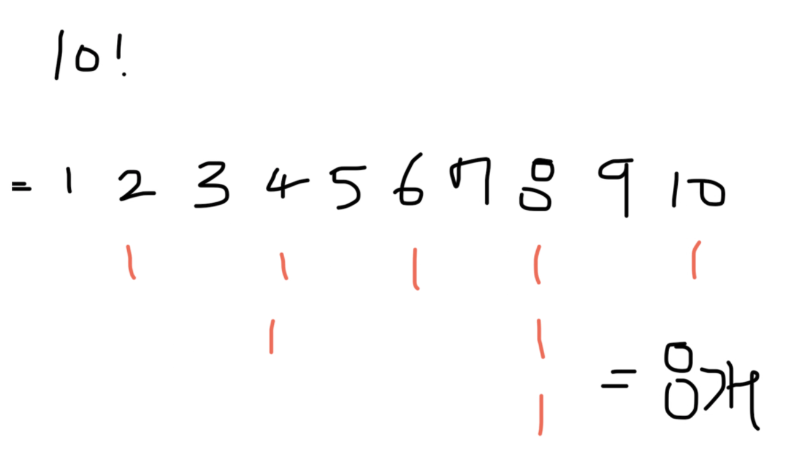
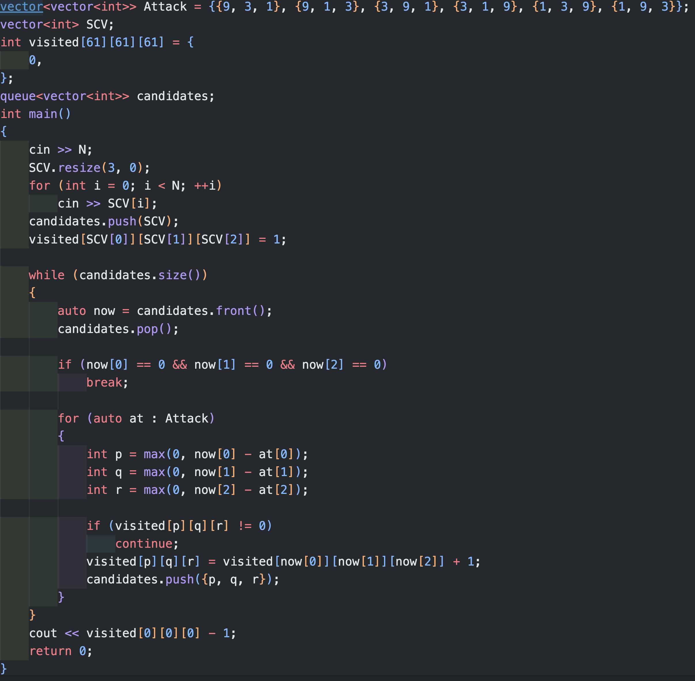

## 삼수생..

### 1. 핵심필기
1. combination 조합 만들기
- 기계적으로 사용할 수 있게 숙달되어야 함
```c++
void make_combi(int start, vector<int>C){
    if (C.size() == r){
        comb.push_back(C);
        return;
    }
    for(int i = start+1; i < 9; ++i){
        C.push_back(i);
        make_combi(i, C);
        C.pop_back();
    }

}
```
- 순열(permutation)같은 경우엔, 재귀적으로도 구할 수 있겠고, 아니면 `next_permutation(V.begin(), V.end())`를 이용해서 구할 수도 있겠음

2. 띄어쓰기를 포함한 입력받기
- `getline(cin, S)`

3. 문자열 자르기
- 특정 문자 위치 찾기: `int npos = str.find('*');`
- 문자열 자르기: `str.substr(npos+1)`
- 문자열 -> 숫자: `stoi(str)`

1. cout 출력 포맷팅
- 자리수 고정하고 빈칸은 0으로 채우기
```
cout.fill('0');
cout << setw(2) << ret << endl;
```

4. 모듈러 연산 
- 나머지 계산(`%`)은 곱셈의 성질과 마찬가지로 분배법칙이 성립하므로, 어떤 자리수가 커지는 연산에 대해 나머지 연산만을 수행하면 되는 경우, 중간 중간 나머지(`%`) 연산을 해줄 것

5. 그래프와 트리
- 그래프: Vertex(Note)와 Edge로 이루어진 집합을 그래프
- 트리: 부모노드(Predecessor), 자식노드(Sucesor)를 갖는 계층적 구조로, 무방향 "그래프"의 일종이자, 사이클이 없는 자료구조
    - 이진트리: 자식노드의 수가 2이하인 것
    - 균형이진트리(balanced binary tree): 모든 노드의 왼쪽 하위트리와 오른쪽 하위트리의 차이가 1이하인 트리. map, set을 구성하는 레드블랙트리는 균형이진트리 중 하나임

- 그래프 또는 트리를 구현하기 위해 인접행렬(adjacency matrix) 또는 인접리스트(adjacency list)를 사용하게 됨
    - 인접행렬: 정점과 간선의 관계를 나타나는 `bool`타입의 정사각형 2차원 배열 (노드끼리 연결되어 있으면 `T`)
        - adj[from][to]
        ```
        V   0   1   2   
        0   T   T   F   
        1   T   T   T   
        2   F   T   T   
        ```
        - 공간복잡도 O(V^2) 
        - 시간복잡도<간선 하나 찾기> O(1)
        - 시간복잡도<간선 모두 탐색> O(V^2)

    - 인접리스트: 연결리스트를 여러개 두어서 그래프를 표현
        - adj[Node] = { 연결된 정점들 }
        ```
        adj[1].push_back(2); ...
        ```
        - 공간복잡도 O(V+E) 
        - 시간복잡도<간선 하나 찾기> O(V)
        - 시간복잡도<간선 모두 탐색> O(V+E)

6. 탐색알고리즘1(DFS, 깊이우선탐색)
- 연결된 노드를 계속해서 `재귀호출`로 반복하는 깊이 탐색
```
DFS(u, adj){
    u.visited = true;
    for(v : adj[u]){
        if (v.visited==0)
            DFS(v,adj);
    }
}
```

7. 탐색알고리즘2(BFS, 너비우선탐색)
- 현재 연결된 노드들을 모두 찾은 뒤, `queue`에 넣어주고 다시 꺼내는 방식을 통해 가장 가까운 곳을 방문하는 레벨 별로 탐색
- 어떤 정점에서 시작해 다음 깊이의 정점으로 이동하기전 현재 깊이의 모든 정점을 탐색하며 방문한 정점은 다시 방문하지 않는 알고리즘입니다. 같은 가중치를 가진 그래프에서 최단거리알고리즘으로 쓰입니다.
```
BFS(){
    queue.push(start)
    searched[start] = 1;

    while(queue.size()){
        here = queue.front()
        queue.pop()
        for(auto there : adj[here]){
            if (searched[there] == 0){
                searched[there] = 1; //최단거리 정보를 담고자할 땐, searched[there] += 1; 
                queue.push(there);
            }
        }
    }
}
```
- 시간복잡도는 그래프의 구현방식이 인접리스트면 O(V+E), 인접행렬이면 O(V^2)이고, BFS/DFS에 따른 차이 없음
    - DFS는 메모리를 덜 쓰며, 코드가 좀 더 짧고 완전탐색 시 사용
    - BFS는 메모리를 더 쓰고, 가중치가 같은 그래프라면 최단거리를 구하는데에 많이 사용함


8. 트리순회 (재귀호출을 통한 traversal)
- 후위순회(post-order): 자식부터
```
postorder(node){
    if (node.visited == false){
        postorder(node->left)
        postorder(node->right)
        node.visited = true
    }
}
```
- 전위순회(pre-order): 자신먼저
```
preorder(node){
    if (node.visited==false){
        node.visited=true;
        preorder(node->left);
        preorder(node->right);

    }
}
```
- in-order: 안에 넣다
```
inorder(node){
    if(node.visited==false){
        inorder(node->left);
        node.visited = true;
        inorder(node->right);
    }
}
```
9. 완전탐색과 백트래킹
- 완전탐색은 모든 경우의 수에 대해 다 찾아서 체크해보는 것이고, 백트래킹은 완탐의 경우의 수 중 제껴도 되는 거는 가지를 쳐주는 알고리즘을 말함
    - 예를 들어, 백트래킹은 완탐 중 답을 찾은 경우에 조기 종료 시킴
- 완전탐색과 원복(원상복구)
```
visited[next_i][next_j] = 1;
ret+=go({next_i, next_j});
visited[next_i][next_j] = 0;
```


### 2. 문제풀이 기록 
#### 1주차
- #1159, #2559, #2979, #9996, #10808, #10988, #11655
- #1213, #1620, #1940
- #1629. #3986, #4375

#### 2주차
- #2178(A), #1012(B), #2468(C), #2583(D), #1992(E)
- #2828(F), #2910(G)
- #4659(H), #2870(I)
- #10709(J), #3474(K, **), #2852(L)
    - #3474
        - 
        - 2를 인자로 갖는 것들, 5를 인자로 갖는 것들을 다 찾은 뒤 최소값이 곧 10을 만드는 요소임
- #1436(M), #9012(N), #4949(O), #14502(P)
- #2636(Q), #1068(R-트리), #1325(S), #17298(T-스택)
    - #17298 아이디어가 필요함

#### 3주차
- #15686(A), #2589(B)
    - #2598 인간의 실수는 반복된다는게,, combi->bfs로 풀이를 이전과 똑같이 떠올렸고 시간초과 발생
    - 이 문제는 `Start, Goal` 지점에 대한 combination을 구해놓고 할 필요가 없이, `Start`들에 대한 모든 distance space를 구한뒤 그 중 최대값을 알려주면 되는 문제이다. 굳이 `Start-Goal` 세트에 대한 bfs를 모두 돌려볼 필요가 없다는거지..,

- #16234(C)
- #4179(D)
    - BFS를 직렬로 2개 배치해서 풀어야하는 문제임, 불이 퍼지는 시간을 기록해둔 뒤, 시간을 비교해서 지훈의 탐색공간 BFS
- #12869(E)
    - 혼자 풀기 실패, 여전히 저번 풀이와 동일한 형태로 접근 (백트래킹)으로 풀었으나, 시간초과
    - 이전 제출 코드를 참고하니 다이나믹프로그래밍(여기선, BFS)으로 풀어야하는 문제다.
    - 정답코드를 참고해서, 풀었음.., 아름다운 코드다 (BFS로 풀 수 있는 다른 문제)
    -     

// #16637(F)

● 3 - G : 12851 - http://boj.kr/6733d00393ba47a98811a83eb6c643
● 3 - H : 13913 - http://boj.kr/69f8a56f74744fbfb766bbc5fef23a79
● 3 - I : 17071 - http://boj.kr/c21e35e4db3143cc9f1e809d10f6eb86
● 3 - J : 14497 - http://boj.kr/d5e9b736ccc643fcb10a5351b836faa6
● 3 - K : 3197 - http://boj.kr/e8e537e2a747a588d33e78d438bde0
● 3 - L : 1987 - http://boj.kr/2a094e84bae14f9091e5c3078337a80f
● 3 - M : 2529 - http://boj.kr/f67b0fcc590a4b80b231209f2b8ce34e
● 3 - N : 9934 - http://boj.kr/c8e5c1b6404343aeadec9950565be83c
● 3 - O : 15684 - http://boj.kr/775a01e2484049a8b9d6b975cc85cb02
● 3 - P : 14620 - http://boj.kr/df51efdea3b04dcc85f9a1c2378ade31
● 3 - Q : 1189 - http://boj.kr/6d4fdbb2023647f3b2da2d638287a875